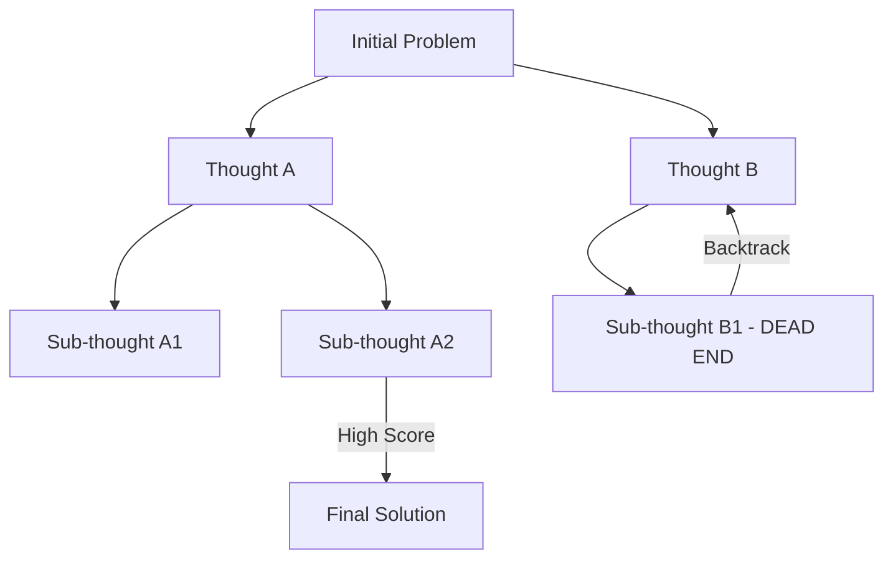

# 🌳 Tree Search Agents: Exploring the Path of Logic
> **Level:** Advanced | **Language:** Hinglish | **Goal:** Master the concepts of Tree-of-Thought (ToT) and Monte Carlo Tree Search (MCTS) for complex reasoning.

---

## 🧭 1. Beginner-friendly Hinglish Explanation
Tree Search ka matlab hai "Multiple Options" ko explore karna. Sochiye aap ek bhool-bhulaiya (maze) mein hain. Aap har mod par raste ki ek photo lete hain aur dimaag mein sochte hain "Agar main left gaya toh kya hoga?". Agar wo rasta band dikhta hai, toh aap wapas aate hain (Backtracking) aur right try karte hain. Tree Search agents ek hi line mein nahi sochte, wo dimaag mein ek "Tree" banate hain aur har branch ko check karte hain sabse best rasta dhoondhne ke liye.

---

## 🧠 2. Deep Technical Explanation
Tree Search architectures apply search algorithms to language generation:
1. **Nodes:** Each node is a partial solution or a "Thought".
2. **Expansion:** Generating multiple possible next steps from a node.
3. **Evaluation:** Scoring each step (using an LLM or heuristic) to see which is most promising.
4. **Search Algorithms:** **BFS (Breadth-First)** for diversity, **DFS (Depth-First)** for deep exploration, and **MCTS** for balancing exploration vs exploitation.
**Key Paper:** *Tree of Thoughts: Deliberate Problem Solving with Large Language Models (2023).*

---

## 🏗️ 3. Real-world Analogies
Tree Search ek **Chess Grandmaster** ki tarah hai.
- Wo ek move nahi dekhta, wo har move ke 10 consequences dimaag mein "Tree" ki tarah calculate karta hai aur sabse safe/best move chunta hai.

---

## 📊 4. Architecture Diagrams (Tree of Thought)


---

## 💻 5. Production-ready Examples (ToT Logic)
```python
# 2026 Standard: Conceptual ToT Implementation
def tree_of_thought_search(problem):
    candidates = ["Initial Idea"]
    for step in range(3): # Explore 3 levels deep
        next_candidates = []
        for c in candidates:
            # Generate 3 variations for each candidate
            variations = llm.generate_variations(c)
            # Score each variation
            scored = [(v, llm.score(v)) for v in variations]
            # Keep top-N
            next_candidates.extend([v for v, s in scored if s > 0.7])
        candidates = next_candidates
    return max(candidates, key=llm.score)
```

---

## ❌ 6. Failure Cases
- **State Explosion:** Itne saare paths generate ho gaye ki memory full ho gayi ya compute bill bahut high ho gaya.
- **Evaluation Bias:** Agent ne ek galat path ko high score de diya, aur poori search galat direction mein chali gayi.

---

## 🛠️ 7. Debugging Section
- **Symptom:** Agent hamesha ek hi branch explore karta hai.
- **Fix:** "Temperature" badhayein expansion step mein taaki diverse thoughts generate hon. Check if the evaluation prompt is too strict.

---

## ⚖️ 8. Tradeoffs
- **Intelligence vs Latency:** Bahut smart results milte hain par 1 response mein 1-2 minute lag sakte hain.
- **Cost:** 1 query ke liye 50-100 LLM calls ho sakti hain.

---

## 🛡️ 9. Security Concerns
- **Exploration Exploits:** Agar search process mein koi unauthenticated tool access ho, toh agent search ke chakkar mein dangerous actions "try" kar sakta hai.

---

## 📈 10. Scaling Challenges
- High-concurrency environments mein Tree Search mehenga padta hai. Use **Parallel Node Evaluation**.

---

## 💸 11. Cost Considerations
- Use **Small Models** for the expansion and a **Large Model** for the final evaluation to save $$.

---

## ⚠️ 12. Common Mistakes
- Bina **Pruning** (discarding bad paths) ke search karna.
- Depth limit na lagana.

---

## 📝 13. Interview Questions
1. How does MCTS differ from standard BFS in the context of LLM agents?
2. What is 'Pruning' and why is it essential for Tree Search?

---

## ✅ 14. Best Practices
- Set a strict **Time Budget**.
- Use **Semantic Deduplication** taaki ek jaise thoughts par compute waste na ho.

---

## 🚀 15. Latest 2026 Industry Patterns
- **Self-Play Tree Search:** Agents jo apne purane search trees se seekhkar next time better pruning karte hain.
- **Differentiable Search Trees:** Neural networks jo search process ko hi optimize karte hain.
