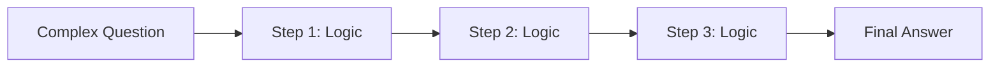

# ⛓️ Chain of Thought (CoT): The Art of Deliberate Thinking
> **Level:** Beginner | **Language:** Hinglish | **Goal:** Master the foundational technique that allows LLMs to solve complex problems by breaking them into logical steps.

---

## 🧭 1. Beginner-friendly Hinglish Explanation
Chain of Thought (CoT) ka matlab hai "Silsile-war Sochna". Sochiye aapne ek bache se math ka sawal pucha. Agar wo seedha answer dega, toh galti hone ke chance hain. Par agar aap use bolein "Pehle sawal ko samjho, fir ek-ek step likho", toh wo sahi answer tak pahunch jayega. CoT AI ko wahi "Space" deta hai. Hum AI ko bolte hain "Let's think step by step", jisse wo apna dimaag (parameters) logical reasoning ke liye use karta hai, na ki sirf agla word predict karne ke liye.

---

## 🧠 2. Deep Technical Explanation
CoT works by prompting the model to generate intermediate reasoning steps before the final output:
1. **Zero-Shot CoT:** Adding the magic phrase `"Let's think step by step"` to the prompt.
2. **Few-Shot CoT:** Providing 2-3 examples where the problem is solved with clear logical steps.
3. **Logic:** It allows the model to allocate more "Compute-per-token" to the hidden states during the reasoning process.
**Key Paper:** *Chain-of-Thought Prompting Elicits Reasoning in Large Language Models (2022).*

---

## 🏗️ 3. Real-world Analogies
Chain of Thought ek **Math Exam** ki tarah hai.
- Sirf "Final Answer" likhne par marks kam milte hain.
- "Step-by-Step Working" likhne se aap khud ko aur examiner (model) ko guide karte hain sahi result tak.

---

## 📊 4. Architecture Diagrams (Sequential Reasoning)


---

## 💻 5. Production-ready Examples (The CoT Prompt)
```python
# 2026 Standard: Few-Shot CoT Template
prompt = """
Q: Roger has 5 tennis balls. He buys 2 more cans of tennis balls. Each can has 3 balls. How many balls does he have?
A: Roger started with 5 balls. 2 cans of 3 balls each is 6 balls. 5 + 6 = 11. The answer is 11.

Q: {user_question}
A: Let's think step by step:
"""
# Response from model will naturally follow the reasoning pattern.
```

---

## ❌ 6. Failure Cases
- **Reasoning Drift:** Model ek step galat likhta hai aur baaki poora "Chain" us galti par build ho jata hai (Snowball effect).
- **Over-Thinking:** Simple sawal (e.g., "What is 2+2?") ke liye 10 steps ka explanation dena.

---

## 🛠️ 7. Debugging Section
- **Symptom:** Agent is jumping to the wrong conclusion.
- **Fix:** Check Step 1. Agar pehla step galat hai, toh logic fail hai. Use **Self-Correction** or **Reflexion** to fix it.

---

## ⚖️ 8. Tradeoffs
- **Accuracy vs Tokens:** Accuracy 20-40% badh sakti hai par output tokens 3x-5x ho sakte hain.

---

## 🛡️ 9. Security Concerns
- **Prompt Injection in Steps:** Agar koi "Hidden Step" inject kar de, toh agent reasoning ke beech mein malicious intent chupa sakta hai.

---

## 📈 10. Scaling Challenges
- Token limits: Complex CoT reasoning context window ko jaldi bhar deti hai.

---

## 💸 11. Cost Considerations
- Use CoT only for **Reasoning-intensive** tasks (Math, Code, Logic). Marketing copy ya creative writing ke liye simple prompting sasti hai.

---

## ⚠️ 12. Common Mistakes
- Zero-shot CoT par blind trust karna. Hamesha few-shot examples dein complex logic ke liye.
- Context mein irrelevant info hona.

---

## 📝 13. Interview Questions
1. Why does 'Let's think step by step' improve LLM performance?
2. What is 'System 2' thinking in the context of Chain of Thought?

---

## ✅ 14. Best Practices
- Define clear **Logical Anchors** in your prompt.
- Use **Self-Consistency** (Majority vote across 3 CoT runs).

---

## 🚀 15. Latest 2026 Industry Patterns
- **Active CoT:** Models jo khud decide karte hain ki kis step par unhe zyada "Attention" deni hai.
- **Verification CoT:** Har reasoning step ke baad ek "Verifier" call jo check kare step sahi hai ya nahi.
