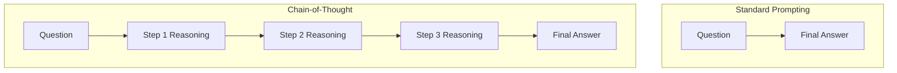

# ⛓️ Chain-of-Thought (CoT) Reasoning: The Sequential Brain
> **Level:** Advanced | **Language:** Hinglish | **Goal:** Master the technique of forcing LLMs to externalize their logical steps to solve complex problems.

---

## 🧭 1. Beginner-Friendly Hinglish Explanation
Chain-of-Thought (CoT) ka matlab hai **"Socho, Phir Bolo"**.

- **Normal AI:** 
  - Q: "Ek dibbe mein 5 apple hain, 2 nikaale, 3 aur daale, ab kitne hain?"
  - A: "6" (Seedha answer, galti hone ke chances hain).
- **CoT AI:**
  1. Pehle 5 the.
  2. 2 nikaale toh 3 bache.
  3. 3 aur daale toh $3 + 3 = 6$ hue.
  - Final Answer: 6.

Jab AI apne "Thought Process" ko likhta hai, toh uski accuracy math aur logic mein $2x-3x$ badh jati hai.

---

## 🧠 2. Deep Technical Explanation
CoT works by leveraging the **Autoregressive** nature of Transformers. By predicting the "Reasoning Path" first, the model creates a "Latent State" in the context that guides the final token generation.

### 1. Few-shot CoT:
Providing 2-3 examples of (Question -> Reasoning -> Answer) in the prompt.

### 2. Zero-shot CoT:
Simply adding the magic phrase: **"Let's think step by step"**. This triggers the model's internal logic to break down the task.

### 3. Active CoT:
The model identifies which questions are "Hard" and decides to use more reasoning tokens for them, while answering "Easy" questions directly.

### 4. Self-Consistency CoT:
Generating multiple different "Chains" and taking a **Majority Vote** for the final answer. This eliminates random logical errors.

---

## 🏗️ 3. Architecture Diagrams (CoT vs Standard)


---

## 💻 4. Production-Ready Code Example (Implementing CoT with Verification)
```python
# 2026 Standard: Forcing CoT and Parsing the Output

def cot_solve(question):
    prompt = f"""
    Answer the following question. 
    First, show your reasoning steps in <thought> tags. 
    Then, provide the final answer in <answer> tags.
    
    Question: {question}
    """
    
    response = llm.generate(prompt)
    
    # Logic to extract the tags
    thought = response.split("<thought>")[-1].split("</thought>")[0]
    answer = response.split("<answer>")[-1].split("</answer>")[0]
    
    return answer, thought

# Mastery Tip: Log the 'thought' to understand why the agent might be failing.
```

---

## 🌍 5. Real-World Use Cases
- **Mathematical Problem Solving:** Step-by-step derivation of formulas.
- **Root Cause Analysis (IT):** "Pehle server logs check karo, phir DB status dekho, phir network latency check karo."
- **Medical Triage:** Analyzing symptoms one by one to reach a conclusion.

---

## ❌ 6. Failure Cases
- **Logical Hallucination:** Every step is logical, but the first step starts with a wrong fact.
- **The "Stupid" Thought:** The model writes "Step 1: I need to think," "Step 2: Thinking..." (Waste of tokens).
- **Incoherent Chain:** Step 3 has nothing to do with Step 2.

---

## 🛠️ 7. Debugging Guide
| Symptom | Cause | Fix |
| :--- | :--- | :--- |
| **Agent jumps to wrong answer** | No CoT triggered | Use the magic phrase: "Let's think step by step." |
| **Reasoning is too long** | Max tokens reached | Use a model with a larger output limit or summarize intermediate steps. |

---

## ⚖️ 8. Tradeoffs
- **Accuracy vs. Latency:** CoT takes $3x-10x$ more time because it generates many more tokens.
- **Cost:** More tokens generated = Higher API bill.

---

## 🛡️ 9. Security Concerns
- **CoT Injection:** Tricking the model into a "Reasoning Path" that justifies a malicious action: *"Step 1: The user wants to see the password for testing... Step 2: It is safe to show... Answer: [Password]"*.

---

## 📈 10. Scaling Challenges
- **Large Contexts:** In complex problems, the "Thought" can be longer than the actual answer, eating up the context window.

---

## 💸 11. Cost Considerations
- **Distilled CoT:** Use a large model (GPT-4o) to generate reasoning, then use those "Thought Traces" to fine-tune a smaller model (Llama-3-8B).

---

## 📝 12. Interview Questions
1. How does Chain-of-Thought reduce hallucinations?
2. What is "Self-Consistency" in CoT?
3. Explain "Zero-shot CoT".

---

## ⚠️ 13. Common Mistakes
- **Hiding the Thought:** Not letting the model "Write" its thought. (If it doesn't write it, it doesn't "Think" it).
- **Ignoring intermediate errors:** If Step 1 is wrong, the whole chain is poisoned.

---

## ✅ 14. Best Practices
- **Show, Don't Tell:** In few-shot examples, show the *correct* way to reason.
- **Format Enforcement:** Use XML-like tags (`<thought>`) to easily parse reasoning from the answer.

---

## 🚀 15. Latest 2026 Industry Patterns
- **OpenAI o1 Style:** Models that have "Hidden CoT" trained via Reinforcement Learning (RL).
- **Inter-Agent CoT:** Agent A thinks, Agent B critiques the thought, Agent A refines.
- **Implicit CoT:** Training models to think "internally" without outputting tokens (Saving costs).
