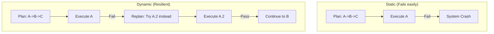

# 🔄 Dynamic Replanning: The Agile Agent
> **Level:** Advanced | **Language:** Hinglish | **Goal:** Master the art of mid-course correction when an agent's initial plan fails or the environment changes.

---

## 🧭 1. Beginner-Friendly Hinglish Explanation
Dynamic Replanning ka matlab hai **"Plan B"** banana jab "Plan A" fail ho jaye.

- **Static Planning:** "Pehle rasta cross karo, phir auto lo, phir office pahuncho." (Agar rasta band hai toh agent wahin khada rahega).
- **Dynamic Replanning:** 
  1. Agent rasta cross karne jata hai.
  2. Dekhta hai rasta band hai (**Observation**).
  3. **Replan:** "Rasta band hai, toh mujhe ab 'Metro' leni chahiye ya dusra rasta dhoondna chahiye."
  4. Wo naya plan banata hai aur aage badhta hai.

Asli duniya mein cheezein kabhi plan ke mutabik nahi chalti, isliye agent ko "Lachila" (Flexible) hona zaroori hai.

---

## 🧠 2. Deep Technical Explanation
Dynamic Replanning is a **Reactive Planning** strategy where the agent updates its **Execution Graph** based on environment feedback.

### 1. The Trigger:
Replanning is triggered by:
- **Error:** Tool output is an error message.
- **Unmet Prerequisite:** A condition needed for Step 2 is not met after Step 1.
- **New Information:** A search result reveals that the goal can be achieved more efficiently in a different way.

### 2. The Process:
1.  **State Audit:** What has been completed? What failed?
2.  **Context Injection:** Adding the "Failure reason" into the prompt.
3.  **Delta Planning:** Only planning the *remaining* steps, not starting from scratch.

### 3. Loop Protection:
Preventing the agent from endlessly replanning if the goal is truly impossible.

---

## 🏗️ 3. Architecture Diagrams (Static vs Dynamic)


---

## 💻 4. Production-Ready Code Example (Replanning Loop)
```python
# 2026 Standard: A resilient execution loop with replanning

def execute_with_replanning(goal):
    plan = planner.generate(goal)
    completed = []
    
    while plan:
        current_step = plan.pop(0)
        result = executor.run(current_step)
        
        if result.status == "SUCCESS":
            completed.append(current_step)
        else:
            print(f"⚠️ Step Failed: {current_step}. Replanning...")
            # Generate a NEW plan based on what was completed and what failed
            plan = planner.replan(goal, completed, failed_step=current_step, error=result.error)

# Insight: Always pass the 'Error Message' to the planner so it doesn't try 
# the same failing thing again.
```

---

## 🌍 5. Real-World Use Cases
- **Autonomous Driving:** Route is blocked by an accident; agent replans a new path instantly.
- **Market Research:** Agent searches for "Company X Revenue" and finds the company was acquired. It replans to search for the parent company.
- **DevOps Agents:** Trying to deploy a container, seeing a "Port Conflict", and replanning to use another port.

---

## ❌ 6. Failure Cases
- **Plan Instability:** The agent replans after *every* tiny observation, even when not needed (Jitter).
- **Sunk Cost Fallacy:** The agent keeps trying to "Fix" a broken path instead of trying a completely different strategy.
- **Replanning Loop:** Step 1 fails -> Replan -> Step 1.1 fails -> Replan -> (Infinite).

---

## 🛠️ 7. Debugging Guide
| Symptom | Cause | Fix |
| :--- | :--- | :--- |
| **Agent keeps trying the same failed tool** | Failure reason not in prompt | Ensure the **Full Error Traceback** is provided to the Re-planner. |
| **Agent loses the main goal** | Goal not pinned in prompt | Use a **Fixed Goal Header** in the re-planning prompt. |

---

## ⚖️ 8. Tradeoffs
- **Resilience vs. Latency:** Dynamic agents are very robust but can be slow because every failure triggers a new LLM call.
- **Cost:** Multiple replanning cycles can double or triple the total task cost.

---

## 🛡️ 9. Security Concerns
- **Environment Manipulation:** An attacker makes Step 1 fail on purpose to trick the agent into a "Replanning" path that is less secure.

---

## 📈 10. Scaling Challenges
- **State Serialization:** If an agent is replanning over a 50-step task, managing the "History of Failures" becomes a memory bottleneck.

---

## 💸 11. Cost Considerations
- **Threshold-based Replanning:** Only replan for "Major" failures. For "Minor" failures (e.g., transient network error), use simple **Retries**.

---

## 📝 12. Interview Questions
1. How is Dynamic Replanning different from simple error handling (Try/Except)?
2. What information must be passed to a "Re-planner" for it to be effective?
3. How do you prevent infinite replanning loops?

---

## ⚠️ 13. Common Mistakes
- **Starting from Scratch:** Regenerating the whole plan from Step 1 when only Step 5 failed.
- **Ignoring Successes:** Forgetting which steps were already successfully completed during the re-plan.

---

## ✅ 14. Best Practices
- **Max Re-plans:** Set a limit (e.g., 3 replans per task).
- **Human-in-the-loop:** If the agent has replanned 3 times and still fails, ask the human for guidance.

---

## 🚀 15. Latest 2026 Industry Patterns
- **Speculative Replanning:** The agent starts generating a "Backup Plan" *while* it is still executing the main plan.
- **Historical Replanning:** Learning from past "Failed Plans" stored in a Vector DB to avoid common pitfalls in the future.
- **Zero-token Replanning:** Small models (SLMs) trained to handle "Simple Fixes" without calling the expensive primary LLM.
