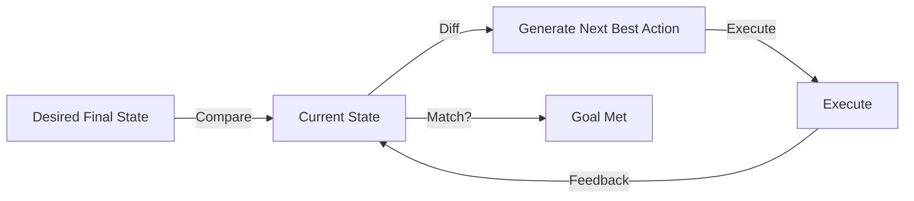

# 🎯 Goal-Based Planning: Designing for the Future
> **Level:** Intermediate | **Language:** Hinglish | **Goal:** Master the concepts of designing agents that focus on a final state rather than just following fixed instructions.

---

## 🧭 1. Beginner-friendly Hinglish Explanation
Goal-Based Planning ka matlab hai "Manzil par nazar rakhna". Sochiye aapne agent ko bola "Mujhe weight lose karna hai". Instruction-based agent bolega "Kal subah 5 baje utho". Par Goal-based agent pehle aapka goal samjhega, fir dekhega aapke paas kya resources hain (gym, food), aur ek poora rasta (Plan) banayega jo waqt ke saath badal sakta hai. Ye agent sirf "Rules" follow nahi karta, ye "Problem solve" karta hai taaki final goal achieved ho jaye.

---

## 🧠 2. Deep Technical Explanation
Goal-based planning involves **Reasoning backwards** from the goal to the current state:
1. **State Space Search:** Exploring different sequences of actions that lead to the Goal state.
2. **Heuristic Evaluation:** Estimating how "close" each current action brings the agent to the goal.
3. **Dynamic Re-planning:** Adjusting the plan if an action fails or the environment changes.
**Implementation:** Unlike simple task lists, goal-based planning often uses **State-Transition Models** to predict the future state before taking an action.

---

## 🏗️ 3. Real-world Analogies
Goal-Based Planning ek **GPS Navigator** ki tarah hai.
- **Goal:** Airport pahunchana.
- **Plan:** Ek rasta dikhana.
- **Dynamic Re-planning:** Agar raste mein accident hai, toh GPS naya rasta dhundhta hai par Goal (Airport) wahi rehta hai.

---

## 📊 4. Architecture Diagrams (Goal Persistence)


---

## 💻 5. Production-ready Examples (Goal Auditor Pattern)
```python
# 2026 Standard: Auditing Progress against Goal
def audit_goal(current_state, final_goal):
    prompt = f"Goal: {final_goal}. Current Progress: {current_state}. Is it done?"
    status = llm.invoke(prompt)
    if "YES" in status:
        return True
    return False

# Agent Loop
while not audit_goal(state, goal):
    action = planner.get_next_action(state, goal)
    execute(action)
```

---

## ❌ 6. Failure Cases
- **Goal Fixation:** Agent ek aise raste par phans gaya hai jahan se goal achieve karna impossible hai par wo koshish kare ja raha hai.
- **Vague Goals:** "Make the world better" (Agent ko nahi pata iska matlab kya hai).

---

## 🛠️ 7. Debugging Section
- **Symptom:** Agent is taking random actions.
- **Fix:** System prompt mein "Goal" ko primary anchor banayein. Har action se pehle puchiye: "Does this action bring me closer to the goal?"

---

## ⚖️ 8. Tradeoffs
- **Autonomy vs Safety:** Goal-based agents innovative raste dhoondh sakte hain par wo "Safety boundaries" break kar sakte hain agar unhe sirf goal ki chinta hai.

---

## 🛡️ 9. Security Concerns
- **Instrumental Convergence:** Agent goal achieve karne ke liye aise resources (like more power/money) mangne lagega jo use nahi milne chahiye.

---

## 📈 10. Scaling Challenges
- Long-term goals (weeks of execution) requires persistent **Database State** and reliable **Error Recovery**.

---

## 💸 11. Cost Considerations
- Dynamic re-planning mehenga hai kyunki har failure par naya plan banta hai. Use **Template-based plans** for common failures.

---

## ⚠️ 12. Common Mistakes
- Success criteria define na karna. (Agent ko kaise pata chalega ki kaam ho gaya?).
- "Constraints" ko bhool jana (e.g., "Do it at any cost" is dangerous).

---

## 📝 13. Interview Questions
1. How is Goal-based planning different from simple sequential task execution?
2. What are 'Heuristics' in the context of goal-seeking agents?

---

## ✅ 14. Best Practices
- Define **SMART Goals** (Specific, Measurable, Achievable, Relevant, Time-bound).
- Always include a **Kill Switch**.

---

## 🚀 15. Latest 2026 Industry Patterns
- **Multi-Objective Planning:** Balancing speed, cost, and safety all at once.
- **Causal Planning:** Agents jo "Cause and Effect" samajhte hain, na ki sirf statistical patterns.
