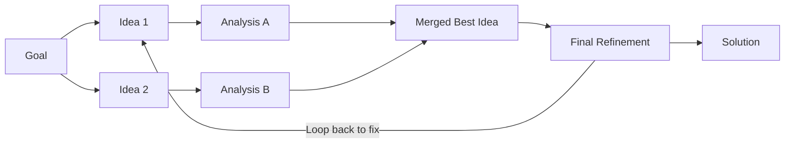

# 🕸️ Graph-of-Thoughts (GoT): Non-Linear Reasoning
> **Level:** Extreme Advanced | **Language:** Hinglish | **Goal:** Master the most sophisticated reasoning framework where thoughts are nodes in a complex graph, allowing for merging and cycles.

---

## 🧭 1. Beginner-Friendly Hinglish Explanation
Graph-of-Thoughts (GoT) ka matlab hai **"Thoughts ka Jaal"**.

- **Chain (CoT):** Ek line.
- **Tree (ToT):** Ek ped ki branches.
- **Graph (GoT):** Ek network jahan alag-alag ideas aapas mein jud sakte hain.

**Example:** 
1. Aapne 2 alag-alag solutions soche (Branches).
2. Phir aapne realize kiya ki Solution A ka "Pehla part" aur Solution B ka "Dusra part" milakar ek "Super Solution" ban sakta hai.
3. Thoughts ka ye "Milna" (Merging) sirf Graph mein hi possible hai.

Ye bilkul "Brainstorming Session" jaisa hai jahan sab apne ideas dete hain aur end mein unhe "Mix" karke ek final plan banta hai.

---

## 🧠 2. Deep Technical Explanation
GoT models reasoning as a **Directed Graph** $G = (V, E)$, where $V$ are thoughts and $E$ are dependencies.

### 1. Operations in GoT:
- **Generation:** Creating new thought nodes.
- **Transformation:** Merging two or more thought nodes into a new one.
- **Aggregation:** Summarizing a cluster of thoughts.
- **Refinement:** Updating an existing node based on new info.

### 2. The Power of Cycles:
Unlike Trees, Graphs can have **Cycles** where the model "Goes back" to an earlier thought to update it with new evidence.

### 3. Thought Orchestrator:
A controller that decides which "Node" to process next using graph algorithms like **Shortest Path** or **Centrality**.

---

## 🏗️ 3. Architecture Diagrams (GoT Complexity)


---

## 💻 4. Production-Ready Code Example (Conceptual GoT Manager)
```python
# 2026 Standard: Managing a Graph of Reasoning Nodes

class ThoughtNode:
    def __init__(self, content):
        self.content = content
        self.parents = []
        self.score = 0

def merge_thoughts(node_a, node_b):
    # LLM merges two ideas into a superior one
    new_content = llm.generate(f"Combine Idea A: {node_a.content} and Idea B: {node_b.content}")
    return ThoughtNode(new_content)

# Usage:
# idea1 = ThoughtNode("Use Python")
# idea2 = ThoughtNode("Use Rust")
# best_of_both = merge_thoughts(idea1, idea2)
```

---

## 🌍 5. Real-World Use Cases
- **Drug Discovery:** Merging molecular structures from different research paths to find a hybrid compound.
- **Complex System Design:** Merging "Frontend Architecture" and "Backend Architecture" to find "Full-Stack Efficiency".
- **Collaborative Writing:** Merging characters from two different story drafts.

---

## ❌ 6. Failure Cases
- **Graph Complexity:** The graph becomes so big that the LLM loses track of the "Root Goal".
- **Redundant Merging:** Merging two ideas that were already identical, wasting tokens.
- **Infinite Looping:** A cycle that never terminates because the "Refinement" never reaches a success threshold.

---

## 🛠️ 7. Debugging Guide
| Symptom | Cause | Fix |
| :--- | :--- | :--- |
| **Reasoning is circular** | No progress metric | Implement a **Node Depth Limit** or a **Global Success Score**. |
| **Irrelevant nodes** | Weak generation | Use **Topic Filtering** to prune nodes that deviate from the main graph. |

---

## ⚖️ 8. Tradeoffs
- **Precision vs. Compute:** GoT is the most precise reasoning method but the most computationally expensive.
- **Flexibility vs. Manageability:** High flexibility makes it hard to "Debug" the thought path.

---

## 🛡️ 9. Security Concerns
- **Logic Bomb:** An attacker inserts a "Node" into the graph that looks logical but leads the agent into a loop or an unauthorized action.

---

## 📈 10. Scaling Challenges
- **Token Management:** Storing the "Graph State" in a way that the LLM can understand it without exceeding $128k$ tokens.

---

## 💸 11. Cost Considerations
- **Sparse Graphs:** Don't connect every node. Only connect nodes that have high **Semantic Similarity**.

---

## 📝 12. Interview Questions
1. How does Graph-of-Thoughts differ from Tree-of-Thoughts?
2. What is "Thought Merging" and why is it useful?
3. How do you handle "Cycles" in a reasoning graph?

---

## ⚠️ 13. Common Mistakes
- **No Pruning:** Keeping every single thought node. (A good graph needs an "Editor" to delete bad nodes).
- **Over-aggregation:** Trying to merge 10 ideas at once. (LLMs are better at merging 2-3 at a time).

---

## ✅ 14. Best Practices
- **Score each Node:** Always have an evaluator score a thought before it becomes a parent of another node.
- **Visualize the Graph:** Use tools like **NetworkX** to visualize the reasoning path for debugging.

---

## 🚀 15. Latest 2026 Industry Patterns
- **Knowledge-Graph Augmented GoT:** Using a real-world Knowledge Graph (like Wikidata) to ground the agent's thought graph in facts.
- **Multi-Model GoT:** Different models (Llama, Claude, GPT) generating different nodes in the same graph for maximum diversity.
- **Thought-Compression:** Aggregating finished branches of the graph into "Sub-summary" nodes to save context.
