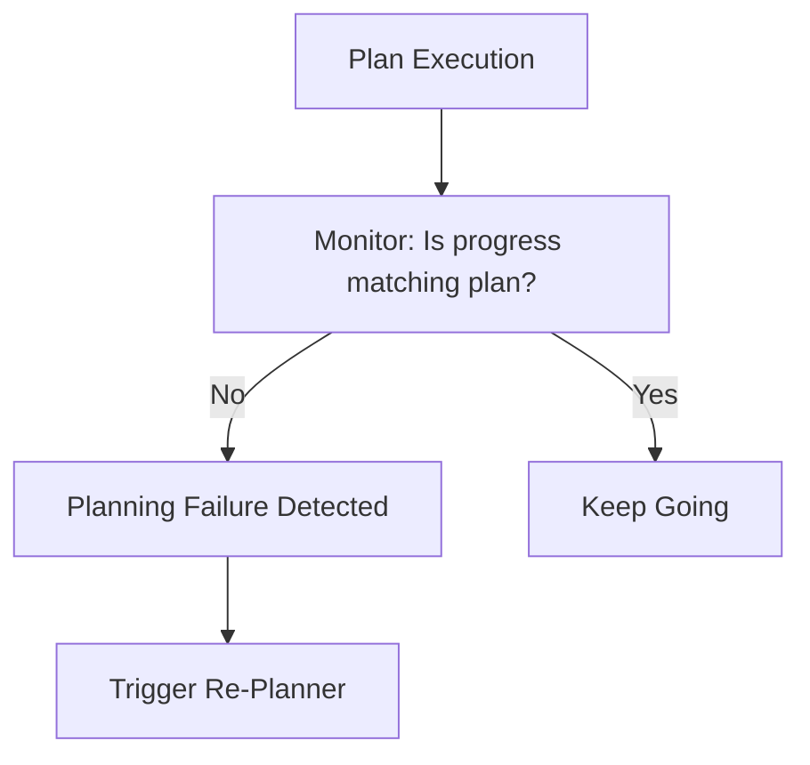

# ⚠️ Planning Failure Cases: Why Agents Fail
> **Level:** Advanced | **Language:** Hinglish | **Goal:** Master the identification and mitigation of common planning failures in autonomous systems.

---

## 🧭 1. Beginner-friendly Hinglish Explanation
Planning Failure ka matlab hai agent ka "Ghalat Naksha" bana lena. Sochiye aapne agent ko bola "Agra jao". Agent ne plan banaya: "Ghar se niklo, car start karo, drive karo". Par usne ye nahi dekha ki car mein petrol nahi hai ya rasta band hai. Planning failure tab hota hai jab agent future ko sahi se predict nahi kar pata, ya uske paas adhuri jankari (Incomplete Info) hoti hai. Ye section aapko sikhayega ki in galtiyon ko kaise pehchanein aur system ko crash hone se bachayein.

---

## 🧠 2. Deep Technical Explanation
Planning failures typically fall into four categories:
1. **Model Inaccuracy:** The LLM's internal "World Model" is wrong (e.g., thinks a tool can do X, but it can't).
2. **Environment Non-determinism:** The environment changes unexpectedly after the plan is made (Stale Plan).
3. **Reasoning Myopia:** The agent focuses on short-term gains but misses long-term constraints (Greedy failure).
4. **Recursive Deadlock:** The agent creates sub-tasks that depend on each other in a loop.

---

## 🏗️ 3. Real-world Analogies
Planning failure ek **Trekker** ki tarah hai.
- Trekker ne purana map use kiya (Model Inaccuracy).
- Beech raste mein barish ho gayi (Environment change).
- Wo thak gaya aur shortcut liya jo daldal mein khatam hua (Reasoning Myopia).

---

## 📊 4. Architecture Diagrams (Failure Detection)


---

## 💻 5. Production-ready Examples (Detecting Stale Plans)
```python
# 2026 Standard: Validating Plan Feasibility
def validate_plan(plan, environment_state):
    for step in plan:
        if not can_execute(step, environment_state):
            return False, f"Step {step} is impossible in current state."
    return True, "Success"

# Usage
is_valid, error = validate_plan(my_plan, current_db_status)
if not is_valid:
    replan_agent.fix_plan(my_plan, error)
```

---

## ❌ 6. Failure Cases
- **The Infinite Re-planner:** Agent ko galti milti hai, wo naya plan banata hai, usme bhi galti hoti hai... aur ye chalta rehta hai.
- **Resource Exhaustion:** Planning itni complex ho gayi ki agent ne tokens/budget pehle hi khatam kar diya bina kaam shuru kiye.

---

## 🛠️ 7. Debugging Section
- **Symptom:** Agent repeats Step 2 over and over.
- **Fix:** Check the **Observation Feedback**. Kya Step 2 ka output wapas planner ko mil raha hai? Planner ko batayein ki "Step 2 failed 3 times, change strategy".

---

## ⚖️ 8. Tradeoffs
- **Reactive Re-planning vs Proactive Monitoring:** Har step par re-plan karna (Safe but slow) vs end mein check karna (Fast but risky).

---

## 🛡️ 9. Security Concerns
- **Exploiting Planning Gaps:** Hackers system mein aise changes kar sakte hain jo agent ke plan ko "Obsolesce" kar dein aur use unsafe paths par bhej dein.

---

## 📈 10. Scaling Challenges
- High-concurrency systems mein "Environment Change" milisec mein hota hai. Planning layers ko extremely fast hona zaroori hai.

---

## 💸 11. Cost Considerations
- Failures are expensive. Every re-plan is a new LLM call. Use **Heuristic Checkers** (Rule-based) to detect failures before calling the LLM.

---

## ⚠️ 12. Common Mistakes
- **Assuming tool success:** Hamesha maan lena ki tool sahi result dega.
- No "Abort" condition.

---

## 📝 13. Interview Questions
1. How do you handle 'Stale Plans' in a dynamic production environment?
2. What is 'Hallucinated Planning' and how do you prevent it?

---

## ✅ 14. Best Practices
- Implement **Execution Monitoring** at every step.
- Use **Checkpoints** for long plans.

---

## 🚀 15. Latest 2026 Industry Patterns
- **Anticipatory Planning:** Agents jo multiple failure scenarios ko pehle hi "Simulate" karte hain.
- **Self-Healing Plans:** Plans jo failure par automatically backup steps switch kar lete hain bina LLM call ke.
