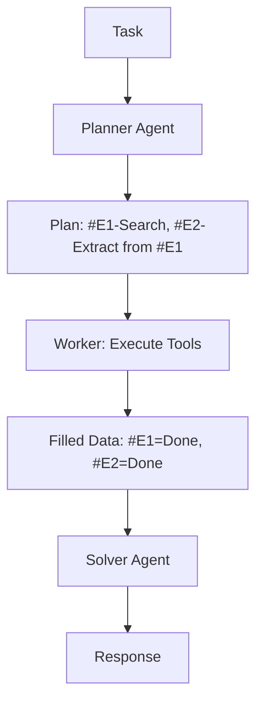

# 🚀 ReWOO: Reasoning Without Observation
> **Level:** Advanced | **Language:** Hinglish | **Goal:** Master the token-efficient reasoning framework that reduces costs and latency by decoupling planning from execution.

---

## 🧭 1. Beginner-friendly Hinglish Explanation
ReWOO ka matlab hai "Bina dekhe sochna". Standard agents (jaise ReAct) har step ke baad raste ko dekhte hain (Wait for observation), jisme time aur tokens zyada lagte hain. ReWOO ek aisa smart agent hai jo shuruat mein hi "Poora Plan" aur "Tools ki list" bana leta hai, aur fir saare tools ko ek saath (Parallel) chala deta hai. Ye bilkul waisa hi hai jaise aap ghar se nikalne se pehle hi decide kar lein ki "Dukaan se doodh lena hai, fir post office jana hai, fir bank"—aap har mod par ruk kar GPS nahi dekhte.

---

## 🧠 2. Deep Technical Explanation
ReWOO (Reasoning Without Observation) architecture decouples the reasoning process into 3 stages:
1. **The Planner:** Takes the task and generates a **Plan Blueprint** with "Placeholders" for tool outputs (e.g., `#E1`, `#E2`).
2. **The Worker:** Executes the tools in parallel or sequence as defined by the plan. It doesn't need to "Reason" anymore, it just fills the placeholders.
3. **The Solver:** Collects the completed data and gives the final answer.
**Benefit:** Significant reduction in token usage (up to 5x) and latency (due to parallel tool execution).

---

## 🏗️ 3. Real-world Analogies
ReWOO ek **Doctor's Prescription** ki tarah hai.
- **Planner (Doctor):** Likhta hai "Pehle Blood Test karao, fir X-ray, fir report lekar aao".
- **Worker (Patient):** Test karata hai (Parallelly in lab).
- **Solver (Doctor):** Reports dekhkar dawai deta hai.
Doctor ko patient ke saath har test lab mein jane ki zarurat nahi hai.

---

## 📊 4. Architecture Diagrams (The Blueprint Pattern)


---

## 💻 5. Production-ready Examples (ReWOO Plan Format)
```python
# 2026 Standard: ReWOO Plan Template
plan_blueprint = """
Step 1: Search for 'SusaLabs Q3 Earnings' on Google. (Tool: search, ID: #E1)
Step 2: Extract the net profit from the text in #E1. (Tool: extract, ID: #E2)
Step 3: Compare #E2 with Q2 profit ($5M). (Tool: math, ID: #E3)
"""

# Worker logic:
# results['#E1'] = run_search(...)
# results['#E2'] = run_extract(results['#E1'])
```

---

## ❌ 6. Failure Cases
- **Dynamic Dependency:** Agar Step 2 ka input bilkul unknown hai Step 1 khatam hone se pehle (e.g., "Step 1 se jo link mile use open karo"). Yahan ReWOO fail ho sakta hai kyunki wo link pehle se nahi janta.
- **Cascading Errors:** Planner ne galat plan banaya, toh Worker bina soche wahi galat tools chalayega.

---

## 🛠️ 7. Debugging Section
- **Symptom:** Worker is trying to call #E1 as a literal string.
- **Fix:** Regex parser check karein jo placeholders (`#E1`) ko replace karta hai actual results se.

---

## ⚖️ 8. Tradeoffs
- **Efficiency vs Flexibility:** ReWOO sasta aur fast hai par ye ReAct jitna flexible nahi hai "Surprises" handle karne ke liye.

---

## 🛡️ 9. Security Concerns
- **Plan Poisoning:** Agar planner malicious tool calls plan mein add kar de, toh worker bina verification ke unhe execute kar dega.

---

## 📈 10. Scaling Challenges
- Complex multi-step plans (10+ steps) manage karna mushkil hai. Context window issues aa sakte hain solver stage par.

---

## 💸 11. Cost Considerations
- **Huge Savings:** Multiple LLM loops ki zarurat nahi hai, isliye input tokens kafi bach jate hain.

---

## ⚠️ 12. Common Mistakes
- Planner ko tool definitions clear na dena.
- Parallel tools ke beech dependencies ko mismanage karna.

---

## 📝 13. Interview Questions
1. How does ReWOO reduce the 'Token Overhead' compared to ReAct?
2. What are the 3 core components of the ReWOO architecture?

---

## ✅ 14. Best Practices
- Use **Structured Output** for the planner to ensure the blueprint is always parseable.
- Combine with **Re-planning** only if a critical step fails.

---

## 🚀 15. Latest 2026 Industry Patterns
- **Async-ReWOO:** Executing millions of tool calls in high-throughput environments using serverless workers.
- **Speculative ReWOO:** Predicting tool results to pre-fill parts of the plan for near-zero latency.
