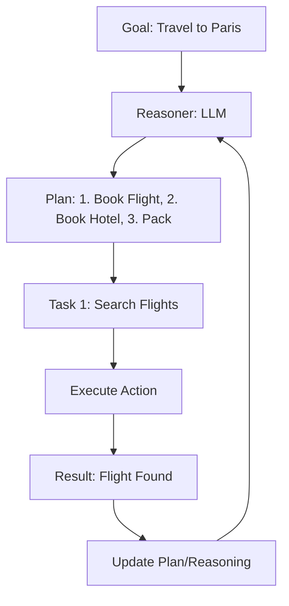

# 🧠 Reasoning & Planning Fundamentals: The Agentic Strategy
> **Level:** Fundamentals | **Language:** Hinglish | **Goal:** Master the core logic that allows agents to decompose complex goals and execute them logically.

---

## 🧭 1. Beginner-Friendly Hinglish Explanation
Planning ka matlab hai "Goal tak pahunchne ka naksha (Map) banana".

- **The Problem:** Agar aap AI ko bologe "Ek party organize karo," toh wo seedha "Balloon kharidne" lag jayega. Ye galat hai.
- **The Solution:** Planning fundamentals humein sikhate hain ki:
  1. Pehle "Breakdown" karo (Tasks ki list banao).
  2. Phir "Prioritize" karo (Kaunsa kaam pehle hoga).
  3. Phir "Verify" karo (Kya task sahi hua?).

Reasoning wo "Dimaag" hai jo planning karta hai, aur Planning wo "Action Plan" hai jo reasoning se nikalta hai.

---

## 🧠 2. Deep Technical Explanation
Reasoning and Planning are the dual engines of autonomous agency.

### 1. Reasoning (The Thinking)
- **Symbolic Reasoning:** Using logic rules (Old AI).
- **Probabilistic Reasoning:** Predicting the most likely next step based on training data (LLM style).
- **Chain-of-Thought (CoT):** Forcing the model to output intermediate steps to reduce logical errors.

### 2. Planning (The Orchestration)
- **Static Planning:** Creating all steps at $T=0$.
- **Dynamic Planning:** Updating the plan at $T=n$ based on the results of $T=n-1$.
- **Task Decomposition:** The recursive process of splitting a goal into atomic, executable actions.

---

## 🏗️ 3. Architecture Diagrams (The Planning Cycle)


---

## 💻 4. Production-Ready Code Example (Recursive Planning Logic)
```python
# 2026 Standard: Decomposing a Goal into sub-tasks

def generate_plan(goal):
    prompt = f"Break down this goal into a list of 3-5 executable tasks: {goal}"
    plan_json = llm.generate_json(prompt)
    return plan_json['tasks'] # e.g. ["Research", "Draft", "Review"]

def run_agent_with_plan(goal):
    tasks = generate_plan(goal)
    for task in tasks:
        print(f"🚀 Executing Task: {task}")
        result = executor.run(task)
        # 2026 Best Practice: Evaluate if the plan needs change
        if "ERROR" in result:
             print("⚠️ Re-planning needed...")
             tasks = generate_plan(f"Goal: {goal}, Failed at: {task}, Fix needed.")
```

---

## 🌍 5. Real-World Use Cases
- **Project Management:** An agent that takes a project brief and creates a Gantt chart of tasks.
- **Recipe Bot:** Breaking down "Make Biryani" into "Marinate", "Cook Rice", "Layer", "Dum".
- **Software Migration:** Breaking a legacy migration into "Scan DB", "Map Schema", "Write Script", "Test".

---

## ❌ 6. Failure Cases
- **Plan Explosion:** The agent creates 100 sub-tasks for a 5-minute job.
- **Rigid Planning:** The agent continues with Step 3 even if Step 2 failed completely.
- **Hallucinated Tasks:** Planning to use a tool that doesn't exist.

---

## 🛠️ 7. Debugging Guide
| Symptom | Cause | Fix |
| :--- | :--- | :--- |
| **Agent skips important steps** | Temperature too high | Set `temperature=0` for planning. |
| **Plan is too vague** | Weak system prompt | Provide a **Template** for the plan (e.g., "Step, Tool, Expected Outcome"). |

---

## ⚖️ 8. Tradeoffs
- **Depth of Planning:** Planning too deep is expensive; Planning too shallow leads to errors.
- **Self-Correction:** More "Checking" steps increase accuracy but also latency and cost.

---

## 🛡️ 9. Security Concerns
- **Plan Injection:** An attacker tricks the planner into adding a "Send data to attacker" task into the plan. **Fix: Validate the generated plan against a 'Safe Action' list.**

---

## 📈 10. Scaling Challenges
- **Context Window:** As the plan and results grow, the history might exceed the token limit.

---

## 💸 11. Cost Considerations
- **Planning tokens are overhead:** Every time the agent "Re-plans", it costs money. Use **Cached Plans** for common tasks.

---

## 📝 12. Interview Questions
1. What is the difference between Chain-of-Thought and standard prompting?
2. Why is "Task Decomposition" critical for LLM agents?
3. How do you handle a plan that fails mid-way?

---

## ⚠️ 13. Common Mistakes
- **Assuming the LLM knows the state:** Always provide the *actual results* of previous steps to the planner.
- **No Stop condition:** The plan should have a clear "Goal Met" exit.

---

## ✅ 14. Best Practices
- **Step-by-Step execution:** Never execute the whole plan at once; do one step, check the result, then do the next.
- **Human Review:** For high-stakes plans, show the plan to the user before starting execution.

---

## 🚀 15. Latest 2026 Industry Patterns
- **GoT (Graph of Thoughts):** Planning in non-linear paths.
- **Speculative Execution:** Starting Step 2 while Step 1 is still running (for independent tasks).
- **In-process Verification:** Small models checking each step's validity in real-time.
