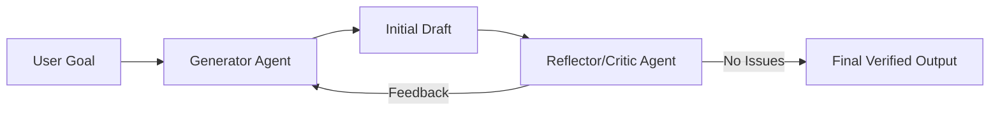

# 💡 Reflection and Self-Correction: The Loop of Excellence
> **Level:** Advanced | **Language:** Hinglish | **Goal:** Master the techniques that allow agents to audit their own thoughts and outputs to minimize hallucinations.

---

## 🧭 1. Beginner-friendly Hinglish Explanation
Reflection aur Self-Correction ka matlab hai "Apna kaam khud check karna". Sochiye aapne ek email likha aur use send karne se pehle dubara padha (Reflection). Aapko ek spelling mistake mili aur aapne use theek kiya (Self-Correction). AI Agents ke liye ye kafi zaroori hai kyunki wo aksar "Over-confident" hote hain. Ye architecture agent ko ek "Inner Voice" deta hai jo use bolti hai: "Ruko, kya ye sahi hai? Dubara check karo".

---

## 🧠 2. Deep Technical Explanation
This reasoning pattern involves two sub-steps:
1. **The Reflection Step:** After generating a response, the agent (or a separate "Critic" agent) analyzes it for errors, hallucinations, or logic gaps based on specific criteria (e.g., "Does this follow the user's budget?").
2. **The Correction Step:** The agent uses the feedback from the reflection to update the original output.
**Techniques:**
- **Self-Critique:** Agent critiquing its own output.
- **External Evaluation:** Using tools (like unit tests or code linters) to provide factual feedback for correction.

---

## 🏗️ 3. Real-world Analogies
Reflection ek **Newspaper Editor** ki tarah hai.
- **Writer (Agent):** News article likhta hai.
- **Editor (Reflection):** Galtiyan nikaalta hai.
- **Correction:** Final article print hone se pehle theek hota hai.

---

## 📊 4. Architecture Diagrams (The Correction Loop)


---

## 💻 5. Production-ready Examples (Self-Correction Prompt)
```python
# 2026 Standard: Reflexion Loop Prompting
def self_correct(task, initial_output):
    critique_prompt = f"Review this for logic errors: {initial_output}"
    feedback = llm.invoke(critique_prompt)
    
    if "ERROR" in feedback:
        final_prompt = f"Task: {task}\nInitial Attempt: {initial_output}\nFeedback: {feedback}\nFix it."
        return llm.invoke(final_prompt)
    return initial_output
```

---

## ❌ 6. Failure Cases
- **Over-Correction Bias:** Agent sahi output ko bhi "Feedback" ke chakkar mein galat kar deta hai (Self-doubt).
- **Infinite Loop:** Agent aur Critic ek dusre ki baat se sehmat nahi ho rahe aur loops mein phanse huye hain.

---

## 🛠️ 7. Debugging Section
- **Symptom:** Agent keeps saying "I've corrected it" but the error is still there.
- **Fix:** Critic ko force karein ki wo **Exact Line Number** aur **Fix Suggestion** de. Sirf "It is wrong" se agent nahi seekhega.

---

## ⚖️ 8. Tradeoffs
- **Accuracy vs Cost:** Accuracy badhti hai par token cost 2x-3x ho jata hai har loop ke saath.

---

## 🛡️ 9. Security Concerns
- **Validation Bypass:** Agar koi reflection layer ko bypass kar de, toh agent harmful content generate kar sakta hai bina detect huye.

---

## 📈 10. Scaling Challenges
- Millions of users ke liye Reflection chalaana compute-intensive hai. Use **Sampling Reflection** (sirf 10% difficult queries par reflection chalaana).

---

## 💸 11. Cost Considerations
- Use **Small Models** for the Generator and a **Large Model** (like Claude-3-Opus) for the Critic for high-fidelity correction.

---

## ⚠️ 12. Common Mistakes
- Bina metrics ke reflection chalaana. (Agent ko batayein kya check karna hai: Spelling? Logic? Code?).
- History manage na karna (Agent ko bhool jata hai ki usne pichle loop mein kya correction kiya tha).

---

## 📝 13. Interview Questions
1. How does 'Self-Correction' reduce Hallucinations in agents?
2. What is the difference between 'Verbal Reinforcement' and 'Self-Critique'?

---

## ✅ 14. Best Practices
- Define a **Maximum Reflection Limit** (e.g., 2 rounds).
- Provide **Few-Shot Examples** of good vs bad outputs in the critic prompt.

---

## 🚀 15. Latest 2026 Industry Patterns
- **Multi-Model Consensus:** Three different models (GPT, Claude, Llama) reflecting on each other's work for maximum truth.
- **Autonomous Error Logging:** Agents jo apni corrections se seekhkar "System Prompt" ko automatically update karte hain for future runs.
