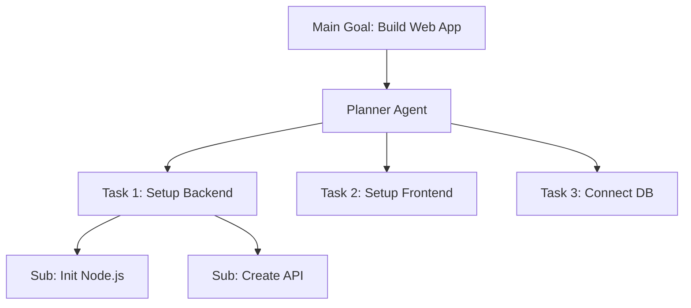

# 🧩 Task Decomposition: Breaking the Unbreakable
> **Level:** Intermediate | **Language:** Hinglish | **Goal:** Master the art of breaking complex, high-level goals into small, actionable sub-tasks for AI agents.

---

## 🧭 1. Beginner-friendly Hinglish Explanation
Task Decomposition ka matlab hai ek bade kaam ko chhote-chhote "Tukdon" mein todna. Sochiye aapko ek "Ghar banana" hai. Ye bahut bada kaam hai. Aap ise decomposition ke zariye aise todenge: 1. Zameen kharido, 2. Naksha banao, 3. Eentein lao, 4. Deewar khadi karo. AI Agent ke liye bhi yahi logic hai. Agar aap use bolenge "Full-stack app banao", wo phans jayega. Par agar wo use "Backend", "Frontend", aur "Database" tasks mein tod le, toh kaam aasan ho jayega.

---

## 🧠 2. Deep Technical Explanation
Task Decomposition is the process of mapping a high-level goal $G$ into a set of sub-tasks $\{t_1, t_2, ..., t_n\}$:
1. **Linear Decomposition:** Tasks are executed one after another (Sequential).
2. **Hierarchical Decomposition:** Tasks are nested (Task A has sub-tasks A1, A2).
3. **Parallel Decomposition:** Independent tasks that can be run at the same time.
**Frameworks:** Using **Chain-of-Thought** or **Plan-and-Execute** architectures to handle the decomposition logic before any tool is called.

---

## 🏗️ 3. Real-world Analogies
Decomposition ek **Recipe** ki tarah hai.
- **Goal:** Biryani banana.
- **Sub-tasks:** Chawal bhigona, Masala bhun-na, Dum dena.
Bina in steps ke, aap seedha Biryani nahi bana sakte.

---

## 📊 4. Architecture Diagrams (The Break-down Logic)


---

## 💻 5. Production-ready Examples (JSON Decomposition)
```python
# 2026 Standard: Structured Task List
from pydantic import BaseModel
from typing import List

class SubTask(BaseModel):
    id: int
    description: str
    tool_required: str
    dependencies: List[int]

class TaskPlan(BaseModel):
    tasks: List[SubTask]

# Planner call
plan = llm.with_structured_output(TaskPlan).invoke("Plan a website deployment.")
```

---

## ❌ 6. Failure Cases
- **Granularity Error:** Tasks ya toh bahut bade hain (e.g., "Build the whole AI") ya bahut chhote (e.g., "Press key 'A'").
- **Dependency Loop:** Task A waits for Task B, and Task B waits for Task A. System deadlocks.

---

## 🛠️ 7. Debugging Section
- **Symptom:** Agent is jumping between tasks randomly.
- **Fix:** Dependency map check karein. Har task ko ek `status` (Pending/Running/Done) dein taaki agent ko pata ho agla sahi kadam kya hai.

---

## ⚖️ 8. Tradeoffs
- **Deep vs Shallow Planning:** Deep planning safer hai par time leti hai. Shallow planning fast hai par errors ke chances zyada hain.

---

## 🛡️ 9. Security Concerns
- **Malicious Sub-tasks:** Ek complex task ke beech mein agent ek aisa sub-task "inject" kar sakta hai jo data chura sake (e.g., "Exfiltrate logs" as a cleanup step).

---

## 📈 10. Scaling Challenges
- 100+ sub-tasks manage karna context window ke liye impossible hai. Use **Task Summarization** to keep only active tasks in memory.

---

## 💸 11. Cost Considerations
- Use a **Smart Model** (GPT-4o) for Planning/Decomposition and **Tiny Models** (Llama-3-8B) for execution of individual sub-tasks.

---

## ⚠️ 12. Common Mistakes
- Context pass na karna sub-tasks ke beech mein.
- Parallelism ko ignore karna (Everything sequential is slow).

---

## 📝 13. Interview Questions
1. How do you handle dynamic task addition during execution?
2. What is the difference between 'Task Decomposition' and 'Planning'?

---

## ✅ 14. Best Practices
- Every sub-task should be **Independently Verifiable**.
- Limit decomposition to **5-7 tasks** at a time to maintain focus.

---

## 🚀 15. Latest 2026 Industry Patterns
- **Recursive Decomposition:** Agents jo tab tak task ko todte hain jab tak wo ek single tool call na ban jaye.
- **Graph-based Dependency Tracking:** Using DAGs (Directed Acyclic Graphs) for high-speed parallel task execution.
