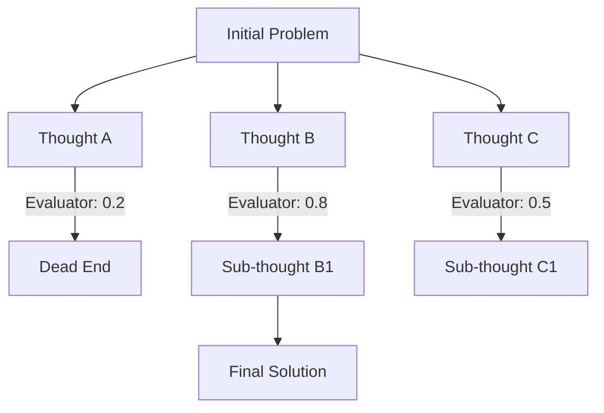

# 🌲 Tree-of-Thoughts (ToT): Parallel Reasoning & Search
> **Level:** Extreme Advanced | **Language:** Hinglish | **Goal:** Master the technique of branching and backtracking in AI reasoning to solve high-complexity problems.

---

## 🧭 1. Beginner-Friendly Hinglish Explanation
Tree-of-Thoughts (ToT) ka matlab hai **"Multiple raaste dhoondna"**.

- **Chain-of-Thought (CoT):** Ek seedha rasta (Step 1 -> Step 2 -> Step 3). Agar Step 1 galat, toh sab galat.
- **Tree-of-Thoughts (ToT):** 
  - AI ek step ke liye 3-4 alag alag possibilities (Branches) sochta hai.
  - Phir har branch ko "Evaluate" karta hai: "Kya ye raasta sahi hai?"
  - Jo raasta galat lagta hai, use chhod deta hai (**Pruning**).
  - Jo sahi lagta hai, uspar aage badhta hai.
  - Agar dead-end par pahunch jaye, toh piche aakar dusra raasta pakadta hai (**Backtracking**).

Ye bilkul **Sudoku** ya **Chess** khelne jaisa hai jahan aap 3-4 moves aage ka sochte hain.

---

## 🧠 2. Deep Technical Explanation
ToT is a framework that frames reasoning as a **Search Problem** over a tree of "Thought Units".

### 1. Thought Decomposition:
Breaking the problem into multiple "Nodes" (Sub-steps).

### 2. Thought Generator ($G$):
Generating multiple diverse candidates for the next step.
- *Prompt:* "Given the current state, what are the next 3 logical steps?"

### 3. State Evaluator ($E$):
Heuristically scoring each candidate (e.g., "Sure", "Maybe", "Impossible").
- *Prompt:* "Evaluate these 3 steps. Which one is most likely to lead to the solution?"

### 4. Search Algorithm:
Using **BFS** (Breadth-First Search) or **DFS** (Depth-First Search) to navigate the tree of thoughts.

---

## 🏗️ 3. Architecture Diagrams (ToT Branching)


---

## 💻 4. Production-Ready Code Example (Conceptual ToT Controller)
```python
# 2026 Standard: Implementing a Search-based Reasoning Loop

def tot_solve(problem):
    tree = {"root": problem, "children": []}
    
    # 1. GENERATE candidates
    candidates = llm.generate_candidates(problem, count=3)
    
    # 2. EVALUATE candidates
    scores = [llm.evaluate(c) for c in candidates]
    
    # 3. SELECT best branch
    best_candidate = candidates[np.argmax(scores)]
    
    # 4. RECURSE
    return tot_solve(best_candidate)

# Mastery Insight: ToT is $10x$ more expensive than CoT but solves problems 
# that CoT simply cannot (Creative Writing, Logic Puzzles).
```

---

## 🌍 5. Real-World Use Cases
- **Creative Writing:** Exploring 5 different plot twists and picking the one that makes most sense for the ending.
- **Scientific Discovery:** Simulating multiple chemical reaction paths.
- **Financial Strategy:** Branching out different "What-if" scenarios for the market.

---

## ❌ 6. Failure Cases
- **Exponential Growth:** If every step has 3 branches, by Step 5 you have $3^5 = 243$ LLM calls. (Extremely expensive).
- **Bad Heuristics:** The "Evaluator" LLM incorrectly marks a "Good" path as "Impossible".
- **Infinite Search:** Searching in circles without reaching a conclusion.

---

## 🛠️ 7. Debugging Guide
| Symptom | Cause | Fix |
| :--- | :--- | :--- |
| **Search is too slow** | Too many branches | Implement **Pruning** - kill any branch with a score < 0.3 immediately. |
| **Found solution is poor** | Evaluator is too "Lazy" | Use a larger model (GPT-4o) for Evaluation and a smaller one for Generation. |

---

## ⚖️ 8. Tradeoffs
- **Accuracy vs. Cost:** ToT is the "Gold Standard" for accuracy but the "Nightmare" for cost.
- **Latency:** ToT can take minutes to solve a single problem.

---

## 🛡️ 9. Security Concerns
- **Exploration Exploits:** An attacker tricks the ToT search into focusing all its compute on a "Useless" or "Harmful" branch, causing a Denial of Service (DoS) on your API budget.

---

## 📈 10. Scaling Challenges
- **Parallelization:** Running multiple branches of the tree in parallel requires complex orchestration of LLM API rate limits.

---

## 💸 11. Cost Considerations
- **Early Pruning:** This is the only way to make ToT viable. If you don't kill bad branches early, you will go bankrupt.

---

## 📝 12. Interview Questions
1. How does Tree-of-Thoughts differ from Chain-of-Thought?
2. What is "Backtracking" in the context of LLM reasoning?
3. Explain the role of the "Evaluator" in ToT.

---

## ⚠️ 13. Common Mistakes
- **No Diversity:** The Generator produces 3 branches that are all almost identical. **Fix: Use high 'Temperature' for generation.**
- **Assuming the first path is best:** Not exploring other branches even when the first one looks "Okay".

---

## ✅ 14. Best Practices
- **Use DFS for Depth, BFS for Breadth:** DFS is better if you think the solution is deep; BFS is better if you want to explore all immediate options.
- **Limit Tree Depth:** Never let the tree go deeper than 5-10 levels.

---

## 🚀 15. Latest 2026 Industry Patterns
- **MCTS (Monte Carlo Tree Search) for LLMs:** Using the same logic as AlphaZero to search the space of thoughts.
- **Self-Play ToT:** Two models playing "ToT" against each other to find the most robust solution.
- **ToT-Distillation:** Taking the "Winning Path" from a ToT run and using it to fine-tune a smaller model so it can do it in "One shot" (CoT).
