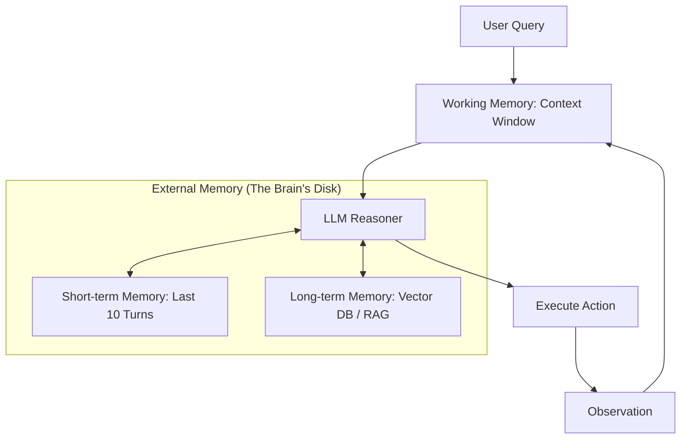

# 🧠 Agent Memory Fundamentals: The Architecture of Recall
> **Level:** Fundamentals | **Language:** Hinglish | **Goal:** Master the core principles of how agents perceive, store, and utilize information over time.

---

## 🧭 1. Beginner-Friendly Hinglish Explanation
Memory ka matlab hai AI ki "Yaaddasht". 

- **The Problem:** Ek standard LLM (jaise GPT-4) ek baar mein sirf kuch hi hazar words yaad rakh sakta hai. Agar aap 2 ghante baat karoge, toh wo pehli baat bhool jayega.
- **The Solution:** Humein agent ke liye ek "External Brain" banana padta hai.
  1. **Working Memory:** Current chat (Jo abhi screen par hai).
  2. **Short-term Memory:** Pichle kuch minutes ki baatein (Summarized).
  3. **Long-term Memory:** Purani meetings, documents, aur preferences (Vector DB mein store ki hui).

Bina memory ke agent ek aise worker ki tarah hai jise har kaam zero se sikhana pade.

---

## 🧠 2. Deep Technical Explanation
Agent memory is a multi-tiered architecture designed to overcome the **Context Window Bottleneck**.

### 1. Episodic Memory (The "What Happened")
- Stores sequences of past experiences (e.g., "Step 1: Searched Google, Step 2: Found nothing").
- Essential for **Self-Correction** and avoiding repetitive mistakes.

### 2. Semantic Memory (The "What is True")
- Stores facts, concepts, and relationships.
- Typically implemented using **Vector Embeddings** and **Semantic Search**.

### 3. Working Memory (The "Current Task")
- The immediate context window ($128k - 1M$ tokens).
- Stores the current goal, the active plan, and the last few observations.

### 4. Procedural Memory (The "How To")
- Implicitly stored in fine-tuned weights or explicitly in "System Instruction" files that teach the agent how to use specific tools.

---

## 🏗️ 3. Architecture Diagrams (The Tiered Memory)


---

## 💻 4. Production-Ready Code Example (A Memory Manager)
```python
# 2026 Standard: Managing short-term and long-term memory handoffs

class MemoryManager:
    def __init__(self, user_id):
        self.buffer = [] # Short-term
        self.vector_db = connect_to_pinecone(user_id) # Long-term

    def get_context(self, current_query):
        # 1. Get recent turns
        recent = self.buffer[-5:]
        
        # 2. Search long-term memory for relevant past facts
        relevant_past = self.vector_db.search(current_query)
        
        return f"Past Facts: {relevant_past}\nRecent Chat: {recent}"

    def update_memory(self, query, response):
        self.buffer.append({"q": query, "a": response})
        # If buffer is too long, move to Long-term
        if len(self.buffer) > 20:
            self.archive_to_vector_db(self.buffer.pop(0))
```

---

## 🌍 5. Real-World Use Cases
- **Customer Support:** Remembering a user's previous complaints to provide better service.
- **Coding Agents:** Keeping track of cross-file dependencies in a large repository.
- **Personal Assistants:** Remembering your family members' birthdays and gift preferences.

---

## ❌ 6. Failure Cases
- **Context Overload:** Too much memory in the prompt makes the agent "Slow" and "Stupid". (The LLM gets confused).
- **Retrieval Error:** The long-term memory brings back a document that looks relevant but is actually for a different user. **Fix: Metadata Filtering.**
- **Stale Memory:** Remembering that "The server is down" from 2 days ago, even though it's up now.

---

## 🛠️ 7. Debugging Guide
| Symptom | Cause | Fix |
| :--- | :--- | :--- |
| **Agent repeats itself** | Memory retrieval is too aggressive | Lower the **Top-K** or increase the **Similarity Threshold**. |
| **Agent forgets the user's name** | Short-term buffer cleared too early | Pin "Essential Facts" to the system prompt so they are never cleared. |

---

## ⚖️ 8. Tradeoffs
- **Full History vs. Summary:** Full history is accurate but token-heavy; Summary is cheap but can lose nuance.
- **Local vs. Cloud Memory:** Local is private/fast; Cloud is persistent/shared.

---

## 🛡️ 9. Security Concerns
- **Memory Injection:** An attacker tricks the agent into "Saving" a false fact into its long-term memory for future use.
- **Privacy:** Storing sensitive data (SSN, Passwords) in unencrypted vector databases.

---

## 📈 10. Scaling Challenges
- **Latency:** Searching a 10-million document vector DB adds $200ms$ to every turn.
- **Consistency:** Ensuring memory is updated across multiple parallel agent sessions.

---

## 💸 11. Cost Considerations
- **Embedding Costs:** Every time you save to memory, you pay for an embedding API call. **Strategy: Batch updates at the end of the day.**

---

## 📝 12. Interview Questions
1. What are the 3 tiers of agent memory?
2. How do you implement "Forgetting" in an AI system?
3. Explain how RAG (Retrieval Augmented Generation) acts as long-term memory.

---

## ⚠️ 13. Common Mistakes
- **No De-duplication:** Storing the same user preference 50 times.
- **Infinite Buffer:** Letting the short-term memory grow until it crashes the model.

---

## ✅ 14. Best Practices
- **Summarize Old Context:** Keep the last 5 turns as raw text, and the rest as a concise summary.
- **Prioritize Recency:** Give higher weight to things the user said "Today" vs "Last Year".

---

## 🚀 15. Latest 2026 Industry Patterns
- **MemGPT Architecture:** Agents that treat their context window like "RAM" and their vector DB like a "Hard Drive".
- **Dynamic Context Windows:** Expanding and shrinking the prompt size based on the complexity of the task.
- **Multimodal Memory:** Storing images, voice clips, and videos in the same vector space as text.
