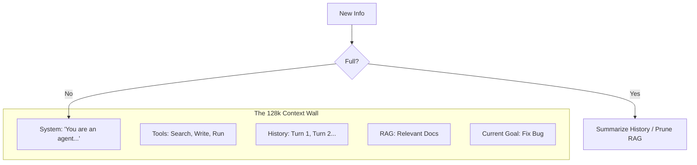

# 🪟 Context Window Management: The Art of Token Packing
> **Level:** Advanced | **Language:** Hinglish | **Goal:** Master the optimization of the limited "working space" in LLM prompts for maximum agent performance.

---

## 🧭 1. Beginner-Friendly Hinglish Explanation
Context Window ka matlab hai AI ki **"Nazar"** (Vision).

- **The Problem:** AI ek baar mein sirf limited tokens (words) dekh sakta hai. Agar aapne use bahut zyada information de di, toh:
  1. Wo slow ho jayega.
  2. Wo purani baatein bhool jayega.
  3. Uski accuracy kam ho jayegi (**Attention loss**).
- **The Solution:** Humein context window ko "Efficiently" use karna hai.
  - Sirf kaam ki baat rakho.
  - Purani baaton ko chhota (Summarize) karo.
  - Important cheezon ko "Pin" karo.

Context management ek budget manage karne jaisa hai; har token ki ek keemat (cost) hai.

---

## 🧠 2. Deep Technical Explanation
The context window is the total number of tokens the model processes in its **Self-Attention** mechanism.

### 1. Token Budget Allocation:
A 2026 standard agent prompt is usually divided into:
- **System Prompt ($20\%$):** Rules, Personas, Tool definitions.
- **Short-term Memory ($40\%$):** Recent chat turns.
- **Long-term Retrieval ($30\%$):** RAG results.
- **Goal & Plan ($10\%$):** Current active task.

### 2. Context Pruning Techniques:
- **Similarity Pruning:** Remove chat turns that are redundant or off-topic.
- **Information Density:** Convert conversational filler (e.g., "Oh, that's interesting!") into zero tokens.
- **Token Truncation:** Simply cutting off the oldest tokens when the limit is reached.

### 3. Attention Sink Management:
Ensuring the model's "Attention" is focused on the most important parts (usually the **System Prompt** at the top and the **Last Message** at the bottom).

---

## 🏗️ 3. Architecture Diagrams (Context Filling)


---

## 💻 4. Production-Ready Code Example (Dynamic Context Pruning)
```python
# 2026 Standard: Pruning context based on token count

def prune_context(messages, max_tokens=100000):
    total_tokens = count_tokens(messages)
    
    while total_tokens > max_tokens:
        # 1. First, prune the oldest RAG results
        if has_rag_content(messages):
            messages = remove_oldest_rag(messages)
        # 2. Second, summarize middle conversation turns
        elif len(messages) > 10:
             messages = summarize_middle(messages)
        # 3. Finally, truncate oldest raw messages
        else:
             messages.pop(1) # Keep system prompt (index 0)
             
        total_tokens = count_tokens(messages)
    
    return messages

# Insight: Always protect the System Prompt and the User's last query.
```

---

## 🌍 5. Real-World Use Cases
- **Enterprise ERP Agent:** Managing context while reading thousands of database rows.
- **Long-form Writing:** Keeping track of characters and plot points across a $500$-page book.
- **Autonomous Debugging:** Managing stack traces, file contents, and terminal logs in a single window.

---

## ❌ 6. Failure Cases
- **The "Needle in a Haystack" Failure:** The context is $100k$ tokens, but the model fails to find a fact hidden at token $50k$.
- **Hallucinated Truncation:** The agent thinks it has access to info that was recently pruned.
- **Rule Erosion:** The conversation gets so long that the agent "Forgets" its system instructions at the top.

---

## 🛠️ 7. Debugging Guide
| Symptom | Cause | Fix |
| :--- | :--- | :--- |
| **Agent ignores system rules** | Context is too crowded | Repeat the core rules in the **User Prompt** (Recency Bias). |
| **Agent's responses are slow** | Quadratic Attention complexity | Use models with **Linear Attention** or **KV Caching**. |

---

## ⚖️ 8. Tradeoffs
- **Context Size vs. Performance:** Larger windows lead to better recall but slower inference and higher costs.
- **Summarization vs. Raw:** Summarization saves space but can lose specific technical details (e.g., code syntax).

---

## 🛡️ 9. Security Concerns
- **Context Hijacking:** An attacker fills the context window with "Garbage" to push the system's safety rules out of the active attention zone.

---

## 📈 10. Scaling Challenges
- **KV Caching Cost:** Storing the "Keys and Values" for $1M$ tokens in GPU memory is extremely expensive.
- **Multi-turn Latency:** The more context you send, the longer it takes for the model to "Start" its response.

---

## 💸 11. Cost Considerations
- **Prompt Caching:** This is mandatory. By caching the static part of the prompt (System + Tools), you save $90\%$ on input costs.

---

## 📝 12. Interview Questions
1. What is "KV Caching" and why does it matter for long contexts?
2. How do you handle a conversation that is 5 times larger than the model's context window?
3. Explain the "Lost in the Middle" phenomenon.

---

## ⚠️ 13. Common Mistakes
- **Assuming $128k = 128k$:** Just because a model *supports* $128k$ tokens doesn't mean it can *reason* well at that size. Most models degrade after $32k$.
- **No Token Counting:** Not calculating the tokens before sending the request, leading to "400 Bad Request" errors.

---

## ✅ 14. Best Practices
- **Prioritize the End:** The most important info should be at the end of the prompt.
- **Use Metadata Tags:** Wrap different sections in XML tags like `<history>`, `<context>`, `<rules>`. This helps the model's attention mechanism.

---

## 🚀 15. Latest 2026 Industry Patterns
- **Infinite Context (RAG-VM):** Architectures that treat the context window like "Registers" and the Vector DB like "RAM".
- **Dynamic Routing:** Sending simple queries to 8k window models and complex ones to 1M window models.
- **In-Context Learning (ICL) Optimization:** Using the context window to "Fine-tune" the model on the fly by providing 100+ examples.
