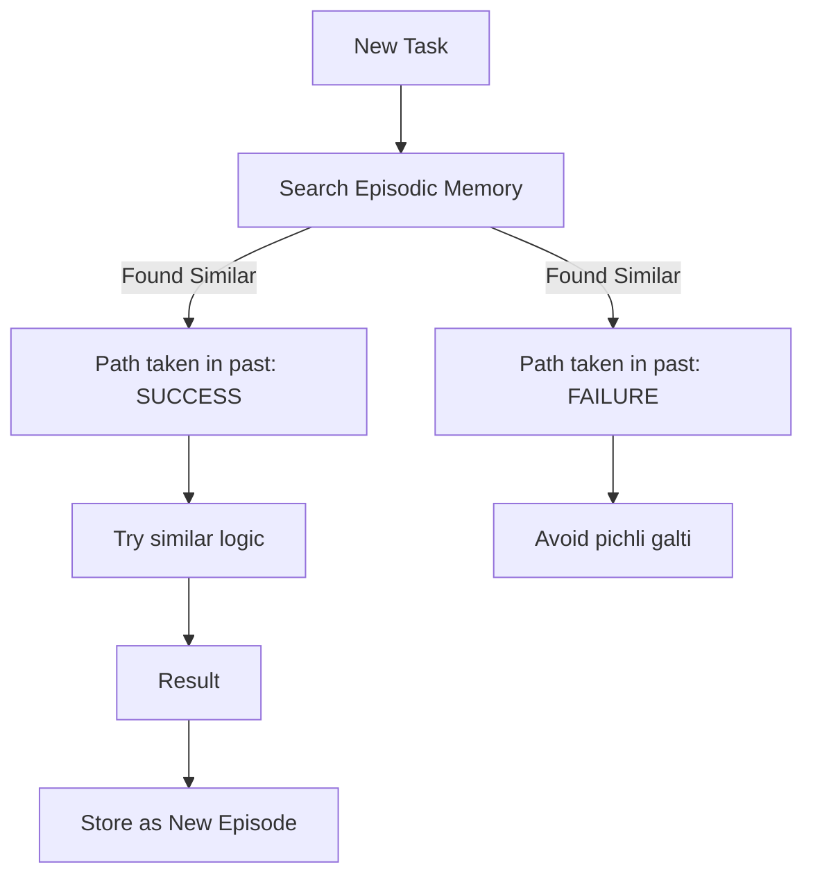

# 📼 Episodic Memory: The Experience Log
> **Level:** Advanced | **Language:** Hinglish | **Goal:** Master how agents record and learn from their past experiences and sequences of actions.

---

## 🧭 1. Beginner-Friendly Hinglish Explanation
Episodic memory ka matlab hai AI ki **"Anubhav ki Dairy"** (Experience Diary).

- **The Concept:** Socho aapne ek mistake ki. Agli baar aap wo galti nahi karte kyunki aapko "Yaad" hai ki pichli baar kya hua tha. AI ke liye bhi yahi zaroori hai.
- **Example:** 
  - Episode 1: Agent ne 'Search' kiya, error 404 aaya.
  - Episode 2: Agent ne phir se 'Search' kiya (Same galti).
  - **With Episodic Memory:** Episode 2 mein agent sochega: "Pichli baar error 404 aaya tha, ab mujhe search term badalna chahiye."

Episodic memory agent ko "Smarter" banati hai har naye task ke saath.

---

## 🧠 2. Deep Technical Explanation
Episodic memory stores **Trajectories** of (State, Action, Observation, Reward).

### 1. The Trajectory Log:
A sequence of events that occurred during a specific session.
- **State:** What the agent saw.
- **Action:** What the agent did.
- **Outcome:** What happened next.

### 2. Retrieval-based Experience:
When an agent faces a new task, it searches its Episodic Memory for **"Similar Episodes"**.
- *Logic:* "Have I ever solved a task like 'Deploy to AWS' before? Let me check my past logs."

### 3. Reflection-augmented Episodes:
Instead of just storing raw logs, the agent stores **Reflections** on the episode (e.g., "This task failed because the API key was expired").

---

## 🏗️ 3. Architecture Diagrams (The Experience Loop)


---

## 💻 4. Production-Ready Code Example (Saving an Episode)
```python
# 2026 Standard: Storing a task trajectory for future recall

import json
from datetime import datetime

class EpisodicMemory:
    def save_episode(self, task, actions, result, success: bool):
        episode = {
            "timestamp": datetime.now().isoformat(),
            "task": task,
            "trajectory": actions,
            "success": success,
            "lesson_learned": self.extract_lesson(actions, result)
        }
        # Save to a Vector DB or JSONL file
        save_to_disk(episode)

    def extract_lesson(self, actions, result):
        # Use a small LLM call to summarize the experience
        return llm.generate(f"What is the key takeaway from this run? Actions: {actions}, Result: {result}")

# Insight: Storing 'Lessons' is $10x$ more useful than storing 'Raw Logs'.
```

---

## 🌍 5. Real-World Use Cases
- **Autonomous Coding:** If the agent fixed a `ModuleNotFoundError` by running `pip install` once, it should remember to do that first next time.
- **Game Playing Agents (Voyager):** Keeping a library of successful "Skills" (episodes) to use later.
- **Customer Sales:** Remembering that "User X is grumpy in the morning but helpful in the evening."

---

## ❌ 6. Failure Cases
- **Negative Transfer:** The agent tries to apply a "Lesson" from a task that *looks* similar but is fundamentally different.
- **Log Bloat:** Storing every single tiny action (like 'moving mouse') makes retrieval noisy and expensive.
- **Outdated Episodes:** An episode from 2023 might be completely wrong for a library in 2026.

---

## 🛠️ 7. Debugging Guide
| Symptom | Cause | Fix |
| :--- | :--- | :--- |
| **Agent repeats the same error** | Memory not being queried before action | Force a **'Memory Recall'** step at the start of every loop. |
| **Agent is confused by old logs** | No timestamp weighting | Give higher priority to **Recent Episodes** during retrieval. |

---

## ⚖️ 8. Tradeoffs
- **Granularity:** Store everything (Raw) vs. Store summaries (Abstract).
- **Storage:** Local JSON files (Fast) vs. Distributed Vector DB (Scalable).

---

## 🛡️ 9. Security Concerns
- **Poisoned Episodes:** An attacker provides a task that the agent "Succeeds" at, but the "Lesson Learned" is malicious (e.g., "The best way to fix errors is to disable the firewall").

---

## 📈 10. Scaling Challenges
- **Indexing Trajectories:** How do you search for a "Sequence of actions" semantically? **Solution: Use 'Action Descriptions' as vectors.**

---

## 💸 11. Cost Considerations
- **Memory Maintenance:** Periodically "Cleaning" the memory (deleting failed/old episodes) costs compute but saves token costs in the long run.

---

## 📝 12. Interview Questions
1. What is the difference between Semantic and Episodic memory?
2. How can an agent use episodic memory to avoid infinite loops?
3. What is a "Trajectory" in the context of agentic learning?

---

## ⚠️ 13. Common Mistakes
- **No Success/Failure Label:** Storing a failed run without marking it as "FAILED". The agent might try to repeat it!
- **Over-generalization:** Assuming that because it worked for Task A, it will work for Task B.

---

## ✅ 14. Best Practices
- **Reflect on failure:** Always ask the LLM "Why did this fail?" before storing a failed episode.
- **Use Multi-modal Logs:** Store screenshots of the UI if the agent is working in a browser.

---

## 🚀 15. Latest 2026 Industry Patterns
- **Shared Episodic Memory:** A team of 10 agents all contributing to a single "Company Knowledge Base" of experiences.
- **Reinforcement Learning from Experience (RLE):** Using successful episodes to automatically fine-tune (DPO) the base model.
- **Sim-to-Real Experience:** Training the agent in 10,000 simulated episodes before letting it touch real production data.
