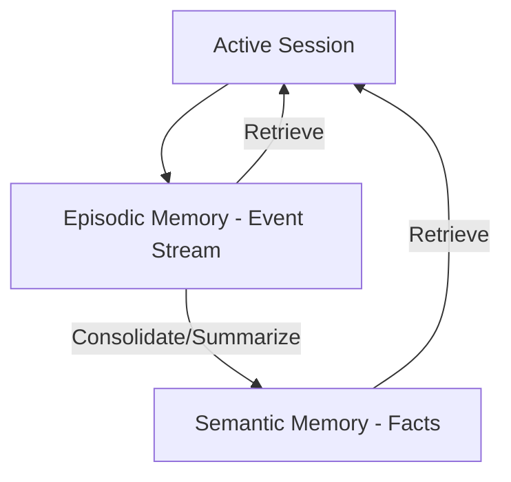

# 🎭 Episodic vs Semantic Memory: Experience vs Knowledge
> **Level:** Advanced | **Language:** Hinglish | **Goal:** Master the distinction between "What happened" and "What is true" to build more human-like agentic memories.

---

## 🧭 1. Beginner-friendly Hinglish Explanation
Episodic aur Semantic memory mein wahi fark hai jo "Ek din" aur "Gyan" mein hota hai. **Episodic Memory** ka matlab hai events ya yaadein (e.g., "Kal maine user ke liye ek flight book ki thi"). **Semantic Memory** ka matlab hai facts ya rules (e.g., "Paris France ki capital hai"). AI Agent ko dono chahiye: Episodic memory se wo pichli galtiyon se seekhta hai, aur Semantic memory se wo duniya ke bare mein jaanta hai.

---

## 🧠 2. Deep Technical Explanation
1. **Episodic Memory (The 'Event' Log):** Captures the sequence of events, tool calls, and observations in a specific session. It is often stored as a list of timestamps and structured logs. It answers: *What did I do at 3 PM?*
2. **Semantic Memory (The 'Knowledge' Base):** Captures generalized facts, user preferences, and constant truths. It is often stored in a Vector DB or Knowledge Graph. It answers: *How do I format a JSON?*
**Interaction:** In 2026, we use **Memory Consolidation** where Episodic experiences are periodically summarized into Semantic facts (e.g., "The user mentioned they are vegan" becomes a permanent semantic rule).

---

## 🏗️ 3. Real-world Analogies
- **Episodic:** Aapko yaad hai ki kal lunch mein aapne kya khaya (Specific event).
- **Semantic:** Aapko pata hai ki "Pizza" ek khana hai (General concept).

---

## 📊 4. Architecture Diagrams (Memory Flow)


---

## 💻 5. Production-ready Examples (Consolidation Logic)
```python
# 2026 Standard: Consolidating Episode into Fact
def consolidate_memory(episode_logs):
    # Prompting the LLM to extract facts from events
    prompt = f"Extract permanent user preferences from these logs: {episode_logs}"
    new_facts = llm.extract_facts(prompt)
    
    for fact in new_facts:
        vector_db.upsert_fact(fact) # Save as Semantic Memory
```

---

## ❌ 6. Failure Cases
- **Over-Generalization:** Agent ne ek baar dekha ki user ne flight cancel ki, aur usne semantic rule bana liya ki "User never travels".
- **Lost Context:** Episodic memory bohot badi ho gayi aur clear nahi ki gayi, jisse agent confuse ho raha hai "Purana vs Naya" event mein.

---

## 🛠️ 7. Debugging Section
- **Symptom:** Agent follows a rule that the user never said.
- **Check:** Semantic DB. Shayad kisi purane episode se galat interpretation "Consolidate" ho gayi hai. Rule ko manually delete ya "Update" karein.

---

## ⚖️ 8. Tradeoffs
- **Episodic:** High detail, High token cost, short-term relevance.
- **Semantic:** Low detail, Low token cost, long-term relevance.

---

## 🛡️ 9. Security Concerns
- **False Fact Injection:** Agar koi user baar-baar ek hi galat baat bole, toh agent use "Semantic Truth" samajhkar save kar sakta hai (Gaslighting the AI).

---

## 📈 10. Scaling Challenges
- Millions of episodes ko process karke semantic facts nikaalna ek heavy "Background Job" hai. Use **Batch Processing**.

---

## 💸 11. Cost Considerations
- Semantic retrieval (Vector DB) is cheaper than storing full episodic logs in the prompt context.

---

## ⚠️ 12. Common Mistakes
- Dono ko ek hi database mein mix kar dena bina clear metadata ke.
- Facts ko update na karna (Conflicts between old and new facts).

---

## 📝 13. Interview Questions
1. Why is 'Consolidation' necessary between episodic and semantic memory?
2. How do you resolve conflicts when a new episodic event contradicts an old semantic fact?

---

## ✅ 14. Best Practices
- Every semantic fact should have a **Confidence Score** and a **Timestamp**.
- Periodically "Prune" episodic memory to keep only the last 24 hours of raw logs.

---

## 🚀 15. Latest 2026 Industry Patterns
- **Knowledge Graphs for Semantic Memory:** Moving away from simple vectors to triple-stores (Subject-Predicate-Object) for 100% factual accuracy.
- **Cross-Session Episodic Recall:** Agents jo naye session mein purane session ki "Story" ko revive kar sakte hain.
