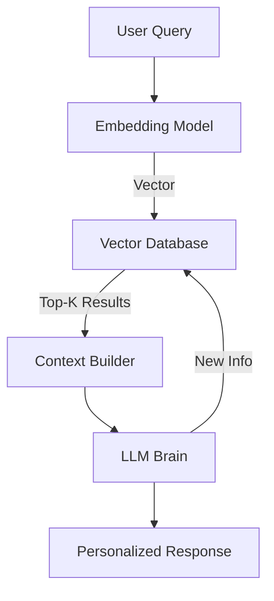

# 🗄️ Long-Term Memory: The Agent's Knowledge Base
> **Level:** Intermediate | **Language:** Hinglish | **Goal:** Master the techniques for storing and retrieving information across sessions using Vector Databases and RAG.

---

## 🧭 1. Beginner-friendly Hinglish Explanation
Long-Term Memory ka matlab hai "Sab kuch hamesha ke liye yaad rakhna". Sochiye aapne agent ko 1 mahine pehle bataya tha ki aapko "Blue color" pasand hai. Agar agent aaj bhi ye yaad rakhta hai, toh wo uski long-term memory hai. AI Agents ke liye hum Vector Databases (jaise Pinecone ya Weaviate) use karte hain. Jab agent ko kuch purana dhoondhna hota hai, wo wahan "Search" karta hai aur relevant info nikaal leta hai. Ye agent ko ek "Permanent Experience" deta hai.

---

## 🧠 2. Deep Technical Explanation
Long-term memory is implemented through **Vector Embeddings** and **Asynchronous Persistence**:
1. **Embedding:** Text chunks are converted into numerical vectors using models like `text-embedding-3-small`.
2. **Vector DB:** These vectors are stored in a database that allows "Similarity Search" (Cosine Similarity).
3. **Retrieval (RAG):** When a user asks a question, the agent searches the Vector DB, gets the top-K matches, and injects them into the prompt.
4. **Update:** Every new important experience is summarized and "Upserted" (Update + Insert) into the DB for future use.

---

## 🏗️ 3. Real-world Analogies
Long-Term Memory ek **Library** ki tarah hai.
- **Short-term:** Jo book aap abhi padh rahe hain (Dimaag mein hai).
- **Long-term:** Lakho books jo shelves par hain. Aapko jab zarurat hoti hai, aap index (Vector Search) check karte hain aur sahi book nikaal lete hain.

---

## 📊 4. Architecture Diagrams (The Retrieval Loop)


---

## 💻 5. Production-ready Examples (Simple Vector Storage)
```python
# 2026 Standard: Storing Experience in Pinecone
import pinecone

def save_to_long_term_memory(agent_id, experience):
    vector = get_embedding(experience)
    index.upsert(vectors=[(f"{agent_id}_msg", vector, {"text": experience})])

def retrieve_memory(query):
    query_vector = get_embedding(query)
    results = index.query(vector=query_vector, top_k=3, include_metadata=True)
    return [res['metadata']['text'] for res in results]
```

---

## ❌ 6. Failure Cases
- **Irrelevant Retrieval:** Agent ne "Blue color" pucha par DB ne "Sky is blue" return kiya kyunki vectors similar dikh rahe the (Semantic noise).
- **Outdated Info:** DB mein 2 saal purani info hai jo ab galat ho chuki hai (Knowledge decay).

---

## 🛠️ 7. Debugging Section
- **Symptom:** Agent says "I don't remember that" even though it's in the DB.
- **Check:** Threshold for similarity search. Agar threshold bahut high (e.g., 0.9) hai, toh matching results nahi milenge. Thoda kam (0.7-0.8) rakhein.

---

## ⚖️ 8. Tradeoffs
- **Full Storage vs Summaries:** Sab kuch save karna (Safe but noisy) vs sirf main points save karna (Clean but lossy).

---

## 🛡️ 9. Security Concerns
- **Data Privacy:** Multiple users ka data ek hi vector index mein store karna dangerous ho sakta hai. Always use **Metadata Filtering** (e.g., `user_id == 123`) in every query.

---

## 📈 10. Scaling Challenges
- Millions of vectors ke liye search latency badh sakti hai. Use **Indexing techniques** like HNSW (Hierarchical Navigable Small World).

---

## 💸 11. Cost Considerations
- Vector DBs and Embedding APIs have costs. Minimize costs by only embedding "High Value" information, not every "Hello/Hi".

---

## ⚠️ 12. Common Mistakes
- Metadata store na karna. (Sirf vector se aap asali text nahi nikaal sakte).
- Embedding models mismatch (Training aur Search mein same model use hona chahiye).

---

## 📝 13. Interview Questions
1. How does a Vector Database enable long-term memory in AI agents?
2. What is 'Semantic Drift' and how does it affect memory retrieval?

---

## ✅ 14. Best Practices
- Use **Hybrid Search** (Vector + Keyword) for better accuracy.
- Implement a **Memory Cleaning** agent that periodically deletes redundant or conflicting memories.

---

## 🚀 15. Latest 2026 Industry Patterns
- **MemGPT Style Memory:** Agents jo khud decide karte hain ki kab "Working Memory" se data "Long-term Archive" mein move karna hai.
- **Sovereign Personal Memory:** Encrypted local vector stores jo sirf user ke control mein hote hain.
