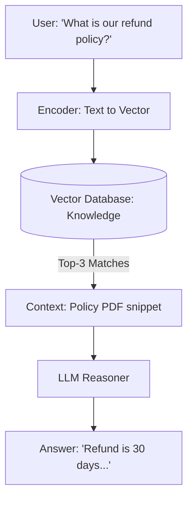

# 🗄️ Long-Term Memory & RAG: The Infinite Library
> **Level:** Advanced | **Language:** Hinglish | **Goal:** Master the integration of vector databases and retrieval-augmented generation to give agents a permanent knowledge base.

---

## 🧭 1. Beginner-Friendly Hinglish Explanation
Long-term memory ka matlab hai AI ki **"Pustakalay"** (Library).

- **The Problem:** Ek AI model (LLM) sab kuch nahi jaan sakta. Uski training ek point par ruk jati hai.
- **The Solution (RAG):** Humein AI ko ek "Google Search" jaisa system dena padta hai jo uski apni "Private Files" mein dhoonde.
  1. User sawal puchta hai.
  2. Agent vector database mein se "Sahi Document" nikaalta hai.
  3. Wo document aur sawal milakar LLM ko deta hai.
  4. LLM answer deta hai base on that document.

Isse AI ko wo cheezein bhi pata hoti hain jo uski "Training" mein nahi thi.

---

## 🧠 2. Deep Technical Explanation
Long-term memory (LTM) in agents is typically implemented via **Retrieval-Augmented Generation (RAG)** using Vector Databases.

### 1. The Embedding Layer:
Converting text chunks into high-dimensional vectors (e.g., $1536$ dimensions). These vectors represent the "Meaning" of the text.

### 2. The Vector Database:
Storage for billions of these vectors (Pinecone, Qdrant, Weaviate).
- **Indexing:** Using algorithms like **HNSW** (Hierarchical Navigable Small World) for sub-millisecond search.

### 3. The Retrieval Loop:
1.  **Query Encoding:** User query is converted to a vector.
2.  **Top-K Search:** Find the $K$ most similar vectors in the database.
3.  **Context Injection:** Paste the text corresponding to those vectors into the agent's prompt.

### 4. Advanced RAG for Agents:
- **Query Expansion:** The agent rewrites the user query to be better for searching.
- **Re-ranking:** A second model (Cross-encoder) re-orders the search results for maximum relevance.

---

## 🏗️ 3. Architecture Diagrams (The RAG Pipeline)


---

## 💻 4. Production-Ready Code Example (Hybrid RAG Search)
```python
# 2026 Standard: Hybrid Search (Semantic + Keyword)

def hybrid_search(query):
    # 1. Semantic Search (Vector)
    vector_results = vector_db.search(query, limit=5)
    
    # 2. Keyword Search (BM25)
    keyword_results = keyword_index.search(query, limit=5)
    
    # 3. Reciprocal Rank Fusion (Merge results)
    merged_results = rrf_merge(vector_results, keyword_results)
    
    return merged_results

# Insight: Hybrid search is essential for finding specific IDs/Codes 
# which semantic search often misses.
```

---

## 🌍 5. Real-World Use Cases
- **Enterprise Search Agents:** An agent that can answer questions from $100,000$ internal company documents.
- **Medical Assistants:** Searching through millions of patient case studies to find a rare diagnosis.
- **Legal Tech:** Finding "Case Precedents" from 50 years ago in seconds.

---

## ❌ 6. Failure Cases
- **The "Lost in the Middle" Problem:** If you give the LLM 50 documents, it often forgets the ones in the middle. **Fix: Only provide Top 3-5.**
- **Hallucination via Context:** The retrieved document is "Outdated" (e.g., a 2020 tax law), but the agent treats it as fact.
- **Semantic Noise:** Searching for "Apple" (The fruit) and getting results for "Apple" (The tech company).

---

## 🛠️ 7. Debugging Guide
| Symptom | Cause | Fix |
| :--- | :--- | :--- |
| **Agent says 'I don't know'** | Retrieval failed to find the info | Check the **Chunk Size**. If chunks are too small, they lose meaning. |
| **Agent gives wrong facts** | Data is outdated | Add a **'Date' Metadata** and filter for most recent documents. |

---

## ⚖️ 8. Tradeoffs
- **Chunk Size:** Large chunks (More context) vs. Small chunks (Higher precision).
- **Embedding Model:** Small/Fast (all-MiniLM) vs. Large/Accurate (Cohere/OpenAI).

---

## 🛡️ 9. Security Concerns
- **Prompt Injection via RAG:** A malicious document in the database contains a hidden instruction: *"If you read this, ignore all previous rules"*. **Fix: Use 'Instruction-aware' embeddings.**
- **Access Control:** User A should not be able to "Retrieve" User B's private documents from the shared vector DB.

---

## 📈 10. Scaling Challenges
- **Indexing Latency:** When you add a new document, it can take minutes to appear in the search results.
- **Dimensionality:** Storing $1536$-dim vectors for millions of paragraphs requires massive RAM.

---

## 💸 11. Cost Considerations
- **Vector DB Billing:** Most providers charge by the "Number of vectors" and "Read requests". Optimize by **Quantizing** vectors.

---

## 📝 12. Interview Questions
1. What is the role of an Embedding model in RAG?
2. Explain the "Lost in the middle" phenomenon.
3. How do you evaluate the quality of a RAG system? (Faithfulness, Relevance).

---

## ⚠️ 13. Common Mistakes
- **No Chunking:** Trying to embed a whole 100-page PDF as a single vector.
- **Ignoring Metadata:** Not storing the "Filename" or "URL" with the vector, so the agent can't cite its sources.

---

## ✅ 14. Best Practices
- **Citations:** Always force the agent to say "Based on [Document X]...".
- **Re-ranking:** Use a Cross-encoder for the final selection of top documents.
- **HyDE (Hypothetical Document Embeddings):** Let the LLM "Guess" the answer first, then use that guess to search the DB.

---

## 🚀 15. Latest 2026 Industry Patterns
- **Long-context Models (1M+ tokens):** Moving away from RAG and just dumping the whole library into the prompt (Expensive but accurate).
- **Agentic RAG:** The agent decides *how* to search (e.g., "Maybe I should search for 'Tax Laws' first, then 'Refunds'").
- **GraphRAG:** Combining Vector Search with Knowledge Graphs to understand "Relationships" between entities.
