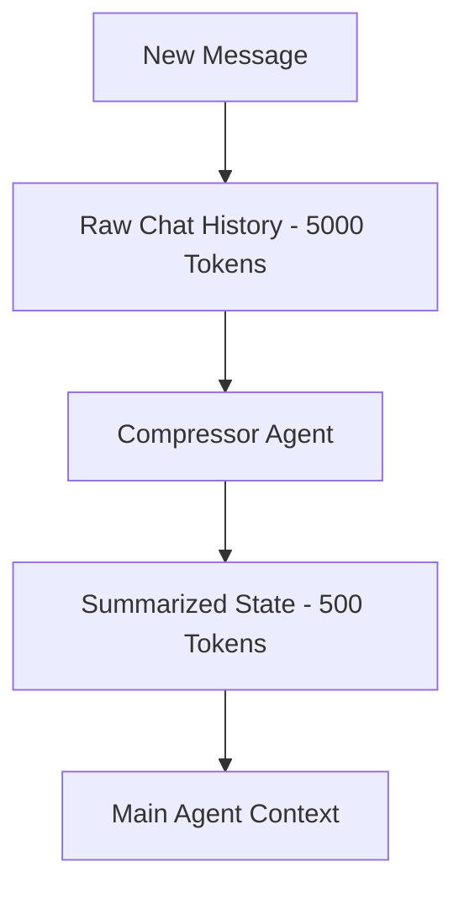

# 🗜️ Memory Compression: Fitting More in Less
> **Level:** Advanced | **Language:** Hinglish | **Goal:** Master the techniques for summarizing and distilling large agent memories to fit within context limits without losing critical info.

---

## 🧭 1. Beginner-friendly Hinglish Explanation
Memory Compression ka matlab hai "Baat ko chhote mein kehna". Sochiye aapne 2 ghante ki movie dekhi. Agar koi aapse puche "Kya hua?", toh aap 2 ghante bolne ki jagah 5 minute mein summary bata denge. AI Agent ke liye bhi yahi hai. Context window (Dimaag ka size) limited hai. Jab baatein bahut zyada ho jati hain, hum purani baaton ko "Summarize" (Compress) kar dete hain taaki nayi baaton ke liye jagah bani rahe. Isse agent ko main baat bhi yaad rehti hai aur tokens bhi bachte hain.

---

## 🧠 2. Deep Technical Explanation
Memory compression uses LLMs to reduce the token footprint of historical data:
1. **Summarization:** Replacing 10 messages with a 1-paragraph summary.
2. **Key-Value Extraction:** Storing only specific facts (e.g., `User likes: Blue`) and deleting the "Hello/Hi" noise.
3. **Recursive Summarization:** Summarizing a summary. When the summary itself gets too large, it's compressed again.
4. **Embedding Compression:** Using dimensionality reduction (like PCA) to store vectors in fewer bytes.

---

## 🏗️ 3. Real-world Analogies
Memory Compression ek **Study Notes** ki tarah hai.
- Aap poori textbook nahi padhte exam se pehle, aap sirf "Summarized Notes" padhte hain jo poore chapter ka saar (essence) hote hain.

---

## 📊 4. Architecture Diagrams (The Compression Loop)


---

## 💻 5. Production-ready Examples (Summarization Logic)
```python
# 2026 Standard: Automatic Memory Summarization
def compress_memory(history):
    if len(history) > 10: # Threshold for compression
        prompt = f"Summarize the following conversation for an AI agent: {history}"
        summary = llm.invoke(prompt)
        # Replace old history with the new summary
        return [{"role": "system", "content": f"Summary of past: {summary}"}]
    return history
```

---

## ❌ 6. Failure Cases
- **Nuance Loss:** Compression mein important details (e.g., specific dates or prices) mita diye gaye jo baad mein zaroori the.
- **Drift:** Summary ka summary banate waqt asali baat bilkul hi badal gayi (The "Chinese Whispers" effect).

---

## 🛠️ 7. Debugging Section
- **Symptom:** Agent forgets a specific name mentioned 5 minutes ago.
- **Fix:** Compression logic check karein. Fact extraction prompts mein "Preserve proper nouns and dates" instructions add karein.

---

## ⚖️ 8. Tradeoffs
- **Compression Ratio vs Fidelity:** Zyada compress karne par sasta padega par agent "Bhulakkad" ho jayega. Balance is required.

---

## 🛡️ 9. Security Concerns
- **Summary Poisoning:** Agar malicious messages compress ho rahe hain, toh summary mein unka harmful intent "System-level rule" ban kar save ho sakta hai.

---

## 📈 10. Scaling Challenges
- Millions of summaries generate karna GPU intensive hai. Use **Tiny Models** (e.g., Llama-3-1B) for summarization to save time and money.

---

## 💸 11. Cost Considerations
- Summarization saves money in the LONG RUN because future prompts will be smaller, but it costs tokens UPFRONT for the summarization call.

---

## ⚠️ 12. Common Mistakes
- Summarize karna hi bhul jana (Context window error crash).
- Summarize karte waqt "User Preference" ko ignore karna.

---

## 📝 13. Interview Questions
1. What are the risks of 'Recursive Summarization' in long-term agent sessions?
2. How do you decide which information is 'Important' enough to survive compression?

---

## ✅ 14. Best Practices
- Always keep the **Last 2-3 Messages** as raw text and only summarize the part before that.
- Use **Entity Extraction** before summarization to preserve names, numbers, and dates.

---

## 🚀 15. Latest 2026 Industry Patterns
- **Knowledge-Graph Compression:** History ko summary ki jagah graph nodes mein convert karna.
- **Latent Space Compression:** Storing memory as compressed neural activations instead of text.
