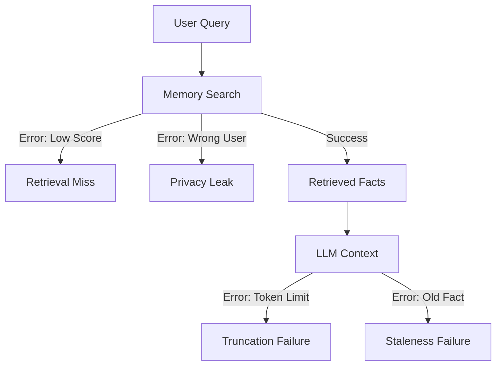

# ⚠️ Memory Failure Cases: When Agents Forget
> **Level:** Advanced | **Language:** Hinglish | **Goal:** Master the identification and mitigation of memory-related failures in AI agents.

---

## 🧭 1. Beginner-friendly Hinglish Explanation
Memory Failure ka matlab hai agent ka "Bhool jana" ya "Galat yaad rakhna". Sochiye aapne agent ko bola "Main kal Mumbai ja raha hoon", aur 2 minute baad usne pucha "Aap kahan ja rahe hain?". Ye memory failure hai. Kabhi-kabhi agent purani aur nayi info mein confuse ho jata hai, ya use lagta hai ki usne kuch kiya hai par wo sirf uska sapna (Hallucination) hota hai. Is section mein hum in galtiyon ko dhoondhna aur theek karna seekhenge.

---

## 🧠 2. Deep Technical Explanation
Memory failures occur due to several technical bottlenecks:
1. **Context Overflow:** The conversation history exceeds the model's token limit, causing the oldest (and often most important) context to be truncated.
2. **Semantic Interference:** Two similar but different memories get mixed up during retrieval (e.g., info about User A and User B).
3. **Retrieval Miss:** The vector search failed to find relevant info because the query was too different from the stored embedding.
4. **Knowledge Stale-ness:** The agent retrieves an old fact (e.g., "User is at Home") while ignoring a newer one ("User is at Office").

---

## 🏗️ 3. Real-world Analogies
Memory failure ek **Purane Computer** ki tarah hai.
- RAM (Short-term) kam hai toh system hang ho jata hai.
- Hard drive (Long-term) mein virus hai toh file galat open hoti hai.

---

## 📊 4. Architecture Diagrams (The Failure Points)


---

## 💻 5. Production-ready Examples (Detecting Stale Info)
```python
# 2026 Standard: Conflict Detection Logic
def check_memory_conflict(new_fact, retrieved_memories):
    for old_mem in retrieved_memories:
        if is_contradictory(new_fact, old_mem):
            return True, old_mem
    return False, None

# Usage
conflict, old_data = check_memory_conflict("User is now in NYC", history)
if conflict:
    # Trigger pruning or update
    update_memory(old_data.id, "STALE")
```

---

## ❌ 6. Failure Cases
- **The Amnesiac Agent:** Agent har message ke baad pichli baat bhool raha hai.
- **The Gaslighter:** Agent insist kar raha hai ki "Aapne ye pehle nahi bola tha" jabki wo memory mein hai.

---

## 🛠️ 7. Debugging Section
- **Symptom:** Agent uses info from a different conversation.
- **Check:** Namespace isolation. Kya aapne Vector DB mein `namespace="user_id"` use kiya hai? Agar nahi, toh memories mix ho rahi hain.

---

## ⚖️ 8. Tradeoffs
- **Broad Retrieval vs Specificity:** Zyada info retrieve karna accuracy badhata hai par tokens aur context bharta hai.

---

## 🛡️ 9. Security Concerns
- **Cross-Session Leakage:** User A ka data User B ko dikh jana. Ye sabse bada compliance risk hai (GDPR violation).

---

## 📈 10. Scaling Challenges
- Millions of sessions mein memory isolation maintain karna challenging hai. Use **Tenant-based database sharding**.

---

## 💸 11. Cost Considerations
- Inefficient retrieval (getting 100 results instead of 5) increases token costs significantly.

---

## ⚠️ 12. Common Mistakes
- Context window ko monitor na karna (Always check `token_count`).
- Stale data ko prune na karna.

---

## 📝 13. Interview Questions
1. What is 'Semantic Interference' in Vector Databases?
2. How do you handle 'Recency Bias' where the model ignores older but more relevant memories?

---

## ✅ 14. Best Practices
- Implement **Unit Tests for Memory**: Test if the agent can remember a fact after 50 turns.
- Use **Metadata Filtering** for strict isolation.

---

## 🚀 15. Latest 2026 Industry Patterns
- **Active Truth Tracking:** Agents jo fact-checkers use karte hain to verify if a memory is still true (e.g., checking a weather API to see if "It's raining" memory is still valid).
- **Auto-forgetting PII:** Privacy-first agents jo automatically sensitive info ko session end hote hi mita dete hain.
