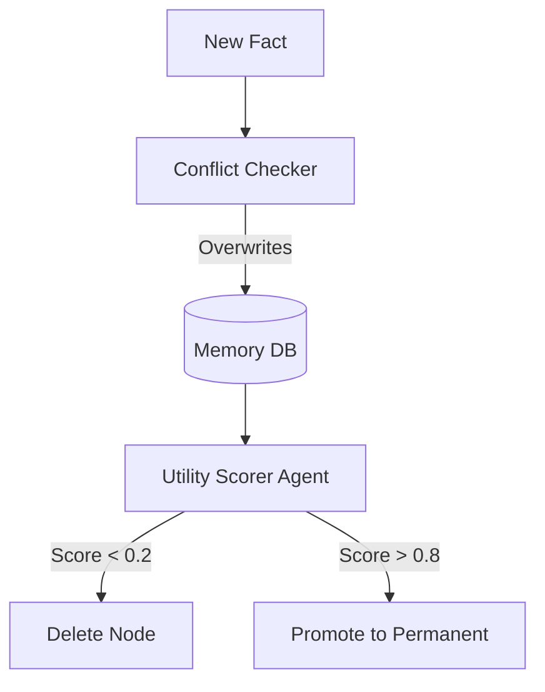

# ✂️ Memory Pruning: Deleting the Irrelevant
> **Level:** Advanced | **Language:** Hinglish | **Goal:** Master the techniques for identifying and deleting useless or outdated memories to keep the agent's knowledge base clean.

---

## 🧭 1. Beginner-friendly Hinglish Explanation
Memory Pruning ka matlab hai "Faltu yaadon ko mita dena". Sochiye aapka dimaag har choti cheez yaad rakhe (jaise 3 saal pehle aapne kaunse rang ki shirt pehni thi), toh aap naya kuch seekh hi nahi payenge. AI Agent ke liye bhi yahi hai. Har saal hazaron files aur chats generate hoti hain. Pruning wo process hai jahan hum decide karte hain ki kaunsi info ab "Kachra" (trash) hai aur use delete kar dete hain taaki agent sirf important baaton par focus kare.

---

## 🧠 2. Deep Technical Explanation
Pruning involves removing nodes or vectors from the memory store based on:
1. **Recency:** Deleting data older than a certain TTL (Time-to-Live).
2. **Frequency:** Deleting memories that are rarely accessed (Least Recently Used - LRU).
3. **Importance/Utility:** Using an LLM to score memories and deleting those with a score below a threshold (e.g., "Hello", "How are you").
4. **Knowledge Conflict:** If a new memory contradicts an old one (e.g., "User changed their address"), the old one is pruned.

---

## 🏗️ 3. Real-world Analogies
Memory Pruning ek **Garden ki trimming** ki tarah hai.
- Agar aap sukhi patiyan (Outdated info) nahi kaatenge, toh naye phool (Fresh info) nahi khilenge. Garden jungle ban jayega aur koi rasta nahi milega.

---

## 📊 4. Architecture Diagrams (The Pruning Filter)


---

## 💻 5. Production-ready Examples (LRU Pruning Concept)
```python
# 2026 Standard: Simple Utility-based Pruning
def prune_memory(memories):
    for mem in memories:
        # If memory is older than 30 days and has low access count
        if mem.age > 30 and mem.access_count < 2:
            db.delete(mem.id)
            print(f"Pruned irrelevant memory: {mem.id}")

# In production, use a background cron job for this.
```

---

## ❌ 6. Failure Cases
- **Over-Pruning:** Agent ne user ka "Birthday" delete kar diya kyunki wo saal mein sirf ek baar access hota tha.
- **Zombies:** Memories jo delete honi chahiye thi par "Conflict" ki wajah se duplicate ho gayi hain.

---

## 🛠️ 7. Debugging Section
- **Symptom:** Agent forgets its own past successes.
- **Fix:** Pruning policy check karein. "Success stories" aur "User preferences" ko protected metadata tags (`protected: true`) dein taaki pruning algorithm unhe touch na kare.

---

## ⚖️ 8. Tradeoffs
- **Storage Cost vs Knowledge:** Zyada prune karne se DB bill kam hoga par agent "Gyan" kho sakta hai.

---

## 🛡️ 9. Security Concerns
- **Evidence Deletion:** Ek audit agent agar apne hi "Failure logs" prune kar de, toh aap kabhi pata nahi laga payenge ki system kahan fail hua tha.

---

## 📈 10. Scaling Challenges
- Millions of vectors ko periodically scan karna slow ho sakta hai. Use **Partitioned Indexes** to prune only specific time clusters.

---

## 💸 11. Cost Considerations
- Pruning background mein chalta hai, isliye iska compute cost monitor karein. Har entry ke liye LLM scoring mehengi pad sakti hai. Use **Rule-based heuristic scores**.

---

## ⚠️ 12. Common Mistakes
- Bina backup ke pruning chala dena.
- Conflict detection ignore karna (Old address vs New address).

---

## 📝 13. Interview Questions
1. What is the difference between Memory Compression and Memory Pruning?
2. How do you implement an 'LRU' policy for a Vector Database?

---

## ✅ 14. Best Practices
- Every memory should have a **'Last Accessed'** timestamp.
- Give users the ability to "Pin" certain memories that should never be pruned.

---

## 🚀 15. Latest 2026 Industry Patterns
- **Semantic Pruning:** AI agents jo "Concepts" ko samajhte hain aur redundant concepts ko merge ya delete karte hain automatically.
- **Privacy-driven Pruning:** Automatically deleting PII (Personally Identifiable Information) as soon as the task is finished.
