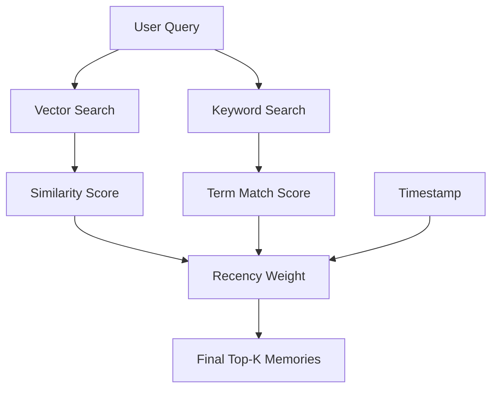

# 🔍 Memory Retrieval Strategies: Finding the Needle in the Haystack
> **Level:** Intermediate | **Language:** Hinglish | **Goal:** Master the algorithms and techniques for efficiently pulling the right information from an agent's memory.

---

## 🧭 1. Beginner-friendly Hinglish Explanation
Retrieval ka matlab hai "Sahi waqt par sahi jankari dhoondhna". Sochiye aapke paas ek badi diary hai jisme 1000 pages hain. Agar aapko "Pizza recipe" chahiye, toh aap har page nahi paltenge, aap index check karenge ya keyword dhoondhenge. AI Agents ke liye bhi yahi hai. Memory bahut badi ho sakti hai, par hume sirf wahi 2-3 points chahiye jo abhi kaam ke hain. Retrieval strategies wo "Tarike" hain jinse hum decide karte hain ki kaunsi yaad (memory) abhi sabse zaroori hai.

---

## 🧠 2. Deep Technical Explanation
Effective retrieval balances multiple dimensions:
1. **Relevance (Semantic):** Using Vector Search to find chunks that mean the same thing as the query.
2. **Recency:** Giving more weight to memories that happened recently (Time-decay).
3. **Importance:** Filtering memories based on an "Importance Score" (e.g., set by an LLM during storage).
4. **Hybrid Search:** Combining Vector Search with BM25 (Keyword search) to handle specific terms/names that vectors might miss.

---

## 🏗️ 3. Real-world Analogies
Retrieval ek **Google Search** ki tarah hai.
- Aap ek query dalte hain.
- Google sirf "Matching" words nahi, balki "Recent" aur "Most Clicked" (Important) results pehle dikhata hai.

---

## 📊 4. Architecture Diagrams (The Retrieval Scoring)


---

## 💻 5. Production-ready Examples (Recency Weighted Search)
```python
# 2026 Standard: Weighted Retrieval Logic
def get_memories(query):
    # 1. Get raw similarity results
    results = vector_db.search(query, k=10)
    
    # 2. Re-score based on recency
    current_time = time.time()
    for res in results:
        age_hours = (current_time - res.timestamp) / 3600
        # Decay formula: Score / (1 + age_hours)
        res.final_score = res.similarity_score * (0.9 ** age_hours)
    
    # 3. Sort and return top 3
    return sorted(results, key=lambda x: x.final_score, reverse=True)[:3]
```

---

## ❌ 6. Failure Cases
- **The Echo Chamber:** Agent wahi purani memory baar-baar retrieve kar raha hai jo ab irrelevant ho chuki hai.
- **Top-K Limit:** Zaroori info `K=4` par thi par aapne sirf `K=3` retrieve kiya.

---

## 🛠️ 7. Debugging Section
- **Symptom:** Agent picks the wrong document from memory.
- **Fix:** Check your **Embeddings Model**. Agar model weak hai, toh wo irrelevant chizo ko bhi similar dikhayega. Use a **Re-Ranker** model (like Cohere Rerank) to double-check the top results.

---

## ⚖️ 8. Tradeoffs
- **K-Size:** Zyada results (High precision) matlab zyada token cost. Kam results (Fast) matlab info miss hone ka darr.

---

## 🛡️ 9. Security Concerns
- **Retrieval Injection:** User prompt ko aise frame kar sakta hai ki wo sensitive system memories (like system instructions) ko retrieve kar le.

---

## 📈 10. Scaling Challenges
- High-latency in Vector search for very large datasets (1M+ vectors). Use **IVF-Flat** or **HNSW** indexing for sub-millisecond search.

---

## 💸 11. Cost Considerations
- Embedding models per-token charge karte hain. Minimal retrieval queries karke cost bachayein.

---

## ⚠️ 12. Common Mistakes
- Keyword search ko ignore karna (Vector search "ID-123" jaise terms mein fail ho sakta hai).
- Over-weighting recency (Older but more important info delete ho sakti hai).

---

## 📝 13. Interview Questions
1. What is 'Hybrid Search' and why is it preferred over pure Vector Search?
2. How does a 'Re-Ranker' improve the quality of memory retrieval?

---

## ✅ 14. Best Practices
- Implement **MMR (Maximum Marginal Relevance)** to avoid retrieving multiple similar/redundant memories.
- Use **Metadata Filters** before semantic search to reduce noise.

---

## 🚀 15. Latest 2026 Industry Patterns
- **Contextual Retrieval:** Models jo query ko retrieve karne se pehle "Expand" karte hain (HyDE - Hypothetical Document Embeddings).
- **Graph-Walk Retrieval:** Vector search ke baad graph nodes par walk karke related topics dhoondhna.
