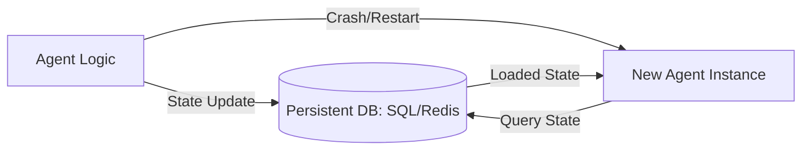

# 💾 Persistent Memory: Beyond the Session
> **Level:** Intermediate | **Language:** Hinglish | **Goal:** Master the techniques for making an agent's memory survive server restarts and session timeouts.

---

## 🧭 1. Beginner-friendly Hinglish Explanation
Persistent Memory ka matlab hai "Pakki Yaad-dasht". Sochiye aapne ek game khela aur beech mein computer band kar diya. Jab aap dubara start karte hain, game wahin se shuru hota hai jahan aapne chhoda tha (Save Game). AI Agents ke liye bhi yahi zaroori hai. Bina persistence ke, agent har baar ek "Blank Brain" ke saath start hoga. Persistent memory ko hum databases (SQL/NoSQL) mein store karte hain taaki mahinon baad bhi agent ko purani baatein yaad rahein.

---

## 🧠 2. Deep Technical Explanation
Persistent memory requires a reliable storage layer outside the agent's RAM:
1. **Serialization:** Converting the agent's internal state (JSON, TypedDict) into a format that can be stored (String, Binary).
2. **Database Layer:** Using **PostgreSQL** for relational state, **Redis** for fast ephemeral state, or **MongoDB** for flexible JSON history.
3. **Checkpoints:** Periodically saving the entire "Graph State" so that in case of a crash, the agent can resume from the exact last successful node.
4. **Encryption:** Ensuring data at rest is encrypted to protect user privacy.

---

## 🏗️ 3. Real-world Analogies
Persistent Memory ek **Bank Ledger** ki tarah hai.
- Agar bank ka computer crash bhi ho jaye, toh unke paas paper/database par record rehta hai ki kiske paas kitne paise hain. Wo info "Fly" (RAM) mein nahi, "Vault" (Database) mein hai.

---

## 📊 4. Architecture Diagrams (The Persistence Layer)


---

## 💻 5. Production-ready Examples (SQLite Checkpointer)
```python
# 2026 Standard: LangGraph with Persistence
from langgraph.checkpoint.sqlite import SqliteSaver

# Connect to a local DB
memory = SqliteSaver.from_conn_string(":memory:")

# When defining the graph, use the checkpointer
app = workflow.compile(checkpointer=memory)

# Usage with thread_id (Unique session ID)
config = {"configurable": {"thread_id": "user_123"}}
app.invoke(input_data, config=config)
```

---

## ❌ 6. Failure Cases
- **Version Mismatch:** Aapne agent ka code update kar diya par database mein purana state format hai. System crash ho jayega (Schema Drift).
- **Concurrent Access:** Do agents ek hi state ko update karne ki koshish kar rahe hain (Race condition).

---

## 🛠️ 7. Debugging Section
- **Symptom:** Agent remembers things from the WRONG user.
- **Check:** `thread_id` or `user_id` logic. Har user ki memory separate honi chahiye. Check if your database queries have proper `WHERE` clauses.

---

## ⚖️ 8. Tradeoffs
- **Full State vs Diff:** Har baar poora state save karna (Heavy/Slow) vs sirf changes save karna (Efficient but complex to restore).

---

## 🛡️ 9. Security Concerns
- **Data Leakage:** Persistent memory mein sensitive data (SSN, Passwords) kabhi plain text mein store na karein. Use **Field-level encryption**.

---

## 📈 10. Scaling Challenges
- 1 million threads ko SQL database mein manage karna slow ho sakta hai. Use **NoSQL** or **Distributed Key-Value stores** like DynamoDB.

---

## 💸 11. Cost Considerations
- Storage is cheap, but IOPS (Input/Output operations) mehenge ho sakte hain cloud par. Optimize by batching saves.

---

## ⚠️ 12. Common Mistakes
- Manual file saving (e.g., `open('state.json', 'w')`) use karna. Ye production mein fail hota hai concurrent users ke saath.
- TTL (Time-to-Live) set na karna (Database unlimited badhta jayega).

---

## 📝 13. Interview Questions
1. What is a 'Checkpointer' and why is it essential for autonomous agents?
2. How do you handle schema updates for a database that stores agent state?

---

## ✅ 14. Best Practices
- Every memory entry should have a **Unique ID** and a **Timestamp**.
- Use **JSON Schemas** to validate state before saving.

---

## 🚀 15. Latest 2026 Industry Patterns
- **Event-Sourced Persistence:** Storing every single thought and action as an immutable event stream instead of just the final state.
- **Cross-Platform Persistence:** Agents jo browser se start hokar cloud par seamlessly resume hote hain using a shared state store.
