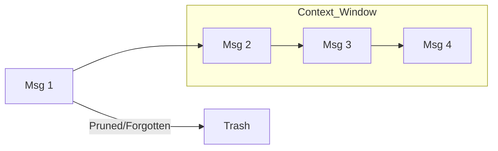

# 🧠 Short-Term Memory: The Agent's Immediate Focus
> **Level:** Beginner | **Language:** Hinglish | **Goal:** Master the management of context windows and transient state in AI agents.

---

## 🧭 1. Beginner-friendly Hinglish Explanation
Short-Term Memory ka matlab hai "Abhi kya ho raha hai" ye yaad rakhna. Sochiye aap kisi se chat kar rahe hain. Aapko pichli 2-3 lines yaad rehti hain taaki aap baat aage badha sakein. AI Agent ke liye ye "Context Window" ki tarah hai. Isme current conversation, tool results, aur immediate goals hote hain. Agar short-term memory full ho jaye, toh agent bhoolne lagta hai ki usne 2 minute pehle kya kaha tha.

---

## 🧠 2. Deep Technical Explanation
Short-term memory in 2026 agents is primarily managed within the **In-Context Learning (ICL)** window:
1. **Context Window:** The limit of tokens (e.g., 128k for GPT-4) the model can "see" at once.
2. **Message History:** A list of JSON objects `{"role": "user", "content": "..."}` that represents the sliding window of the conversation.
3. **Working State:** Temporary variables (e.g., current loop index, partial tool results) stored in the application's RAM or a fast cache like Redis.
**Crucial Point:** Short-term memory is **Episodic** and **Volatile**—it clears when the session ends unless persisted.

---

## 🏗️ 3. Real-world Analogies
Short-Term Memory ek **Whiteboard** ki tarah hai.
- Aap us par current calculation likhte hain.
- Jab whiteboard bhar jata hai, aap purana mita dete hain (Buffer window) naya likhne ke liye.

---

## 📊 4. Architecture Diagrams (The Sliding Window)


---

## 💻 5. Production-ready Examples (Sliding Window Buffer)
```python
# 2026 Standard: Managing Message History
from langchain.memory import ConversationBufferWindowMemory

# Keep only the last 5 interactions
memory = ConversationBufferWindowMemory(k=5)

def get_chat_history(user_input):
    history = memory.load_memory_variables({})
    # Inject history into the prompt
    return history
```

---

## ❌ 6. Failure Cases
- **Context Flush:** Token limit hit hone par system ne poori memory clear kar di, aur agent ko user ka naam bhi yaad nahi raha.
- **Context Poisoning:** Short-term memory mein irrelevant error logs bhar gaye, jisse agent asli kaam bhool gaya.

---

## 🛠️ 7. Debugging Section
- **Symptom:** Agent repeats the user's question as its own answer.
- **Check:** Memory buffer. Shayad aapne prompt mein "User" aur "Assistant" roles ko sahi se separate nahi kiya, aur agent confuse ho gaya.

---

## ⚖️ 8. Tradeoffs
- **K-Window vs Summary:** Last 10 messages rakhna (Fast/Cheap) vs saari messages ko summarize karke rakhna (Smart but slow).

---

## 🛡️ 9. Security Concerns
- **Sensitive Data Leakage:** Short-term memory mein stored passwords ya API keys agar user prompt mein galti se reflect ho jayein.

---

## 📈 10. Scaling Challenges
- Millions of active sessions matlab millions of Redis keys. Efficient **TTL (Time to Live)** management zaroori hai.

---

## 💸 11. Cost Considerations
- Large context windows mean higher token costs per message. Use **Selective Pruning** to remove non-essential metadata from tool results in memory.

---

## ⚠️ 12. Common Mistakes
- Tool outputs ko bina truncate kiye memory mein dalna. (Ek bada JSON memory bhar sakta hai).
- Loop ke beech mein memory update na karna.

---

## 📝 13. Interview Questions
1. What is the difference between a context window and short-term memory?
2. How do you handle a scenario where a tool output is larger than the entire context window?

---

## ✅ 14. Best Practices
- Always use a **Sliding Window** for chat-based agents.
- Summarize tool outputs before adding them to short-term memory.

---

## 🚀 15. Latest 2026 Industry Patterns
- **Differential Context:** Agents jo dynamically decide karte hain ki kaunse purane messages "Important" hain aur unhe "Pinned" rakhte hain.
- **Token Pruning:** AI models jo generation ke waqt irrelevant context tokens ko ignore karte hain to save compute.
