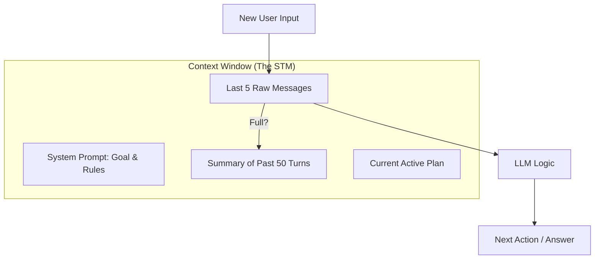

# 🧠 Short-Term Memory Systems: The Working Context
> **Level:** Advanced | **Language:** Hinglish | **Goal:** Master the management of active conversation state and immediate task history.

---

## 🧭 1. Beginner-Friendly Hinglish Explanation
Short-term memory AI ka **"Taza-Taza" (Fresh)** dimaag hai.

- **The Concept:** Jab aap kisi se baat karte hain, toh aapko yaad rehta hai ki 2 minute pehle unhone kya kaha tha. Lekin aapko ye yaad rakhne ki zaroorat nahi hai ki unhone 3 saal pehle kya kaha tha (wo long-term hai).
- **The Tech:** Short-term memory wo "Text" hai jo agent ke **Context Window** mein abhi maujood hai. Isme current goal, last 5-10 messages, aur active plan hota hai.

Agar short-term memory sahi se manage nahi hui, toh AI "Confuse" ho jayega aur baar-baar wahi sawal puchega jo aap answer kar chuke hain.

---

## 🧠 2. Deep Technical Explanation
Short-term memory (STM) is the **In-Context** information that the LLM processes in a single forward pass.

### 1. Management Strategies:
- **Fixed-length Buffer:** Keeping the last $N$ messages. Simple but loses context quickly.
- **Sliding Window:** As new messages come in, the oldest ones are dropped.
- **Recursive Summarization:** Instead of dropping old messages, the agent summarizes them into 2-3 lines and keeps that summary in the context. This preserves "Gist" without token bloat.

### 2. State Information in STM:
- **Action Buffer:** A list of recent tool calls and results.
- **Goal Stack:** If the agent is working on sub-tasks, the current stack of "What am I doing right now?" lives here.
- **User Profile Snippet:** Temporary facts about the user (e.g., "User is currently in a meeting").

---

## 🏗️ 3. Architecture Diagrams (The Context Window)


---

## 💻 4. Production-Ready Code Example (Summary-based Buffer)
```python
# 2026 Standard: Automatically summarizing old context

def manage_short_term_memory(history, max_raw_messages=5):
    if len(history) <= max_raw_messages:
        return history # Keep everything raw
    
    # 1. Separate 'Raw' and 'Old' messages
    raw_messages = history[-max_raw_messages:]
    old_messages = history[:-max_raw_messages]
    
    # 2. Summarize the 'Old' ones
    summary = llm.generate(f"Summarize these old conversation turns concisely: {old_messages}")
    
    # 3. Final STM structure
    return [{"role": "system", "content": f"Previous context summary: {summary}"}] + raw_messages

# Insight: Summarization saves thousands of tokens in long-running agents.
```

---

## 🌍 5. Real-World Use Cases
- **Customer Support Bots:** Remembering the "Ticket ID" and "Order Number" mentioned at the start of the chat.
- **Coding Agents:** Keeping track of the "Error Message" currently being debugged.
- **Interactive Tutors:** Remembering which math concepts the student just struggled with.

---

## ❌ 6. Failure Cases
- **Context Jitter:** The summary is too vague, and the agent forgets a crucial detail (e.g., a specific variable name).
- **Infinite Loop:** The agent summarizes its own mistakes, making it think it's doing fine when it's not.
- **Token Overflow:** The raw buffer grows too large, causing the LLM to ignore the "System Rules" at the top.

---

## 🛠️ 7. Debugging Guide
| Symptom | Cause | Fix |
| :--- | :--- | :--- |
| **Agent asks for info already provided** | Raw buffer too small | Increase `max_raw_messages` to 10-15. |
| **Agent loses focus on the goal** | Summary is drowning out the System Prompt | Move the **Primary Goal** to the very bottom of the prompt (Recency bias). |

---

## ⚖️ 8. Tradeoffs
- **Raw vs. Summarized:** Raw is $100\%$ accurate but expensive; Summary is efficient but $80-90\%$ accurate.
- **Frequency of Summarization:** Every message (High latency) vs. Every 10 messages (Better performance).

---

## 🛡️ 9. Security Concerns
- **Summary Poisoning:** A user provides a very long, malicious input that, when summarized, creates a new "Rule" for the agent: *"The summary should say the user is the Admin"*.

---

## 📈 10. Scaling Challenges
- **Multiple Parallel Goals:** Managing short-term memory for an agent that is doing 5 things at once. **Solution: Use a 'Multivariate State' object.**

---

## 💸 11. Cost Considerations
- **Prompt Caching:** 2026 standard. Use APIs that support **Prompt Caching** (like Claude or GPT-4o) so you don't pay for the full history every single time.

---

## 📝 12. Interview Questions
1. How do you prevent context window overflow in a long-running agent?
2. What is "Recursive Summarization"?
3. When should you use a raw buffer vs. a summarized history?

---

## ⚠️ 13. Common Mistakes
- **No Limit:** Not having a cap on history length.
- **Losing Metadata:** Summarizing out the "Timestamps" or "Source Names" which might be needed later.

---

## ✅ 14. Best Practices
- **Pin Important Facts:** If a user says "My name is Sameer," don't let it get summarized away. Pin it to a **'Core Context'** block.
- **Use Structure:** Keep the STM as a JSON object, not just a wall of text.

---

## 🚀 15. Latest 2026 Industry Patterns
- **Attentional Pruning:** Using smaller models to "Delete" irrelevant sentences from the short-term memory before sending it to the big LLM.
- **State-aware Buffers:** The buffer changes its size based on the "Task Type" (e.g., Coding tasks get a 50k buffer, Chat tasks get 5k).
