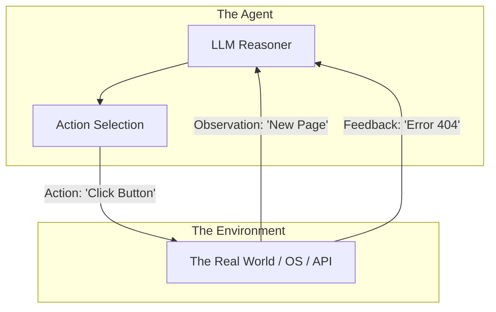

# 🌐 Action Spaces & Environment Interaction: Beyond the Prompt
> **Level:** Advanced | **Language:** Hinglish | **Goal:** Master the theory and practice of how agents manipulate their surroundings and interpret environmental feedback.

---

## 🧭 1. Beginner-Friendly Hinglish Explanation
Action Space ka matlab hai AI ki **"Duniya"** (Environment) aur usme uski **"Capabilities"**.

- **Environment:** Wo jagah jahan AI kaam kar raha hai (e.g., A computer, A web browser, A robot body).
- **Action Space:** Un sabhi actions ki list jo AI kar sakta hai.
  - Computer environment mein action space: `[click, type, scroll, wait]`.
  - Finance environment mein action space: `[buy, sell, hold, research]`.

AI ko ye samajhna zaroori hai ki uska har action "Duniya" ko badalta hai (State Change).

---

## 🧠 2. Deep Technical Explanation
The interaction between an agent and its environment is modeled as a **Markov Decision Process (MDP)** or a **Partially Observable Markov Decision Process (POMDP)**.

### 1. Types of Action Spaces:
- **Discrete:** Finite set of choices (e.g., Up, Down, Left, Right).
- **Continuous:** Numerical ranges (e.g., Move at speed $5.43$ m/s).
- **Natural Language:** The LLM outputs text which is then mapped to an action (The most common for current agents).

### 2. Environmental Feedback (The Observation):
The environment responds to an action by providing:
- **New State:** A screenshot, a JSON response, or a log file.
- **Reward:** (In RL agents) A numerical value indicating success.
- **Side Effects:** Changes in the world that aren't immediately visible (e.g., updating a database).

### 3. Latent Action Space:
When an agent creates a "Thought" before an "Action", that thought is part of its internal latent space that precedes the external action.

---

## 🏗️ 3. Architecture Diagrams (Agent-Environment Loop)


---

## 💻 4. Production-Ready Code Example (Defining an Action Space Wrapper)
```python
# 2026 Standard: Mapping LLM outputs to a restricted Action Space

class BrowserEnvironment:
    def __init__(self):
        self.action_space = ["click", "type", "scroll", "back"]

    def step(self, action_name, params):
        if action_name not in self.action_space:
            return "ERROR: Invalid Action"
        
        # Execute actual browser logic (Playwright/Selenium)
        result = self.execute_browser_action(action_name, params)
        return result

# Insight: Always validate the LLM output against the allowed Action Space.
```

---

## 🌍 5. Real-World Use Cases
- **Web Agents (LaVague/MultiOn):** Environment is the browser DOM; Action space is interacting with HTML elements.
- **Robotics:** Environment is the physical world; Action space is motor torques and joint movements.
- **Game AI:** Environment is the game engine; Action space is button presses or unit commands.

---

## ❌ 6. Failure Cases
- **Out-of-Bounds Action:** Agent tries to click an $(x, y)$ coordinate that is outside the screen.
- **Environment Stale-ness:** The environment changes (e.g., a popup appears), but the agent is still using an old observation.
- **Irreversible Action:** Agent deletes a file it was supposed to edit. **Fix: Use 'Undo' mechanisms or 'Dry Runs'.**

---

## 🛠️ 7. Debugging Guide
| Symptom | Cause | Fix |
| :--- | :--- | :--- |
| **Agent keeps missing buttons** | Resolution mismatch | Ensure the LLM knows the exact screen resolution it is acting on. |
| **Agent is stuck in a loop** | Action doesn't change state | Check if the tool actually executed or if the environment is "Frozen". |

---

## ⚖️ 8. Tradeoffs
- **High-level vs Low-level Actions:** `click_login_button` (High) vs `move_mouse(120, 450)` (Low). High-level is easier for LLMs; Low-level is more flexible.
- **Determinism:** Real-world environments are stochastic (unpredictable). Agents must be ready for "Random" changes.

---

## 🛡️ 9. Security Concerns
- **Environment Escaping:** An agent finds a way to use an action to gain root access to the underlying OS.
- **State Manipulation:** An attacker changes the environment's state to trick the agent into a "Phishing" action.

---

## 📈 10. Scaling Challenges
- **Massive Action Spaces:** When an agent can do 1,000 different things, it becomes hard for it to choose. **Solution: Hierarchical Action Selection (Select category, then action).**

---

## 💸 11. Cost Considerations
- **Environment Simulation:** Running a full browser or a 3D simulation for every agent step costs massive server resources.

---

## 📝 12. Interview Questions
1. What is an "Action Space" in the context of reinforcement learning?
2. How do you handle "Partially Observable" environments in AI agents?
3. What is the difference between a "Discrete" and a "Continuous" action space?

---

## ⚠️ 13. Common Mistakes
- **Assuming Instant Success:** The agent acts and assumes it worked. **Best Practice: Always verify the state change.**
- **Ignoring Latency:** The environment might take time to "React". The agent should have a `wait_for_state` capability.

---

## ✅ 14. Best Practices
- **Use 'Action Enums':** Force the LLM to pick from a strictly defined list of strings.
- **Visual Feedback:** For GUI agents, always provide the agent with a "Before" and "After" screenshot of its action.

---

## 🚀 15. Latest 2026 Industry Patterns
- **Vision-Action-Language (VLA) Models:** Models like RT-2 that map pixels directly to robotic actions without intermediate text.
- **Infinite Action Spaces:** Agents that can "Code" their own new actions and add them to their own action space.
- **Shared Environments:** Multiple agents (Swarm) interacting with the same shared world state.
