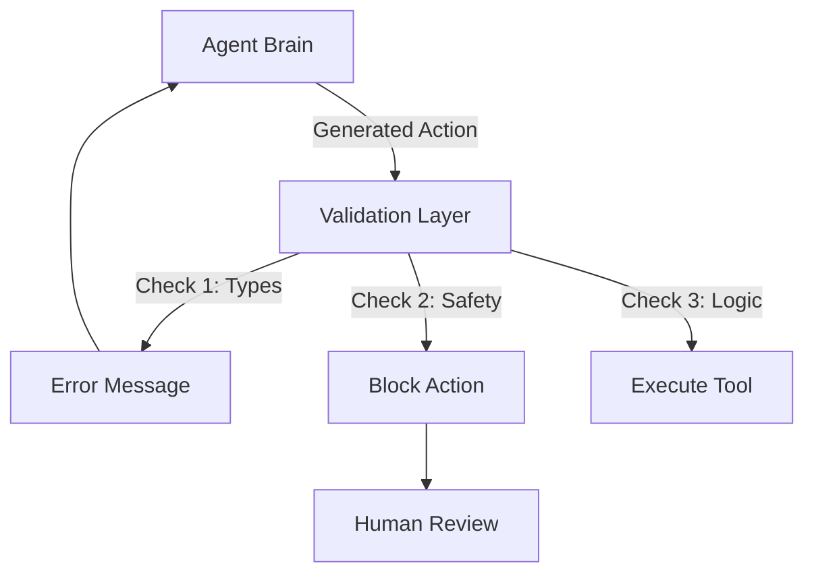

# ✅ Action Validation: The Safety Inspector
> **Level:** Intermediate | **Language:** Hinglish | **Goal:** Master the techniques for verifying if an agent's intended action is valid, safe, and logical before execution.

---

## 🧭 1. Beginner-friendly Hinglish Explanation
Action Validation ka matlab hai "Kaam karne se pehle sochna". Sochiye aapne apne chhote bhai ko bola "Ghar ki safai karo". Wo deewar par pani dalne ja raha hai. Aap use rokenge kyunki ye galat hai. Action validation wahi "Checking" hai. Agent tool call generate karta hai, par hum use turant chalate nahi hain. Pehle hum check karte hain: Kya ye address sahi hai? Kya ye amount limit ke andar hai? Kya ye file delete karna safe hai? Isse system crash hone se bach jata hai.

---

## 🧠 2. Deep Technical Explanation
Action validation is a "Middleware" layer between the LLM and the Tool:
1. **Schema Validation:** Using Pydantic to ensure the arguments match the expected types (e.g., `amount` must be `int`, not `str`).
2. **Business Logic Validation:** Checking if the action is allowed (e.g., `if amount > balance: reject`).
3. **Semantic Validation:** Using a second "Validator LLM" to check if the action actually solves the user's problem or if it's a hallucination.
4. **Pre-flight Checks:** Simulating the action (e.g., `read-only` check) before committing to it.

---

## 🏗️ 3. Real-world Analogies
Action Validation ek **Airport Security** ki tarah hai.
- Aapke paas ticket (Action) hai.
- Par security (Validation) check karti hai ki aapke paas koi dangerous item toh nahi hai aur aapka ID sahi hai ya nahi.
- Sab theek hone par hi aap plane (Execution) mein baith sakte hain.

---

## 📊 4. Architecture Diagrams (The Validation Gate)


---

## 💻 5. Production-ready Examples (The Validation Script)
```python
# 2026 Standard: Validation Middleware
def validate_withdrawal(args):
    # 1. Type Check (Automatic via Pydantic)
    amount = args.get('amount')
    
    # 2. Business Rule Check
    if amount > 10000:
        raise ValueError("Amount exceeds daily withdrawal limit of $10k.")
    
    # 3. Target Check
    if not is_valid_account(args.get('account_id')):
        raise ValueError("Invalid account ID provided.")
    
    return True # Validation Passed
```

---

## ❌ 6. Failure Cases
- **Silent Rejection:** Validation ne action block kar diya par agent ko nahi bataya kyu, jisse agent baar-baar wahi action try kar raha hai.
- **Over-strict Validation:** Sahi actions ko bhi "Unsafe" bolkar block kar dena (False Positives).

---

## 🛠️ 7. Debugging Section
- **Symptom:** Agent says "I've sent the email" but it's not sent.
- **Check:** Validation logs. Shayad validation ne block kiya tha par agent ne use "Success" samajh liya. Make sure your validation layer returns an explicit error to the agent.

---

## ⚖️ 8. Tradeoffs
- **Speed vs Safety:** Har action ko validate karne se latency badhti hai par risk 0 ho jata hai. Critical tasks (Finance/Admin) mein safety ko priority dein.

---

## 🛡️ 9. Security Concerns
- **Validation Bypass:** Hacking attempts jahan prompt injection ke zariye validation logic ko "Ignore" karwaya jaye. Always run validation in a **Trusted Backend**, not inside the LLM prompt.

---

## 📈 10. Scaling Challenges
- Millions of validations per minute require an efficient **Rule Engine** (like Drools or a fast Python validator).

---

## 💸 11. Cost Considerations
- Simple rule-based validation is free. LLM-based semantic validation costs tokens. Use LLM-validation only for ambiguous tasks.

---

## ⚠️ 12. Common Mistakes
- Sirf JSON format check karna par logic ignore karna.
- Validation errors ko user ko na dikhana (Black box failure).

---

## 📝 13. Interview Questions
1. What is the difference between 'Syntactic' and 'Semantic' validation?
2. How do you implement a 'Human-in-the-loop' validation gate?

---

## ✅ 14. Best Practices
- Every validation failure should return a **Helpful Error Message** to the agent so it can fix the action.
- Use **Idempotency Keys** to prevent the same action from being validated/executed twice.

---

## 🚀 15. Latest 2026 Industry Patterns
- **Simulation-based Validation:** Executing the action in a "Shadow Database" or "Dry Run" mode to see the outcome before actual execution.
- **AI Guardrails (NeMo/LlamaGuard):** Standardized layers that validate every action against ethical and safety policies.
