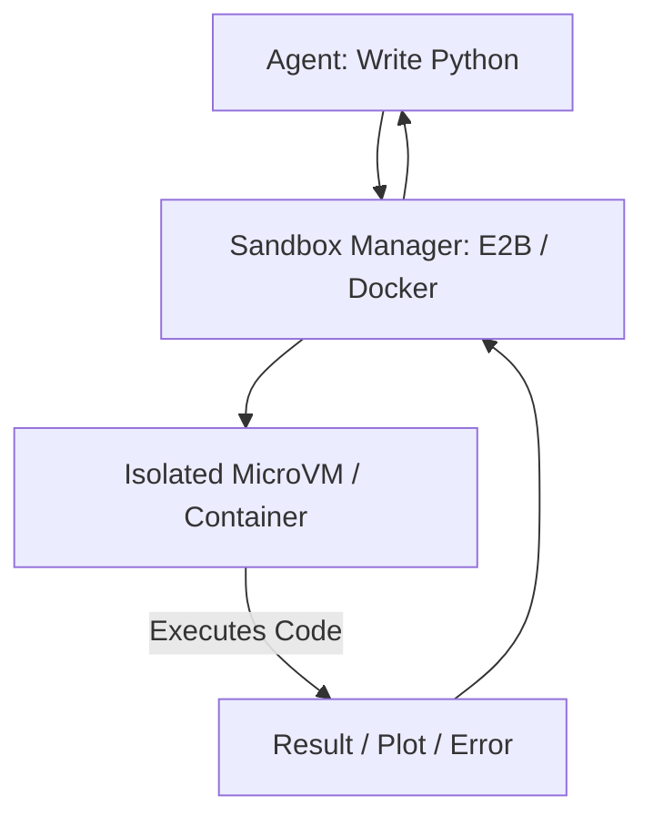

# 💻 Code Interpretation & Sandboxing: The Ultimate Tool
> **Level:** Extreme Advanced | **Language:** Hinglish | **Goal:** Master the art of allowing agents to write and execute arbitrary code while maintaining maximum security.

---

## 🧭 1. Beginner-Friendly Hinglish Explanation
Code Interpretation ka matlab hai AI ko ek **"Laptop"** dena jispar wo khud code likh kar run kar sake.

- **The Problem:** Agar aap AI se pucho "Is data ka graph banao," toh wo sirf code likh sakta hai, par use run karke image nahi dikha sakta.
- **The Solution:** Humein AI ko ek "Safe Room" (Sandbox) dena padta hai jahan wo code run kare.
  - AI code likhta hai.
  - System use "Sandbox" mein run karta hai.
  - AI ko result ya image dikh jati hai.

**Sandboxing** zaroori hai kyunki hum nahi chahte ki AI koi aisa code run kare jo hamare asli computer ki files delete kar de.

---

## 🧠 2. Deep Technical Explanation
Code interpretation transforms an agent into a **Turing-complete System**.

### 1. The Execution Environment (The Sandbox):
To prevent malicious code (e.g., `os.system("rm -rf /")`), we use isolated environments:
- **Docker Containers:** Ephemeral containers that are destroyed after the task.
- **MicroVMs (Firecracker):** Extremely lightweight VMs (used by AWS Lambda).
- **WebAssembly (WASM):** Running code inside a secure browser-level sandbox.

### 2. State Persistence:
In complex tasks, the agent needs to maintain the environment state (e.g., variables, imported libraries) across multiple code execution turns.

### 3. I/O Management:
Handling how files (CSVs, Images) are passed into the sandbox and how results (Plots, Dataframes) are passed back to the agent.

---

## 🏗️ 3. Architecture Diagrams (The Sandbox Flow)


---

## 💻 4. Production-Ready Code Example (Using a Sandbox API like E2B)
```python
# 2026 Standard: Executing code in a secure remote sandbox

from e2b import Sandbox

def run_agent_code(python_code):
    # 1. Create a fresh sandbox
    with Sandbox() as sb:
        # 2. Execute the code written by the LLM
        execution = sb.run_python(python_code)
        
        # 3. Handle results
        if execution.error:
            return f"Error: {execution.error}"
        
        # 4. Return logs and any generated files (e.g. charts)
        return execution.results, execution.logs

# Insight: Never run LLM-generated code on your local machine!
```

---

## 🌍 5. Real-World Use Cases
- **Data Analyst Agents:** Writing Pandas code to analyze large datasets and plot charts.
- **Software Engineering Agents:** Writing unit tests and running them to verify code.
- **Mathematical Solving:** Using Python's `SymPy` or `NumPy` to solve complex equations that the LLM might hallucinate.

---

## ❌ 6. Failure Cases
- **Resource Exhaustion:** Agent writes a `while True` loop that consumes all CPU in the sandbox. **Fix: Set CPU/Memory limits and Timeouts.**
- **Network Exfiltration:** Agent writes code to `curl` sensitive data to an external server. **Fix: Disable network access in the sandbox.**
- **Infinite Installs:** Agent tries to `pip install` 100 libraries, slowing down the system.

---

## 🛠️ 7. Debugging Guide
| Symptom | Cause | Fix |
| :--- | :--- | :--- |
| **Code runs but no output** | Agent didn't `print()` the result | Add "Always use print() to show results" to the system prompt. |
| **Sandbox is slow** | Container startup time | Use **Pre-warmed** containers or MicroVMs. |

---

## ⚖️ 8. Tradeoffs
- **Stateful vs. Stateless Sandboxes:** Stateful is better for multi-turn tasks but harder to manage; Stateless is simpler and more secure.
- **Local vs. Cloud Sandboxing:** Local is cheap but risky; Cloud is secure but adds latency and cost.

---

## 🛡️ 9. Security Concerns (Critical)
- **Prompt Injection to RCE:** An attacker tricks the agent into running a command that escapes the sandbox. **Solution: Hardened kernels and no-root users.**
- **Side-Channel Attacks:** Monitoring the sandbox's power usage or timing to steal keys.

---

## 📈 10. Scaling Challenges
- **Cold Starts:** Waiting 2 seconds for a container to start for every code block.
- **Volume Mounting:** Managing how many gigabytes of data can be moved into a temporary sandbox.

---

## 💸 11. Cost Considerations
- **Sandbox-as-a-Service:** Services like **E2B** or **Piston** charge per execution or per minute. Optimize by closing sandboxes immediately after use.

---

## 📝 12. Interview Questions
1. Why is sandboxing necessary for AI Agents?
2. What is the difference between a Docker sandbox and a MicroVM sandbox?
3. How do you handle file uploads/downloads in an agentic sandbox?

---

## ⚠️ 13. Common Mistakes
- **No Resource Limits:** Not setting a timeout, leading to "Hanging" agents.
- **Full Permissions:** Giving the sandbox user "Sudo" access.

---

## ✅ 14. Best Practices
- **Timeout everything:** No code should run for more than 30 seconds.
- **Redact Sensitive Info:** Ensure environment variables (API keys) are NOT accessible inside the sandbox.
- **Standard Library Only:** Limit the libraries available to the agent to reduce the attack surface.

---

## 🚀 15. Latest 2026 Industry Patterns
- **WASM Sandboxing:** Compiling agent tools into WebAssembly for near-instant, extremely secure execution.
- **Self-Healing Code Loops:** Agents that see a `SyntaxError` in the sandbox and automatically "Reflect" and "Rewrite" the code.
- **Multi-modal Sandboxes:** Sandboxes that can "Render" a web browser or a GUI and send the video stream back to the agent.
