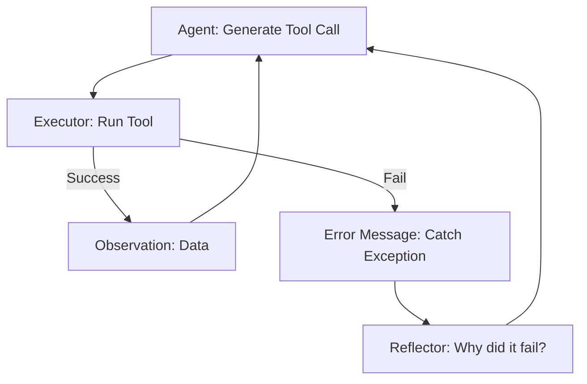

# 🛡️ Error Handling in Tool Use: Resilience by Design
> **Level:** Advanced | **Language:** Hinglish | **Goal:** Master the techniques for managing failures, hallucinations, and edge cases when agents interact with tools.

---

## 🧭 1. Beginner-Friendly Hinglish Explanation
Error Handling ka matlab hai AI ko **"Galthiyon se nipatna"** sikhana.

- **The Problem:** Tools hamesha kaam nahi karte. Kabhi internet chala jata hai, kabhi API key galat hoti hai, aur kabhi AI "Bematlab" ke parameters bhej deta hai.
- **The Solution:** Humein agent ko sirf tool nahi dena, balki ye bhi batana hai ki:
  - "Agar error aaye, toh crash mat hona."
  - "Galti ko padho aur use fix karne ki koshish karo."
  - "User se pucho agar samajh na aaye."

Asli "Expert Agent" wo nahi jo galti na kare, balki wo hai jo **"Galti sudhar sake"**.

---

## 🧠 2. Deep Technical Explanation
Error handling in tool-use involves a loop of **Exception Capture -> LLM Feedback -> Correction**.

### 1. Types of Tool Errors:
- **Syntactic (Parsing) Error:** The LLM outputted invalid JSON or missing required fields.
- **Semantic (Logic) Error:** The parameters are technically correct but logically wrong (e.g., searching for a date in the future).
- **Runtime (Environment) Error:** The external API returned a `500 Internal Server Error` or a `403 Forbidden`.

### 2. Error Feedback Loop:
Instead of throwing a Python Exception, we catch the error and pass the **Traceback/Error Message** back to the LLM as a **Tool Observation**. 
- *Observation:* "Error: The city 'Londonn' was not found. Did you mean 'London'?"

### 3. Retry Strategies:
- **Exponential Backoff:** For rate-limit errors.
- **Prompt Refinement:** Re-sending the system instructions with the error highlighted.

---

## 🏗️ 3. Architecture Diagrams (Resilient Tool Loop)


---

## 💻 4. Production-Ready Code Example (Try-Except with LLM Feedback)
```python
# 2026 Standard: Feeding tool errors back to the agent

def safe_tool_executor(func, args):
    try:
        result = func(**args)
        return {"status": "success", "data": result}
    except Exception as e:
        # 1. Capture the error message
        error_msg = str(e)
        # 2. Return a structured error for the LLM
        return {
            "status": "error",
            "message": f"The tool failed with error: {error_msg}. Please check your arguments and try again."
        }

# Usage: 
# output = safe_tool_executor(get_weather, {"town": "Mumbay"})
# agent.feed_observation(output) # Agent now knows 'town' was wrong.
```

---

## 🌍 5. Real-World Use Cases
- **Database Agents:** If a SQL query is malformed, the agent sees the SQL error and "Patches" the query automatically.
- **Web Scraping:** If a selector is missing, the agent reflects on the HTML and tries a different CSS selector.
- **Financial Payments:** If a balance is insufficient, the agent notifies the user instead of just failing.

---

## ❌ 6. Failure Cases
- **The Infinite Retry Loop:** The agent keeps trying the same failing tool call over and over. **Fix: Set a `max_retries` counter.**
- **Hallucinated Fixes:** The agent "Thinks" it fixed the error, but the fix is just more broken code.
- **Suppressed Errors:** The system catches the error but doesn't tell the agent *why* it failed.

---

## 🛠️ 7. Debugging Guide
| Symptom | Cause | Fix |
| :--- | :--- | :--- |
| **Agent is 'Confused' by errors** | Error message is too technical | Use a **Wrapper** to translate low-level system errors into high-level agent-friendly text. |
| **Agent gives up too easily** | Weak 'Retry' instruction | Add "If you encounter an error, analyze it and try one alternative approach" to the prompt. |

---

## ⚖️ 8. Tradeoffs
- **Fail-Fast vs. Self-Correction:** Fail-fast is cheaper/faster; Self-correction is more resilient but uses more tokens.
- **Detailed vs. Summary Errors:** Providing a $100$-line stack trace vs. a $1$-line summary.

---

## 🛡️ 9. Security Concerns
- **Error Leakage:** Error messages might contain sensitive info (e.g., database connection strings). **MANDATORY: Sanitize error messages before giving them to the LLM.**
- **Denial of Wallet:** An attacker makes a tool fail repeatedly, forcing the agent into expensive "Reflection" loops.

---

## 📈 10. Scaling Challenges
- **Distributed Errors:** Handling errors when tools are running across multiple microservices.

---

## 💸 11. Cost Considerations
- **Error-only Reflection:** Only call the expensive LLM to "Reflect" if the error is complex. For simple errors, use a hardcoded fix or a small model.

---

## 📝 12. Interview Questions
1. How do you feed a Python Exception back to an LLM?
2. What is the danger of an infinite "Error-Reflection" loop?
3. How do you handle "Rate Limit" errors in a multi-agent system?

---

## ⚠️ 13. Common Mistakes
- **Silent Failures:** Catching an exception but returning an empty string. The agent will think everything is fine!
- **Not logging the errors:** If you don't log the tool failures, you can't improve your tools later.

---

## ✅ 14. Best Practices
- **Max Retries:** Never let an agent retry more than 3 times for the same tool call.
- **Specific Errors:** Instead of "Something went wrong," say "The argument 'date' must be in YYYY-MM-DD format."
- **Fallback Tools:** If Tool A fails, suggest Tool B as an alternative.

---

## 🚀 15. Latest 2026 Industry Patterns
- **Automatic Tool Correction:** Servers that return "Corrected JSON" back to the agent when it makes a small mistake.
- **Predictive Error Handling:** Models that "Know" a tool call will fail before they even send it, based on past episodic memory.
- **Self-Healing Tool Registries:** If many agents fail to use a tool, the system automatically updates the tool's description to be clearer.
