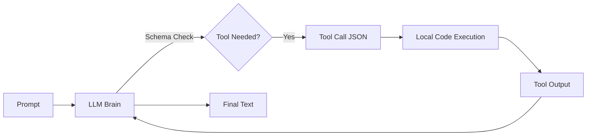

# 📞 Function Calling: Giving the Agent Hands
> **Level:** Beginner | **Language:** Hinglish | **Goal:** Master the fundamental mechanism of how LLMs generate structured tool requests.

---

## 🧭 1. Beginner-friendly Hinglish Explanation
Function Calling ka matlab hai AI ko "Sahi Form" mein kaam mangne ke liye bolna. Sochiye aapne AI ko bola "Bijli ka bill bhar do". AI khud bill nahi bhar sakta, par wo ek "Function" (ek small program) call kar sakta hai. AI dimaag lagata hai aur bolta hai: `pay_bill(account_id="123", amount=500)`. Ye JSON format mein hota hai. Isse hamara system samajh jata hai ki ab use asli payment API chalani hai. Function calling AI ki "Baaton" ko "Asli Action" mein badalti hai.

---

## 🧠 2. Deep Technical Explanation
Function calling involves a specific handshake between the LLM and the application:
1. **Tool Definition:** You provide a JSON Schema describing the function name, description, and required parameters (types, enums).
2. **Inference:** The LLM receives the schema. If it detects a need for the tool, it stops generating text and instead generates a `tool_calls` object.
3. **Parsing:** The application parses this JSON and executes the local Python/JS function.
4. **Injection:** The function's result is sent back to the LLM as a `tool` role message.
5. **Synthesis:** The LLM sees the result and generates a human-readable final answer.

---

## 🏗️ 3. Real-world Analogies
Function Calling ek **Restaurant Waiter** ki tarah hai.
- **User:** Customer jo bolta hai "Muje Pasta chahiye".
- **LLM (Waiter):** Customer ki baat sunta hai aur kitchen ke liye ek "Slip" (JSON) likhta hai: `Order: Pasta, Quantity: 1`.
- **Kitchen (Code):** Slip dekhkar actually khana banata hai.

---

## 📊 4. Architecture Diagrams (The Handshake)


---

## 💻 5. Production-ready Examples (The Schema)
```python
# 2026 Standard: Defining a Tool with Pydantic
from pydantic import BaseModel, Field

class WeatherInput(BaseModel):
    location: str = Field(description="The city name, e.g. London")
    unit: str = Field(default="celsius", enum=["celsius", "fahrenheit"])

# This schema is converted to JSON and passed to OpenAI/Claude
tools = [
    {
        "type": "function",
        "function": {
            "name": "get_weather",
            "description": "Get current weather",
            "parameters": WeatherInput.model_json_schema()
        }
    }
]
```

---

## ❌ 6. Failure Cases
- **Argument Hallucination:** Model ne argument mein aisi value bhej di jo valid hi nahi hai (e.g., `date="tomorrow_morning"` instead of `YYYY-MM-DD`).
- **Missing Parameters:** Required fields skip kar dena.

---

## 🛠️ 7. Debugging Section
- **Symptom:** The model is still just talking instead of calling the function.
- **Fix:** System prompt mein "Force Tool Use" instructions dein. Check if the tool description is clear. Agar `get_stock` description "Get data" hai, toh model confuse ho jayega. Use "Fetch real-time stock prices for a ticker".

---

## ⚖️ 8. Tradeoffs
- **Schema Size vs Context:** 100 tools ke schemas dene se model "Overwhelmed" ho sakta hai aur context window bhari ho jati hai.

---

## 🛡️ 9. Security Concerns
- **JSON Injection:** Malicious inputs in tool arguments. Always validate and sanitize inputs before passing them to a database or system command.

---

## 📈 10. Scaling Challenges
- High-latency in sequential tool calls. Use **Parallel Tool Calling** where possible.

---

## 💸 11. Cost Considerations
- Har function calling round (Call + Execution + Result + Answer) multiple tokens consume karta hai. Use **Mini models** for simple tool routing.

---

## ⚠️ 12. Common Mistakes
- Descriptions ko casual likhna. (Tool description hi model ka "Manual" hai).
- Error handle na karna (Agar tool fail ho, toh error message LLM ko wapas bhejein taaki wo "Self-Correct" kar sake).

---

## 📝 13. Interview Questions
1. How does the LLM know when to stop generating text and trigger a function call?
2. What is 'Strict Mode' in OpenAI function calling?

---

## ✅ 14. Best Practices
- Use **Strict Mode** (Structured Output) to ensure 100% valid JSON.
- Provide **Few-shot examples** of tool calls in the prompt.

---

## 🚀 15. Latest 2026 Industry Patterns
- **Native Tool Integration:** Models jo bina extra prompt ke natively `tool_use` optimize karte hain.
- **Multi-modal Tool Calling:** Using images as inputs for function calls (e.g., "Look at this bill and pay it").
