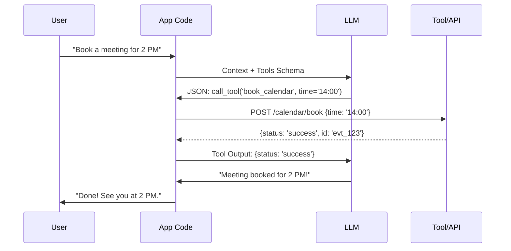

# 📞 Function Calling Mechanisms: The Technical Core
> **Level:** Advanced | **Language:** Hinglish | **Goal:** Master the low-level protocols and formats that enable structured communication between LLMs and external systems.

---

## 🧭 1. Beginner-Friendly Hinglish Explanation
Function calling ka matlab hai AI se **"Code mein baat karna"**.

- **Normal Conversation:** "Mujhe stock price batao." -> "Nvidia ka price $120 hai." (Text).
- **Function Calling:** "Mujhe stock price batao." -> AI ek JSON object bhejta hai: `{"tool": "get_stock", "symbol": "NVDA"}`. 

Ye JSON computer ke liye padhna asaan hai. AI ko humne sikha diya hai ki jab bhi use "Stock" dhoondna ho, use normal english nahi balki ye **"Specific JSON Format"** use karna hai.

---

## 🧠 2. Deep Technical Explanation
Function calling is a multi-step orchestration between the **Model**, the **Application Code**, and the **External Tool**.

### 1. The Schema Definition (The Blueprint):
We define the function using **JSON Schema**.
- **`name`**: Unique identifier.
- **`description`**: Natural language description for the LLM to understand "When" to use it.
- **`parameters`**: Nested object defining fields and types.

### 2. The Model Output (The Invocation):
The model doesn't "Call" the function. It outputs a `tool_calls` array in the response object. The application parses this.

### 3. The Execution Phase:
The application looks up the function in its **Tool Registry**, executes the code with the LLM's provided arguments, and captures the output.

### 4. The Feedback Loop:
The result is sent back to the LLM in a special message role (e.g., `role: "tool"` or `role: "function"`). This allows the LLM to "Observe" the result and formulate a final answer.

---

## 🏗️ 3. Architecture Diagrams (Sequential Logic)


---

## 💻 4. Production-Ready Code Example (Parsing OpenAI Tool Calls)
```python
# 2026 Standard: Handling Tool Calls programmatically

import openai

def handle_query(query):
    # 1. First Call to LLM
    response = openai.chat.completions.create(
        model="gpt-4o",
        messages=[{"role": "user", "content": query}],
        tools=my_tools_schema
    )
    
    msg = response.choices[0].message
    
    if msg.tool_calls:
        # 2. Iterate through requested tool calls
        for tool_call in msg.tool_calls:
            func_name = tool_call.function.name
            args = json.loads(tool_call.function.arguments)
            
            # 3. Execute the actual function
            result = my_local_functions[func_name](**args)
            
            # 4. Feed back to LLM
            # (Append to messages and call LLM again)
```

---

## 🌍 5. Real-World Use Cases
- **Database Querying:** AI converts natural language to `{"sql": "SELECT * FROM..."}`.
- **IoT Control:** `{"action": "lock_door", "room": "main_entry"}`.
- **Email Automation:** `{"to": "boss@co.com", "subject": "Daily Report", "body": "..."}`.

---

## ❌ 6. Failure Cases
- **Invalid JSON:** The model misses a quote or a bracket, making the tool call un-parsable.
- **Wrong Type:** Sending `tenure: "5 years"` instead of `tenure: 60` (months).
- **Hallucinated Arguments:** The model invents parameters that were not in the schema.

---

## 🛠️ 7. Debugging Guide
| Symptom | Cause | Fix |
| :--- | :--- | :--- |
| **Model ignores tools** | System prompt is too long | Move the "Use tools whenever possible" instruction to the **end** of the prompt. |
| **Model keeps calling the same tool** | Tool output is not clear | Improve the tool's return message (e.g., say "Error: Stock not found" instead of just "[]"). |

---

## ⚖️ 8. Tradeoffs
- **One Large Tool vs. Many Small Tools:** Large tools (e.g., `do_everything`) are harder for the LLM to get right. Small, atomic tools are more reliable.
- **Parallel Tool Calls:** Calling 3 tools at once (Faster) vs. Sequential calls (Better reasoning).

---

## 🛡️ 9. Security Concerns
- **Data Injection:** If a tool output contains a string that looks like a new instruction, the LLM might follow it (**Indirect Prompt Injection**).
- **Tool Shadowing:** A tool name that is very similar to a system keyword might confuse the model's logic.

---

## 📈 10. Scaling Challenges
- **Schema Management:** Managing hundreds of tools across different versions. Use a **Tool Registry Service**.

---

## 💸 11. Cost Considerations
- **Output Token Costs:** Complex tool calls with massive JSON objects can be expensive. Use **Concise Schemas**.

---

## 📝 12. Interview Questions
1. How does the LLM know which tool's schema to follow?
2. What happens if the `tool_calls` JSON is invalid?
3. What is the difference between `function` role and `user` role in the message list?

---

## ⚠️ 13. Common Mistakes
- **No 'Required' Fields:** Not specifying which parameters are mandatory, leading to empty tool calls.
- **Vague Descriptions:** "Tool for data" instead of "Tool for fetching 2026 sales figures from the SQL database".

---

## ✅ 14. Best Practices
- **Use Pydantic:** Define tools as Pydantic models to auto-generate JSON schemas and validate inputs.
- **Handle Retries:** If the JSON is invalid, send the error back to the LLM and ask it to "Fix the JSON".

---

## 🚀 15. Latest 2026 Industry Patterns
- **Native JSON Models:** Models (like Llama-3-Groq) that are fine-tuned specifically to output valid JSON with $99.9\%$ accuracy.
- **Streaming Tool Calls:** Processing the tool call *as it is being generated* to reduce latency.
- **Multi-modal Function Calling:** Calling a tool by "Pointing" at a UI element in an image.
  - *Example:* "Click this button" -> `{"action": "click", "x": 120, "y": 450}`.
  
