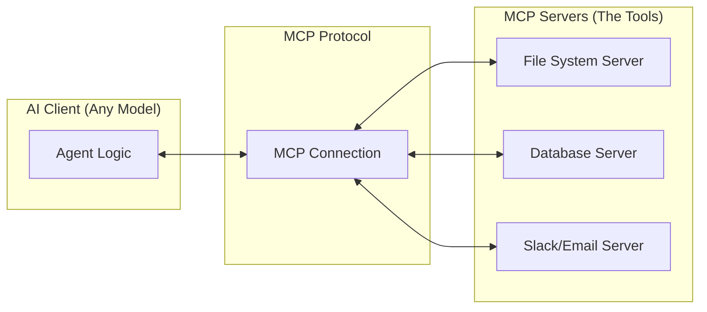

# 🔌 MCP (Model Context Protocol): The Universal Plug
> **Level:** Advanced | **Language:** Hinglish | **Goal:** Master the 2026 standard for connecting LLMs to local data, tools, and enterprise environments.

---

## 🧭 1. Beginner-Friendly Hinglish Explanation
MCP ka matlab hai AI ka **"Universal USB Port"**.

- **The Problem:** Pehle har AI (OpenAI, Claude, Llama) ke liye alag tarah se tools aur data connect karna padta tha. Ye bahut thaka dene wala kaam tha.
- **The Solution (MCP):** Anthropic aur industry leaders ne milkar ek protocol banaya. 
  - Ek baar "MCP Server" banao.
  - Wo server kisi bhi AI model se connect ho jayega.
  - Ab aapka AI aapke computer ki files, database, aur apps ko asani se use kar sakta hai.

MCP ne AI ko "Internet search" se badhkar aapke **"Local Desktop"** ka power de diya hai.

---

## 🧠 2. Deep Technical Explanation
The **Model Context Protocol (MCP)** is an open standard that decouples the **AI Client** from the **Data Source**.

### 1. Key Components:
- **MCP Client:** The AI application (e.g., Claude Desktop, an IDE, or a custom agent).
- **MCP Server:** A small service that exposes **Resources** (data), **Tools** (functions), and **Prompts** (templates).
- **Transport Layer:** How they talk (usually via Standard I/O or HTTP/SSE).

### 2. The Core Capabilities:
- **Resources:** Static data like log files, database schemas, or documentation.
- **Tools:** Executable actions like "Run SQL", "Send Slack", or "Compile Code".
- **Prompts:** Pre-defined system instructions that help the model use the specific data source.

### 3. Why it's a Game Changer:
It eliminates the need to build "Custom Connectors" for every new LLM. If you have an MCP server for Postgres, any MCP-compliant agent can use it immediately.

---

## 🏗️ 3. Architecture Diagrams (The MCP Bridge)


---

## 💻 4. Production-Ready Code Example (A Minimal MCP Server in Python)
```python
# 2026 Standard: Building an MCP Server using the FastMCP library

from mcp.server.fastmcp import FastMCP

# Create the server
mcp = FastMCP("MyLocalTools")

# 1. Define a Tool
@mcp.tool()
def get_system_load() -> str:
    """Returns the current CPU and Memory usage."""
    import psutil
    return f"CPU: {psutil.cpu_percent()}%, RAM: {psutil.virtual_memory().percent}%"

# 2. Define a Resource
@mcp.resource("config://app-settings")
def get_config() -> str:
    """Exposes the application settings file."""
    with open("settings.json", "r") as f:
        return f.read()

if __name__ == "__main__":
    mcp.run()
```

---

## 🌍 5. Real-World Use Cases
- **Desktop AI Assistants:** An agent that can read your local code, fix bugs, and run your tests via MCP.
- **Enterprise Data Access:** Securely exposing SQL databases to internal AI agents without complex API layers.
- **IoT Orchestration:** Controlling local smart devices via a unified MCP hub.

---

## ❌ 6. Failure Cases
- **Transport Latency:** Using MCP over a slow network can make the agent feel sluggish.
- **Schema Mismatch:** The model fails to understand the parameters of an MCP tool.
- **Permissions:** The MCP server has access to files that the user shouldn't be allowed to see via the AI.

---

## 🛠️ 7. Debugging Guide
| Symptom | Cause | Fix |
| :--- | :--- | :--- |
| **Tool doesn't show up in AI** | JSONRPC handshake failed | Check the **Standard Error (stderr)** logs of the MCP server. |
| **Agent halluncinates data** | Resource is too large | Use **Pagination** or **Summarization** within the MCP resource handler. |

---

## ⚖️ 8. Tradeoffs
- **Standardization vs. Flexibility:** MCP is great for standard tools but might be restrictive for highly custom, interactive UI tools.
- **Security vs. Ease of Use:** Local MCP servers run with the user's permissions, which is powerful but risky.

---

## 🛡️ 9. Security Concerns
- **Capability Leakage:** A model might accidentally trigger a destructive MCP tool (e.g., `delete_file`) while trying to be helpful. **Fix: Implement 'Read-only' modes for sensitive servers.**
- **Local Exploits:** Malicious MCP servers could gain access to the user's computer.

---

## 📈 10. Scaling Challenges
- **Multiple Servers:** Managing 10-20 different MCP servers at once requires a robust **MCP Gateway**.

---

## 💸 11. Cost Considerations
- **Low Overhead:** MCP servers are extremely lightweight (small Python/Node processes). The main cost is the LLM tokens used to describe the tools.

---

## 📝 12. Interview Questions
1. What is the main goal of the Model Context Protocol?
2. Explain the difference between an MCP Tool and an MCP Resource.
3. How does the "Transport Layer" work in MCP?

---

## ⚠️ 13. Common Mistakes
- **No Error Handling:** Not returning a clear error message from an MCP tool.
- **Large Resources:** Sending a $10MB$ file as a single resource (it will crash the context window).

---

## ✅ 14. Best Practices
- **Version your MCP Servers:** Ensure your tools don't break when you update the server.
- **Strict Typing:** Always use type hints in your tool definitions.
- **Secure by Default:** Only expose the minimum number of tools and resources needed.

---

## 🚀 15. Latest 2026 Industry Patterns
- **MCP-to-API Gateways:** Automatically converting existing REST APIs into MCP servers.
- **Collaborative MCP:** Multiple users sharing a set of remote MCP servers for a shared project.
- **On-device MCP:** Hardware manufacturers (Apple/NVIDIA) baking MCP support into their drivers for direct AI control.
