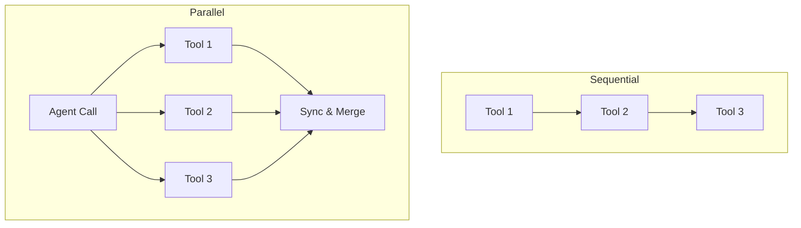

# ⚡ Parallel Tool Execution: Speeding Up the Agent
> **Level:** Intermediate | **Language:** Hinglish | **Goal:** Master the techniques for running multiple tool calls simultaneously to minimize latency and improve agent efficiency.

---

## 🧭 1. Beginner-friendly Hinglish Explanation
Parallel Tool Execution ka matlab hai "Ek saath kai kaam karna". Sochiye aapko party plan karni hai. Agar aap pehle phool layenge, fir ghar aakar cake mangwayenge, fir ghar aakar music system rent karenge, toh bahut time lagega. Lekin agar aap 3 logon ko ek saath bhej dein (Parallel), toh kaam 3 guna jaldi ho jayega. AI Agents bhi yahi karte hain. Agar use 3 alag-alag sources se data chahiye, toh wo 3 calls ek saath bhejta hai, jisse user ko wait kam karna padta hai.

---

## 🧠 2. Deep Technical Explanation
Parallel execution involves the agent generating multiple `tool_calls` in a single response:
1. **Multi-Tool Generation:** Models like GPT-4 and Claude-3.5 can output an array of tool calls (e.g., `[call_1, call_2, call_3]`) in one turn.
2. **Async Execution:** Using Python's `asyncio` or `threading`, the application triggers all functions at once instead of waiting for each one to finish.
3. **Synchronization:** The system waits for all results to return (using `asyncio.gather`) and then sends the combined output back to the LLM.
4. **Benefit:** Reduces overall wall-clock time from $O(N)$ to $O(1)$ (assuming tools are independent).

---

## 🏗️ 3. Real-world Analogies
Parallel Execution ek **Multi-tasking Chef** ki tarah hai.
- Ek chulhe par pasta ubal raha hai.
- Dusre par sauce ban rahi hai.
- Oven mein bread sik rahi hai.
Teeno kaam saath ho rahe hain taaki dish jaldi ready ho.

---

## 📊 4. Architecture Diagrams (Sequential vs Parallel)


---

## 💻 5. Production-ready Examples (Async Tool Execution)
```python
# 2026 Standard: Parallel Execution with Asyncio
import asyncio

async def run_tools_parallel(tool_calls):
    tasks = []
    for call in tool_calls:
        # Create a task for each tool execution
        tasks.append(execute_single_tool(call))
    
    # Run all tasks simultaneously
    results = await asyncio.gather(*tasks)
    return results

# results will be a list of outputs corresponding to each call
```

---

## ❌ 6. Failure Cases
- **Dependency Conflict:** Agent ne Tool 2 ko Tool 1 se pehle chalane ki koshish ki, jabki Tool 2 ko Tool 1 ka result chahiye tha (e.g., "Search for a link" and "Read that link").
- **Resource Exhaustion:** Ek saath 100 tools chalane se system ki memory ya API rate limits khatam ho gayi.

---

## 🛠️ 7. Debugging Section
- **Symptom:** Agent starts 3 tools but only receives output from 1.
- **Check:** Error handling in the async loop. Agar ek tool fail hota hai, toh kya poora `asyncio.gather` crash ho raha hai? Use `return_exceptions=True` in gather to catch individual failures.

---

## ⚖️ 8. Tradeoffs
- **Speed vs Complexity:** Fast hai par error handling aur dependency management mushkil ho jati hai.
- **Cost:** Parallel execution tokens bachata nahi hai, sirf "Time" bachata hai.

---

## 🛡️ 9. Security Concerns
- **Race Conditions:** Agar do tools ek hi file ya database record ko update karne ki koshish karein, toh data corrupt ho sakta hai. Use **Locks** or **Atomic Transactions**.

---

## 📈 10. Scaling Challenges
- Network bandwidth bottleneck. Bahut saari heavy API calls ek saath karne se network choke ho sakta hai.

---

## 💸 11. Cost Considerations
- Parallel execution user experience (UX) ke liye acchi hai, par isse LLM cost kam nahi hoti.

---

## ⚠️ 12. Common Mistakes
- Independent vs Dependent tasks ko na pehchanna.
- Timeout set na karna (Ek slow tool poore parallel batch ko rok sakta hai).

---

## 📝 13. Interview Questions
1. When can you NOT use parallel tool execution for an agent?
2. How does `asyncio.gather` work in the context of agentic tool loops?

---

## ✅ 14. Best Practices
- Only parallelize tasks that have **Zero Dependencies** on each other.
- Implement **Global Timeouts** for the entire batch.

---

## 🚀 15. Latest 2026 Industry Patterns
- **Speculative Tool Execution:** Agent predict karta hai ki use next kaunse tools chahiye honge aur unhe pehle se hi parallel mein "Warm-up" kar deta hai.
- **Streaming Parallel Results:** User ko partial results dikhana jaise-jaise individual tools finish hote hain.
