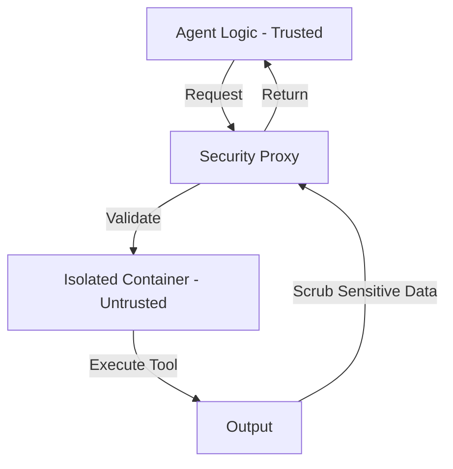

# 🛡️ Safe Tool Execution: The Secure Sandbox
> **Level:** Advanced | **Language:** Hinglish | **Goal:** Master the security patterns for executing agent-generated actions without compromising system integrity.

---

## 🧭 1. Beginner-friendly Hinglish Explanation
Safe Tool Execution ka matlab hai agent ko "Controlled Environment" mein kaam karne dena. Sochiye aapne kisi naye naukar ko ghar ki chabi di. Aap use ye toh nahi bolenge ki "Tum locker bhi khol sakte ho". Aap use sirf wahi chabi denge jo zaroori hai. AI Agents ke liye Safe Execution ka matlab hai unhe ek **"Sandbox"** (Safe Box) mein rakhna. Agar wo koi galat command chalayein, toh wo sirf us box ke andar rahe aur aapke poore computer ya server ko nuksan na pahunchaye.

---

## 🧠 2. Deep Technical Explanation
Safety in execution involves multiple layers of defense:
1. **Isolation (Sandboxing):** Running tool code in a **Docker Container** or **WASM** environment with zero network access unless required.
2. **Least Privilege (RBAC):** Giving the agent's API keys only the minimum permissions (e.g., `READ-ONLY` for the DB).
3. **Execution Timeouts:** Killing any tool execution that takes longer than 30 seconds to prevent DDoS or infinite loops.
4. **Input Sanitization:** Escaping special characters in strings to prevent SQL Injection or OS Command Injection.

---

## 🏗️ 3. Real-world Analogies
Safe Execution ek **Chemistry Lab** ki tarah hai.
- Aap experiments karte hain.
- Par aap ek "Fume Hood" (Glass box) ke andar karte hain taaki agar koi blast ho ya gas nikle, toh wo poori lab mein na faile.

---

## 📊 4. Architecture Diagrams (The Sandbox Pattern)


---

## 💻 5. Production-ready Examples (Sandboxed Execution)
```python
# 2026 Standard: Running Python code safely
import docker

def execute_in_sandbox(python_code):
    client = docker.from_env()
    # Run code in a container with restricted CPU, Memory, and Networking
    container = client.containers.run(
        "python:3.10-slim",
        command=f"python -c '{python_code}'",
        mem_limit="128m",
        cpu_period=100000,
        cpu_quota=50000,
        network_disabled=True,
        detach=False
    )
    return container.decode('utf-8')
```

---

## ❌ 6. Failure Cases
- **Escaping the Sandbox:** Agent ne aisi command chalayi jo docker se bahar nikal kar host machine ka access le gayi (Container escape).
- **Infinite Resource Consumption:** Agent ne `while True: pass` likh diya, jisse CPU 100% ho gaya.

---

## 🛠️ 7. Debugging Section
- **Symptom:** Tool execution is always returning "Permission Denied".
- **Check:** IAM roles and Sandbox permissions. Zyada restrict karne se agent "Crippled" ho sakta hai. Use **Audit Logs** to see exactly which permission is missing.

---

## ⚖️ 8. Tradeoffs
- **High Security vs Low Performance:** Docker containers spawn karne mein time lagta hai (Latency). For simple math, it might be overkill, but for code execution, it's mandatory.

---

## 🛡️ 9. Security Concerns
- **Prompt Injection for RCE:** User agent ko bolta hai "Write a script to delete /root/". Agar agent ke paas permission hai, toh system gaya. Always use **Hard Constraints** in the sandbox.

---

## 📈 10. Scaling Challenges
- 1000s of agents running 1000s of docker containers can crash a server. Use **Lightweight WASM** or **Firecracker MicroVMs** for scale.

---

## 💸 11. Cost Considerations
- Running isolated environments increases infrastructure costs (Compute + Memory). Optimize by reusing warm containers.

---

## ⚠️ 12. Common Mistakes
- Agent ko `root` access dena.
- Internet access allow karna (Agent data leak kar sakta hai external server par).

---

## 📝 13. Interview Questions
1. What is 'Least Privilege' and how do you apply it to AI Agents?
2. Why is 'Input Sanitization' alone not enough for safe tool execution?

---

## ✅ 14. Best Practices
- Never execute **Dynamic Strings** in the shell.
- Use **Read-Only File Systems** for the agent.
- Implement **Human Approval** for any 'Write' or 'Delete' actions.

---

## 🚀 15. Latest 2026 Industry Patterns
- **E2B Sandboxes:** Specialized cloud environments (Edit2Build) designed specifically for AI agents to run code safely.
- **Privacy-Preserving Execution (TEE):** Running sensitive tool calls in Trusted Execution Environments where even the cloud provider can't see the data.
