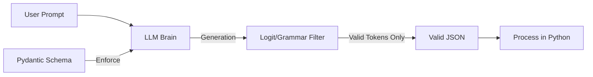

# 📋 Structured Output: Precision in Communication
> **Level:** Beginner | **Language:** Hinglish | **Goal:** Master the techniques for forcing AI agents to output data in 100% valid JSON or Pydantic formats.

---

## 🧭 1. Beginner-friendly Hinglish Explanation
Structured Output ka matlab hai AI ko ek "Fixed Saanche" (Fixed Format) mein baat karne par majboor karna. Sochiye aapne AI ko bola "User ka data do". AI kabhi likhega "User ka naam Rahul hai", kabhi likhega "Rahul (User)". Isse aapka computer program confuse ho jayega. Structured output ka matlab hai AI hamesha JSON mein answer dega: `{"name": "Rahul", "age": 25}`. Isse hamara code AI ke answer ko bina kisi galti ke read kar sakta hai.

---

## 🧠 2. Deep Technical Explanation
Structured Output ensures the model's generation adheres to a schema (JSON Schema or Pydantic model):
1. **Constraint Decoding:** Modern APIs (like OpenAI's `.with_structured_output`) modify the sampling process to only allow tokens that fit the grammar of the schema.
2. **Schema Definition:** You define the expected output structure using tools like **Pydantic**.
3. **Parsing vs Native:** Old method used "JSON parsing with retries". New 2026 method uses "Native Constraints" provided by the LLM provider, guaranteeing 100% validity.
**Benefit:** Eliminates "Malformed JSON" errors and simplifies downstream logic.

---

## 🏗️ 3. Real-world Analogies
Structured Output ek **Passport Application Form** ki tarah hai.
- Aap apni marzi se kahin bhi kuch nahi likh sakte.
- Har box fixed hai: "First Name", "Date of Birth".
- Form ke rules (Schema) ke bina application reject ho jayegi.

---

## 📊 4. Architecture Diagrams (The Schema Enforcer)


---

## 💻 5. Production-ready Examples (Pydantic Enforcement)
```python
# 2026 Standard: Using Pydantic for Structured Output
from pydantic import BaseModel

class AuditResult(BaseModel):
    is_safe: bool
    summary: str
    risk_score: int

# Using a modern client
structured_llm = model.with_structured_output(AuditResult)
result = structured_llm.invoke("Audit this system log: ...")

# Accessing values is now 100% safe
print(result.is_safe, result.risk_score)
```

---

## ❌ 6. Failure Cases
- **Constraint Overload:** Schema itna complex hai ki model reasoning hi bhool gaya (Model focus shifted to formatting).
- **Hallucinating Constraints:** Model ne required fields bharne ke liye fake data invent kar liya.

---

## 🛠️ 7. Debugging Section
- **Symptom:** LLM takes too long to respond when structured output is enabled.
- **Fix:** Schema ko simplify karein. Har field ke liye "Description" dein taaki model ko formatting mein confusion na ho. Avoid deeply nested objects if possible.

---

## ⚖️ 8. Tradeoffs
- **Precision vs Creativity:** Structured output creativity ko limit karta hai. Sirf "Data extraction" ke liye use karein, "Storytelling" ke liye nahi.

---

## 🛡️ 9. Security Concerns
- **Schema Poisoning:** Agar koi user schema ke fields ke name change karwa de via prompt injection, toh downstream parsing fail ho sakti hai.

---

## 📈 10. Scaling Challenges
- Millions of structured calls require high-speed JSON validators in the middleware to prevent processing lag.

---

## 💸 11. Cost Considerations
- Structured output sometimes uses more tokens because of JSON formatting (brackets, quotes). Use **YAML** or **TSV** formats if you want to save every single token (though JSON is industry standard).

---

## ⚠️ 12. Common Mistakes
- Pydantic models mein "Optional" fields define na karna.
- LLM provider ka native structured mode use na karna (Using raw prompts instead).

---

## 📝 13. Interview Questions
1. What is the difference between 'Logit Bias' and 'Grammar Constraints' for structured output?
2. How do you handle a scenario where the model says it cannot fit the data into the requested schema?

---

## ✅ 14. Best Practices
- Always use **Native Structured Output** features of the API.
- Keep schemas **Flat** for better accuracy with smaller models.

---

## 🚀 15. Latest 2026 Industry Patterns
- **Type-Safe Agents:** Agents jo end-to-end Pydantic types share karte hain, ensuring zero runtime type errors.
- **Dynamic Schema Generation:** AI jo khud decide karta hai ki is specific task ke liye output schema kya hona chahiye.
