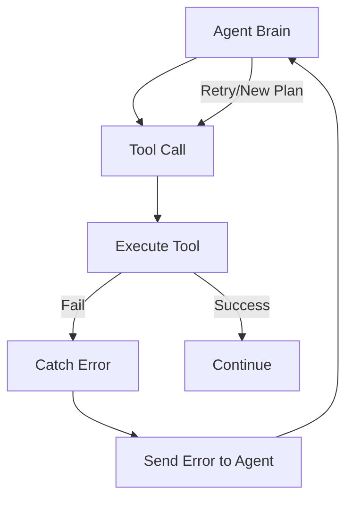

# 🩹 Tool Error Recovery: Resilience in Action
> **Level:** Intermediate | **Language:** Hinglish | **Goal:** Master the techniques for making agents robust against tool failures, API errors, and invalid arguments.

---

## 🧭 1. Beginner-friendly Hinglish Explanation
Tool Error Recovery ka matlab hai "Galti hone par haar na maanna". Sochiye aapne agent ko bola "Dukan se bread lao". Agent dukan gaya par dukan band thi (Error). Ek bura agent wapas aakar ro dega. Par ek smart agent (Recovery enabled) sochega "Theek hai, dusri dukan dekhte hain" ya "Swiggy se order karte hain". Is section mein hum sikhayenge ki kaise agent ko sikhaya jaye ki agar koi tool fail ho, toh use handle kaise karein aur alternative rasta kaise dhundhein.

---

## 🧠 2. Deep Technical Explanation
Error recovery involves a feedback loop where errors are treated as **Observations**:
1. **Exception Catching:** The application catches the Python/JS error (e.g., `404 Not Found`).
2. **Error Feedback:** Instead of crashing, the system sends the error message back to the LLM as a tool result: `{"status": "error", "message": "API Key Expired"}`.
3. **Self-Correction:** The LLM analyzes the error and decides to either:
   - **Retry:** With different arguments.
   - **Switch Tool:** Try a different tool for the same goal.
   - **Ask Human:** Request help if the error is unrecoverable.

---

## 🏗️ 3. Real-world Analogies
Error Recovery ek **Proactive Secretary** ki tarah hai.
- Aapne kaha "Meeting schedule karo".
- Room busy hai (Error).
- Secretary aapse nahi puchti, wo dusra khali room dhundhti hai (Recovery) aur fir aapko final update deti hai.

---

## 📊 4. Architecture Diagrams (The Recovery Loop)


---

## 💻 5. Production-ready Examples (The Error Prompt)
```python
# 2026 Standard: Feeding Errors back to LLM
def safe_execute_tool(tool_name, args):
    try:
        return run_tool(tool_name, args)
    except Exception as e:
        # Crucial: Return the error to the model
        return f"Error: Tool {tool_name} failed with message: {str(e)}. Please fix your arguments or try a different approach."

# The LLM will see this 'Error' string and use its reasoning to pivot.
```

---

## ❌ 6. Failure Cases
- **Infinite Retry Loop:** Agent baar-baar wahi galat command bhej raha hai aur system wahi error.
- **Silent Failures:** Tool fail ho gaya par system ne "None" return kar diya, jisse agent ko laga kaam ho gaya.

---

## 🛠️ 7. Debugging Section
- **Symptom:** Agent is stuck repeating the same failed tool call.
- **Fix:** Error message ko zyada "Actionable" banayein. Sirf "Error" likhne ki jagah likhein "Error: Address must include a Zip Code". Model instruction samajhkar Zip Code dhoondhne ki koshish karega.

---

## ⚖️ 8. Tradeoffs
- **Auto-Recovery vs Safety:** Automatically retry karna fast hai par "Multiple wrong payments" ka risk bhi ho sakta hai. Use human approval for critical retries.

---

## 🛡️ 9. Security Concerns
- **Error Leakage:** Error message mein kabhi sensitive database paths ya stack traces na bhejien. Use generic errors for security (e.g., "Database access denied").

---

## 📈 10. Scaling Challenges
- Millions of errors log karna aur analyze karna heavy kaam hai. Use **Error Pattern Clustering** to find common tool bugs.

---

## 💸 11. Cost Considerations
- Har "Retry" ek extra LLM call hai. Limit retries to 2-3 to save budget.

---

## ⚠️ 12. Common Mistakes
- LLM ko error message na dikhana (Crash kar dena).
- Error hone par state clear na karna.

---

## 📝 13. Interview Questions
1. Why should you feed the exact error message back to the LLM?
2. How do you prevent 'Infinite Loops' in autonomous error recovery?

---

## ✅ 14. Best Practices
- Use **Exponential Backoff** for network retries.
- Always log every failure for human auditing.

---

## 🚀 15. Latest 2026 Industry Patterns
- **Self-Healing Toolkits:** Agents jo tools ke source code ko autonomously edit karke bugs fix kar dete hain (Experimental but powerful).
- **Fallback Chains:** Pehle specialized tool try karna, fail ho toh "General Search" tool par switch hona automatically.
