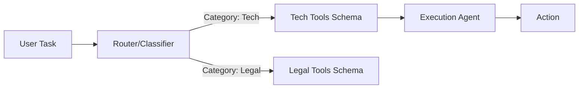

# 🎯 Tool Selection Strategies: Choosing the Right Weapon
> **Level:** Intermediate | **Language:** Hinglish | **Goal:** Master the algorithms and logic for selecting the most appropriate tool among hundreds of possibilities.

---

## 🧭 1. Beginner-friendly Hinglish Explanation
Tool Selection ka matlab hai "Sahi Kaam ke liye Sahi Auzaar chunna". Sochiye aapke paas ek bahut badi toolkit hai jisme 500 tools hain. Agar aapko ek keel (nail) thonkni hai, toh aap aari (saw) nahi uthayenge, aap hathoda (hammer) dhundhenge. AI Agent ke liye bhi yahi hai. Agar hum use saare 500 tools ek saath de dein, toh wo confuse ho jayega. Hum "Selection Strategies" use karte hain taaki agent sirf wahi tools dekhe jo uske current task ke liye zaroori hain.

---

## 🧠 2. Deep Technical Explanation
Advanced tool selection is required when the total number of tools exceeds the model's context window or reasoning capacity:
1. **Semantic Selection (RAG for Tools):** Storing tool descriptions in a Vector DB. When a user asks a query, retrieve the top 5-10 most similar tool schemas and inject them into the prompt.
2. **Classification/Routing:** A "Router Agent" first classifies the task (e.g., `Finance`) and then provides only finance-related tools to the executor.
3. **Few-Shot Selection:** Providing examples where the agent chose the correct tool for similar ambiguous queries.
4. **Agentic Selection:** A high-level agent creates a "Plan" and explicitly requests specific tools for each step.

---

## 🏗️ 3. Real-world Analogies
Tool Selection ek **Departmental Store** ki tarah hai.
- Aap poore store ki list lekar nahi ghumte.
- Aap board dekhte hain: "Electronics Section". Aap wahan jaate hain aur wahan ke specialized tools (items) dekhte hain.

---

## 📊 4. Architecture Diagrams (The Selection Pipeline)


---

## 💻 5. Production-ready Examples (Vector-based Tool Selection)
```python
# 2026 Standard: Tool Retrieval Logic
def select_tools(query, tool_db):
    # Vector search to find tools matching the query intent
    relevant_tools = tool_db.search(query, k=5)
    # Convert tools to JSON schema format
    return [t.to_schema() for t in relevant_tools]

# Usage
prompt_tools = select_tools("Find my last invoice", my_vector_db)
response = llm.invoke(user_prompt, tools=prompt_tools)
```

---

## ❌ 6. Failure Cases
- **The "Everything is a Hammer" Problem:** Agent ek hi tool ko har kaam ke liye use karne ki koshish karta hai kyunki uska description bahut general hai.
- **Missing Link:** Best tool retrieve hi nahi hua kyunki user ne alag keywords use kiye the.

---

## 🛠️ 7. Debugging Section
- **Symptom:** Agent says "I don't have a tool for this" even when the tool exists.
- **Check:** Embedding quality of the tool descriptions. Descriptions ko "Agentic" banayein (e.g., "Use this tool when the user wants to calculate tax" instead of just "Tax calculator").

---

## ⚖️ 8. Tradeoffs
- **Dynamic vs Static Selection:** Dynamic selection context bachaati hai par latency badhati hai (Extra search step). Static selection (all tools) safe hai par expensive.

---

## 🛡️ 9. Security Concerns
- **Tool Shadowing:** Ek malicious tool ka description aise likhna ki wo valid tool ki jagah select ho jaye (e.g., `execute_secure_command` vs `execute_command_helper`).

---

## 📈 10. Scaling Challenges
- 10,000+ tools manage karna requires **Hierarchical Vector Stores** and fast caching.

---

## 💸 11. Cost Considerations
- Reducing the number of tools in the prompt significantly reduces the **Input Token Cost**.

---

## ⚠️ 12. Common Mistakes
- Tool names ko ek jaise rakhna (e.g., `search_db_1` and `search_db_v2`).
- Descriptions mein irrelevant details bharna.

---

## 📝 13. Interview Questions
1. How do you handle 'Tool Bloat' in large-scale agentic systems?
2. Why is 'Semantic Retrieval' useful for function calling?

---

## ✅ 14. Best Practices
- Every tool should have a **Unique and Descriptive Name**.
- Use **Tool Categories** to group related functions.

---

## 🚀 15. Latest 2026 Industry Patterns
- **On-Demand Tool Discovery:** Agents jo internet par search karke naye APIs dhoondhte hain aur unka code autonomously likhte hain to solve a task.
- **Logit-Bias Selection:** Optimizing the router to output tool IDs directly for near-instant selection.
