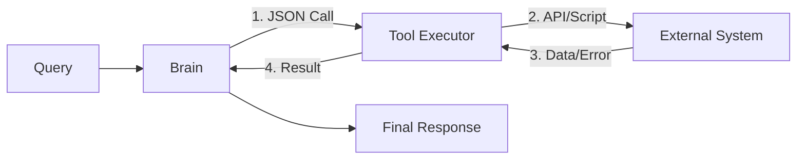

# 🛠️ Tool Use Fundamentals: The Hands of the Agent
> **Level:** Fundamentals | **Language:** Hinglish | **Goal:** Master the core mechanics of how AI models interact with external software, APIs, and databases.

---

## 🧭 1. Beginner-Friendly Hinglish Explanation
Tool Use ka matlab hai AI ko **"Power-ups"** dena.

- **The Problem:** Ek LLM (jaise GPT) sirf "Pata" sakta hai, wo kuch "Kar" nahi sakta. Wo aapko cake ki recipe de sakta hai, par wo oven on nahi kar sakta.
- **The Solution:** Humein AI ko "Tools" dene padte hain (APIs, Functions, Scripts).
  1. **Brain:** "Mujhe lights off karni hain."
  2. **Tool Selection:** "Main 'SmartHomeAPI' use karunga."
  3. **Action:** `smart_home.off(light_id='kitchen')`
  4. **Result:** "Done! Kitchen ki light band ho gayi."

Tool use hi wo cheez hai jo ek "Chatbot" ko "Agent" banati hai.

---

## 🧠 2. Deep Technical Explanation
Tool use (or Function Calling) is the process where an LLM outputs **Structured Data** (usually JSON) instead of natural language to trigger an external process.

### 1. The Interaction Flow:
- **Registry:** A list of available tools with their names, descriptions, and parameter schemas.
- **Trigger:** The LLM decides a tool is needed based on the user's intent.
- **Payload Generation:** The LLM fills in the arguments for the tool based on the conversation context.
- **Execution:** The application code (not the LLM) calls the actual function.
- **Observation:** The output of the function is converted back to text and fed to the LLM.

### 2. Standard Schema (OpenAI/Anthropic):
Tools are defined using **JSON Schema**. This ensures the LLM knows exactly what data types (`string`, `integer`, `boolean`) the tool expects.

---

## 🏗️ 3. Architecture Diagrams (The Tool Loop)


---

## 💻 4. Production-Ready Code Example (Defining a Simple Tool)
```python
# 2026 Standard: Defining a tool for an LLM Agent

from typing import Annotated

def calculate_emi(principal: float, rate: float, tenure: int):
    """
    Calculates the Monthly Installment for a loan.
    Args:
        principal: The total loan amount.
        rate: Annual interest rate (e.g. 8.5 for 8.5%).
        tenure: Loan duration in months.
    """
    r = rate / (12 * 100)
    emi = (principal * r * (1 + r)**tenure) / ((1 + r)**tenure - 1)
    return round(emi, 2)

# Tool Schema to be sent to the LLM
emi_tool = {
    "type": "function",
    "function": {
        "name": "calculate_emi",
        "description": "Calculates monthly loan payments",
        "parameters": {
            "type": "object",
            "properties": {
                "principal": {"type": "number"},
                "rate": {"type": "number"},
                "tenure": {"type": "integer"}
            },
            "required": ["principal", "rate", "tenure"]
        }
    }
}
```

---

## 🌍 5. Real-World Use Cases
- **E-commerce Agents:** Tools to `check_stock`, `apply_coupon`, `track_order`.
- **Data Science Agents:** Tools to `run_sql_query`, `plot_chart`, `clean_csv`.
- **System Admin Agents:** Tools to `restart_server`, `check_logs`, `scale_pods`.

---

## ❌ 6. Failure Cases
- **Parameter Hallucination:** Agent sends an argument that doesn't exist.
- **Type Mismatch:** Agent sends a string `"100"` when the tool expects an integer `100`.
- **Premature Call:** Agent calls the tool before it has enough information (e.g., trying to book a flight without a date).

---

## 🛠️ 7. Debugging Guide
| Symptom | Cause | Fix |
| :--- | :--- | :--- |
| **Agent is 'Scared' to use tools** | Tool description is too technical | Use simple, goal-oriented descriptions (e.g., "Use this to find user info" instead of "Fetches from user_db_v2"). |
| **Tool call is missing arguments** | `required` list in JSON schema is missing | Explicitly list all mandatory parameters in the tool definition. |

---

## ⚖️ 8. Tradeoffs
- **Too many tools:** Context clutter. If you give 50 tools, the agent will get confused. **Best Practice: Max 10-15 per agent.**
- **Generic vs Specific:** One "Search" tool vs. "SearchGoogle", "SearchWiki", "SearchInternalDocs".

---

## 🛡️ 9. Security Concerns
- **Remote Code Execution:** An agent with a `run_python` tool can be tricked into deleting your entire database. **MANDATORY: Always use Sandboxing.**
- **Over-privileged Tools:** Don't give an agent a `transfer_money` tool without a **Human-in-the-loop** confirmation.

---

## 📈 10. Scaling Challenges
- **API Latency:** If a tool takes 10 seconds, the agent response will take at least 15 seconds.
- **Concurrent Execution:** Handling two agents trying to write to the same file.

---

## 💸 11. Cost Considerations
- **Token Usage:** Every tool definition is part of the system prompt. Long descriptions = high token cost. Use **Concise Definitions**.

---

## 📝 12. Interview Questions
1. How does an LLM "know" which tool to use?
2. What is the purpose of the JSON Schema in function calling?
3. What are the security risks of letting an agent execute arbitrary code?

---

## ⚠️ 13. Common Mistakes
- **No Error Feeding:** If a tool fails, don't just stop. Give the error message back to the LLM so it can "Replan".
- **Naming Conflicts:** Having two tools named `get_data` and `fetch_data`.

---

## ✅ 14. Best Practices
- **Atomic Tools:** Each tool should do one thing perfectly.
- **Strict Typing:** Use Pydantic or TypeScript for tool definitions.
- **Audit Trails:** Log every tool call, its parameters, and its output.

---

## 🚀 15. Latest 2026 Industry Patterns
- **MCP (Model Context Protocol):** A new standard to make tools "Portable" across different LLM providers.
- **Self-Healing Tools:** Tools that return "Usage Instructions" when the agent calls them incorrectly.
- **Small-Model Tool Specialist:** Using a tiny, fast model (7B) dedicated only to "Tool Selection" and "JSON Generation".
