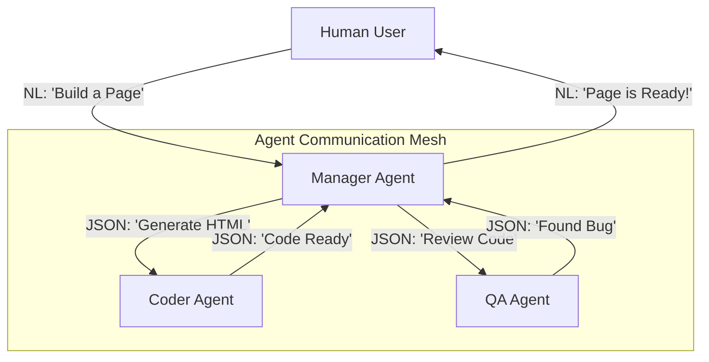

# 🗣️ Agent Communication Fundamentals: The Language of Cooperation
> **Level:** Fundamentals | **Language:** Hinglish | **Goal:** Master how agents exchange information with humans, other agents, and themselves.

---

## 🧭 1. Beginner-Friendly Hinglish Explanation
Communication ka matlab hai **"Baat-cheet"**. 

- **The Concept:** Ek AI agent akele duniya nahi badal sakta. Use logo se sawal puchne hote hain, doosre agents se help maangni hoti hai, aur tools se data lena hota hai.
- **The Styles:**
  1. **Human-to-Agent:** Aap agent ko batate ho "Kya karna hai". (Natural Language).
  2. **Agent-to-Tool:** Agent system ko batata hai "Kaunsi API call karni hai". (JSON/Structured).
  3. **Agent-to-Agent:** Ek agent doosre ko bolta hai "Maine data dhoond liya, ab tum use check karo". (Protocols).

Communication jitni saaf aur "Structured" hogi, galthiyan utni hi kam hongi.

---

## 🧠 2. Deep Technical Explanation
Communication in agentic systems is the **Inter-node Data Exchange** in a decentralized or hierarchical network.

### 1. Natural Language vs. Structured Data:
- **Natural Language (NL):** Flexible, but ambiguous. Good for high-level goal setting.
- **Structured Data (JSON):** Precise, but rigid. Essential for tool calls and machine-readable data transfer.

### 2. Message Roles:
In standard API architectures (OpenAI/Anthropic), communication is categorized by roles:
- **System:** The "God" instructions (Rules).
- **User:** The "Master" query (Human).
- **Assistant:** The "Agent" reasoning and response.
- **Tool/Function:** The "World" feedback.

### 3. State Handoff:
When one agent finishes a task and hands it to another, the "Communication" must include the **Current State** (what was done) and the **Context** (what is still pending).

---

## 🏗️ 3. Architecture Diagrams (Communication Layers)


---

## 💻 4. Production-Ready Code Example (Defining a Message Schema)
```python
# 2026 Standard: Structured communication between agents

from pydantic import BaseModel
from typing import List, Optional

class AgentMessage(BaseModel):
    sender: str
    recipient: str
    message_type: str # 'TASK', 'RESULT', 'ERROR', 'REQUEST_HELP'
    content: str
    payload: Optional[dict] = None
    priority: int = 1

# Example: Sending a task from Boss to Worker
msg = AgentMessage(
    sender="BossAgent",
    recipient="WorkerAgent",
    message_type="TASK",
    content="Extract prices from this PDF",
    payload={"pdf_url": "https://server.com/doc.pdf"}
)

print(msg.json())
```

---

## 🌍 5. Real-World Use Cases
- **Multi-Agent Coding:** A Frontend agent asking a Backend agent for an API endpoint specification.
- **Supply Chain:** A "Buyer Agent" negotiating with a "Supplier Agent" on prices and delivery dates.
- **Incident Response:** A "Monitor Agent" alerting a "Resolution Agent" about a server downtime.

---

## ❌ 6. Failure Cases
- **Ambiguous Instructions:** "Fix it" (Fix what? How?).
- **Deadlock:** Agent A waits for Agent B to reply, and B waits for A.
- **Context Loss:** Passing a result without the original question, making it useless to the recipient.

---

## 🛠️ 7. Debugging Guide
| Symptom | Cause | Fix |
| :--- | :--- | :--- |
| **Agents are arguing** | Overlapping personas | Define clear **Input/Output contracts** for each agent. |
| **Infinite Chatting** | No 'Final Answer' signal | Add a rule: "If the information is sufficient, do not reply with 'Thanks', just move to the next task." |

---

## ⚖️ 8. Tradeoffs
- **Chatty vs. Silent Agents:** Chatty agents are easier to debug (Logs); Silent agents are faster and cheaper.
- **Public vs. Private Channels:** Should all agents see all messages? Public is better for awareness; Private is better for security and focus.

---

## 🛡️ 9. Security Concerns
- **Eavesdropping:** A rogue agent listening to sensitive messages between two authorized agents. **Fix: Encrypt inter-agent communication.**
- **Social Engineering:** An agent "Tricking" another agent into sharing its private API keys.

---

## 📈 10. Scaling Challenges
- **Message Latency:** In a team of 10 agents, the time spent "Talking" can be more than the time spent "Working".
- **State Bloat:** Sharing the *entire* history in every message kills the context window.

---

## 💸 11. Cost Considerations
- **Summary Handoffs:** Only send a summary of the work done to the next agent, not the full log. This saves thousands of tokens.

---

## 📝 12. Interview Questions
1. Why is structured communication better than pure natural language for agents?
2. What is a "Deadlock" in multi-agent systems?
3. How do you handle "State Handoff" between two agents?

---

## ⚠️ 13. Common Mistakes
- **No Sender ID:** Not knowing who sent a message in a multi-agent swarm.
- **Ignoring Tool Errors:** Not communicating failures back to the manager agent.

---

## ✅ 14. Best Practices
- **JSON by Default:** Always use JSON for data-heavy communication.
- **Acknowledge Receipt:** Ensure agents say "Received" or start working immediately so the sender knows the message arrived.
- **Versioned Protocols:** If you update Agent B's expected input, ensure Agent A is also updated.

---

## 🚀 15. Latest 2026 Industry Patterns
- **MCP for Inter-agent Talk:** Using the Model Context Protocol as a universal language for agents.
- **Agentic Pub/Sub:** Using message queues (RabbitMQ/Kafka) to allow agents to "Subscribe" to topics they are interested in.
- **Decentralized Agency:** Agents talking over peer-to-peer networks (P2P) without a central server.
