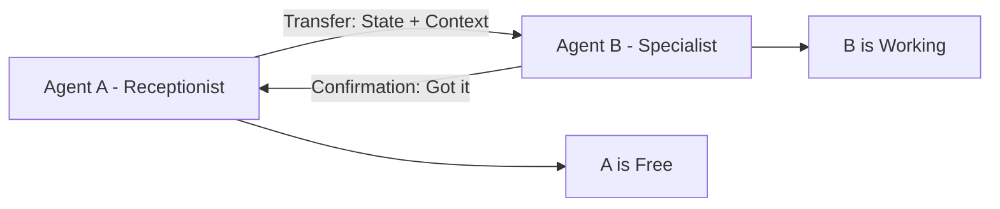

# 🤝 Agent Handoffs: Passing the Baton
> **Level:** Intermediate | **Language:** Hinglish | **Goal:** Master the art of transferring context and control between agents to ensure a seamless multi-agent workflow.

---

## 🧭 1. Beginner-friendly Hinglish Explanation
Agent Handoff ka matlab hai "Zimmewari transfer karna". Sochiye aap ek customer care call par hain. Pehle ek robot aapse baat karta hai (Bot A), par jab baat complex ho jati hai, wo aapko ek human agent ya senior bot (Bot B) ko "Handoff" kar deta hai. Sahi handoff ka matlab hai ki aapko apni baat dubara nahi dohrani pade (Context transfer). Agentic systems mein ye tab hota hai jab ek agent apna kaam khatam karke agle specialist ko batata hai ki ab aage kya karna hai.

---

## 🧠 2. Deep Technical Explanation
A successful handoff involves transferring two things:
1. **Control:** Passing the execution token or flow to the next agent node.
2. **State/Context:** Passing the history, extracted facts, and current goals.
**Patterns:**
- **Push Handoff:** Agent A finishes and pushes the task to Agent B (Sequential).
- **Pull Handoff:** Agent B monitors a queue and pulls the task when it's ready.
- **Supervisor Handoff:** A central manager decides when to handoff from A to B.

---

## 🏗️ 3. Real-world Analogies
Agent Handoff ek **Relay Race** ki tarah hai.
- Ek runner (Agent A) bhaagta hai.
- Wo dusre runner (Agent B) ko baton (Context) pakdata hai.
- Baton pakdate waqt dono ko ek hi speed par hona chahiye taaki wo gire na (Synchronization).

---

## 📊 4. Architecture Diagrams (The Baton Pass)


---

## 💻 5. Production-ready Examples (The Handoff Schema)
```python
# 2026 Standard: Defining a Handoff Object
class Handoff(BaseModel):
    target_agent: str
    task_summary: str
    extracted_entities: dict
    full_history_link: str

def trigger_handoff(current_agent, next_agent, state):
    handoff_data = Handoff(
        target_agent=next_agent.id,
        task_summary=state['last_summary'],
        extracted_entities=state['entities'],
        full_history_link=state['db_id']
    )
    next_agent.receive(handoff_data)
```

---

## ❌ 6. Failure Cases
- **Context Loss:** Agent B ko task mil gaya par use ye nahi pata ki Agent A ne pehle kya-kya dhoondha tha.
- **Dangling Handoff:** Agent A ne task handoff kar diya par Agent B offline tha. Task kahin nahi pahuncha (Lost in space).

---

## 🛠️ 7. Debugging Section
- **Symptom:** The new agent asks the same questions the first agent already asked.
- **Check:** **State Injection**. Kya handoff ke waqt `messages` list sahi se pass hui? Make sure the new agent starts its turn by reading the `task_summary` from the handoff object.

---

## ⚖️ 8. Tradeoffs
- **Full Context vs Summary Handoff:** Poora context dena accurate hai par tokens consume karta hai. Summary sasti hai par nuances miss ho sakte hain.

---

## 🛡️ 9. Security Concerns
- **Privilege Leak:** Agent A ke paas high-access tha, kya handoff ke waqt wo access Agent B ko bhi mil raha hai? Access controls ko hamesha strictly define karein per-agent.

---

## 📈 10. Scaling Challenges
- High-traffic mein handoffs bottlenecks ban sakte hain. Use **Asynchronous Event Streams** (Kafka/Redis) to handle handoffs without blocking.

---

## 💸 11. Cost Considerations
- Handoff summarization (creating the summary for Agent B) costs extra tokens. Balance the summary length.

---

## ⚠️ 12. Common Mistakes
- **No Acknowledgment:** Bina ye confirm kiye handoff karna ki next agent ready hai.
- **Circular Handoffs:** Agent A -> B -> A... (Infinite redirection).

---

## 📝 13. Interview Questions
1. What is the difference between a 'Hard Handoff' and a 'Soft Handoff'?
2. How do you maintain 'Session Continuity' during a multi-agent handoff?

---

## ✅ 14. Best Practices
- Every handoff should include a **'Reason for Transfer'**.
- Next agent should always confirm **'Receipt'** of the handoff data.

---

## 🚀 15. Latest 2026 Industry Patterns
- **Zero-Latency Handoffs:** Predictively warming up Agent B before Agent A even finishes its task.
- **Multi-Modal Handoffs:** Transferring not just text context, but current UI states or active file pointers.
