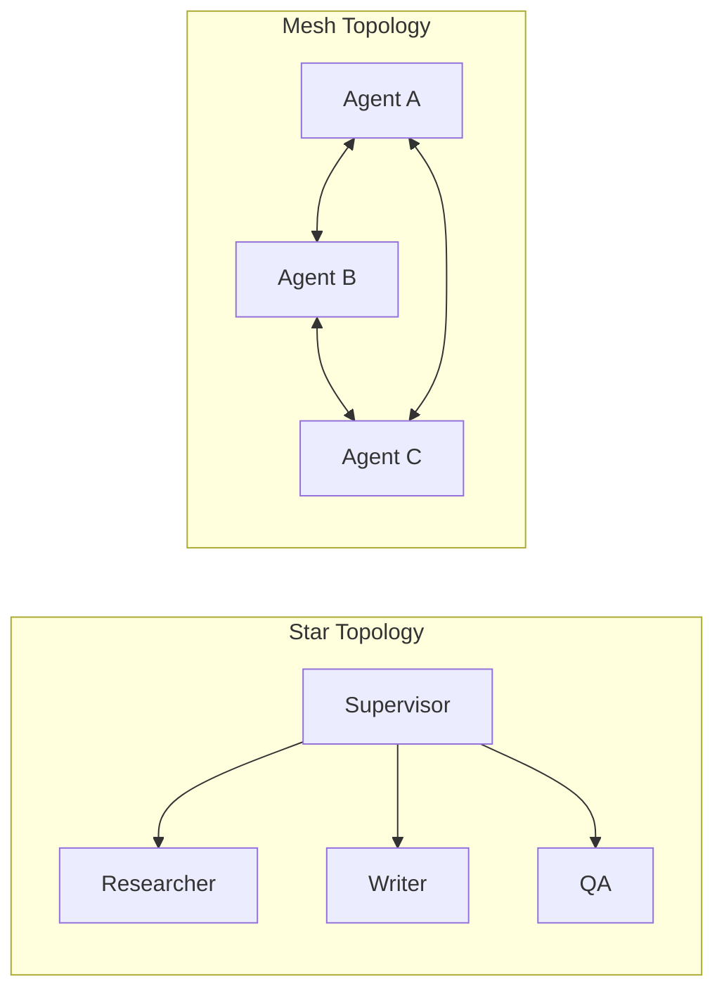

# 🤝 Agent-to-Agent Communication: The Collaborative Mesh
> **Level:** Advanced | **Language:** Hinglish | **Goal:** Master the patterns and protocols used by multiple agents to synchronize their work and achieve shared goals.

---

## 🧭 1. Beginner-Friendly Hinglish Explanation
Agent-to-Agent communication ka matlab hai **"AI ka aapas mein baat karna"**.

- **The Idea:** Sochiye aap ek ghar banwa rahe hain. Architect, Engineer, aur Plumber ko aapas mein baat karni padegi warna ghar gir jayega.
- **The Execution:** AI agents bhi ek dusre ko messages bhejte hain.
  - "Bhai, maine wall khadi kar di, ab tum wiring karo."
  - "Ruko, wiring ke liye pehle wall sukhni chahiye."
- **Why it's hard:** Insaano ki tarah AI bhi "Miss-communication" kar sakta hai. Isliye humein unke liye **"Sahi Rules"** (Protocols) banane padte hain.

Agent-to-agent talk hi "Multi-Agent Systems" (MAS) ki jaan hai.

---

## 🧠 2. Deep Technical Explanation
Agent-to-Agent (A2A) communication is governed by **Multi-Agent Orchestration Patterns**.

### 1. Communication Topologies:
- **Star (Hub & Spoke):** All agents talk to a central "Supervisor" who routes messages. (Most common).
- **Mesh (Peer-to-Peer):** Every agent can talk to any other agent directly. (High complexity).
- **Pipeline (Sequential):** Agent A passes data to Agent B, who passes to C.

### 2. The ACL (Agent Communication Language):
Historically, languages like **FIPA-ACL** were used. In 2026, we use:
- **Natural Language with JSON Envelopes:** Human-readable intent + Machine-readable metadata.
- **MCP (Model Context Protocol):** A standardized way for agents to expose their capabilities to each other.

### 3. Synchronization (Locking):
Preventing two agents from trying to "Edit the same file" at the same time. This is handled by a **Shared State Manager**.

---

## 🏗️ 3. Architecture Diagrams (The Mesh)


---

## 💻 4. Production-Ready Code Example (A Simple Handoff)
```python
# 2026 Standard: Implementing a handoff between two agents

def agent_handoff(source_agent, target_agent, data):
    print(f"🔄 Handing off from {source_agent.name} to {target_agent.name}")
    
    # 1. Package the state
    payload = {
        "work_done": data,
        "original_goal": session.goal,
        "pending_items": ["Review for bugs", "Format as MD"]
    }
    
    # 2. Call target agent
    response = target_agent.execute(payload)
    return response

# Insight: Always include the 'Original Goal' so the new agent doesn't get lost.
```

---

## 🌍 5. Real-World Use Cases
- **Autonomous E-commerce:** A "Sales Agent" talks to a "Stock Agent" to check availability before confirming an order with the user.
- **Software CI/CD:** A "Linter Agent" passes code to a "Test Agent", who then passes it to a "Deploy Agent".
- **Social Media Management:** A "Content Creator" agent sends a draft to an "Image Generator" agent, who then sends both to a "Scheduler" agent.

---

## ❌ 6. Failure Cases
- **Infinite Loop (The Echo):** Agent A: "What's the status?" -> Agent B: "Checking..." -> Agent A: "What's the status?"...
- **Role Confusion:** Both agents think they are the "Manager" and try to give each other orders.
- **Context Fragmentation:** Agent B doesn't have the "Memory" of what Agent A said to the user, leading to contradictory answers.

---

## 🛠️ 7. Debugging Guide
| Symptom | Cause | Fix |
| :--- | :--- | :--- |
| **Deadlock (No one is talking)** | Agents waiting for each other | Implement a **Timeout** or a **Keep-alive** signal from the Supervisor. |
| **Hallucinated Handoffs** | Target agent doesn't exist | Use a **Tool Registry** where agents must "Lookup" each other before talking. |

---

## ⚖️ 8. Tradeoffs
- **Shared vs Private Memory:** Shared is easier but can get "Noisy"; Private is cleaner but requires explicit communication.
- **Centralized vs Decentralized:** Centralized is easier to control; Decentralized is more resilient but harder to debug.

---

## 🛡️ 9. Security Concerns
- **Sybil Attacks:** A malicious agent joins the mesh and starts giving fake instructions to other agents. **Fix: Use Digital Signatures for all inter-agent messages.**
- **Information Leakage:** A "Public" agent accidentally sharing "Internal" company data with another agent that has internet access.

---

## 📈 10. Scaling Challenges
- **Message Storms:** 100 agents talking at once can crash the backend. **Solution: Use a Message Queue (like Redis or RabbitMQ).**

---

## 💸 11. Cost Considerations
- **Protocol Overhead:** Sending "Are you there?" messages costs tokens. Use **Lightweight heartbeats** or non-LLM signals for status checks.

---

## 📝 12. Interview Questions
1. How do you prevent "Circular Dependencies" in multi-agent systems?
2. What is the benefit of a "Supervisor" in agent-to-agent communication?
3. Explain the "Star" vs "Mesh" topology.

---

## ⚠️ 13. Common Mistakes
- **No Stop Condition:** Agents "Chatting" forever without finishing the task.
- **Oversharing:** Sending the full 100k token history of Agent A to Agent B. (Just send the **Relevant Subset**).

---

## ✅ 14. Best Practices
- **Define clear API contracts:** Agent A should know exactly what Agent B's input JSON looks like.
- **Limit 'Talk' Rounds:** Set a hard limit (e.g., 5 messages) for any single agent-to-agent sub-task.

---

## 🚀 15. Latest 2026 Industry Patterns
- **Standardized Handoffs (LangGraph style):** Using "Edges" in a graph to define exactly how and when data moves between agents.
- **Agentic P2P:** Agents that can "Discover" each other on a local network and collaborate without a cloud server.
- **Language of Thoughts (LoT):** Agents communicating in a high-density, compressed token format that is faster and cheaper than English.
