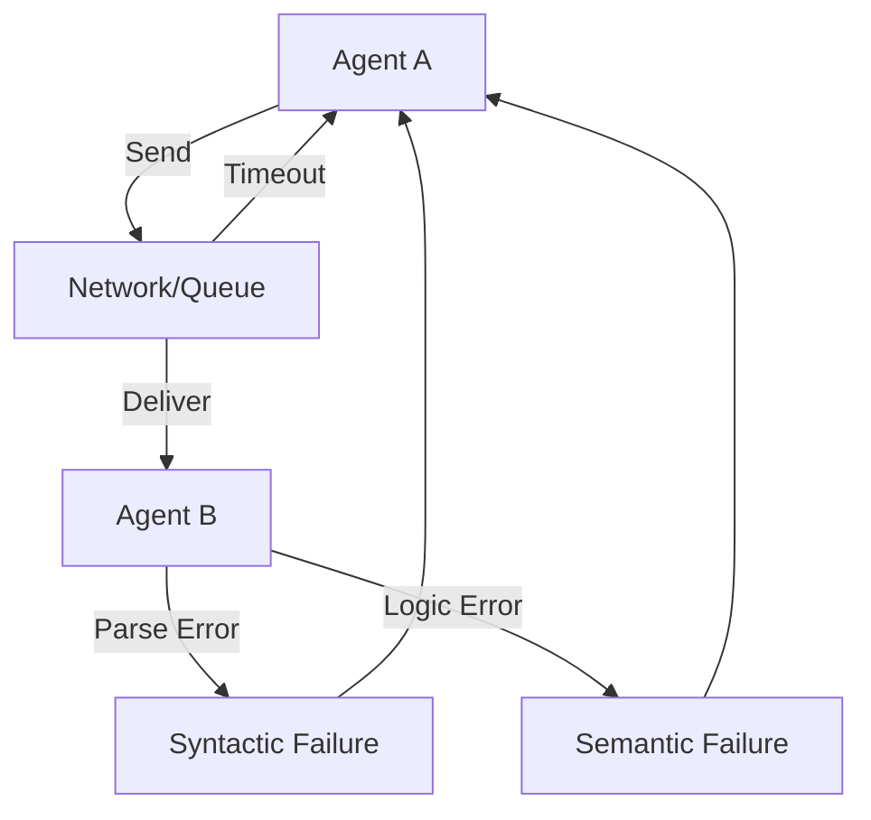

# ⚠️ Communication Failure Cases: When Agents Don't Talk Right
> **Level:** Advanced | **Language:** Hinglish | **Goal:** Master the identification and mitigation of communication-based failures in multi-agent systems.

---

## 🧭 1. Beginner-friendly Hinglish Explanation
Communication Failure ka matlab hai do agents ke beech "Galat-fehmi" ho jana. Sochiye aapne apne dost ko bola "Kal milte hain", par aapne ye nahi bataya ki "Kahan milte hain". Aapka dost wait karta reh gaya. Agents ke saath bhi yahi hota hai. Kabhi message network mein kho jata hai, kabhi doosra agent use samajh nahi pata, aur kabhi dono agents ek hi baat ko lekar behas karne lagte hain. Is section mein hum in "Communication Gaps" ko theek karna seekhenge.

---

## 🧠 2. Deep Technical Explanation
Communication failures are categorized into three layers:
1. **Transport Layer Failures:** Network timeouts, packet loss, or service downtime (e.g., Agent B is offline).
2. **Syntactic Failures:** Agent A sends JSON, but Agent B expects XML, or the JSON schema is malformed.
3. **Semantic Failures:** Both agents use the same format, but interpret the meaning differently (e.g., Agent A's "Process" means "Edit", Agent B's "Process" means "Delete").
**Key Problem:** **The Byzantine Generals' Problem**—reaching consensus over an unreliable network.

---

## 🏗️ 3. Real-world Analogies
Communication failure ek **Phone Call** ki tarah hai.
- **Transport:** Signal chala gaya (Call drop).
- **Syntactic:** Aap Hindi bol rahe hain, saamne wala Chinese (Language barrier).
- **Semantic:** Aapne kaha "Zara dekhna", aapka matlab tha "Koshish karo", par usne sirf "Dekha" (Interpretation error).

---

## 📊 4. Architecture Diagrams (The Failure Points)


---

## 💻 5. Production-ready Examples (The Acknowledgment Pattern)
```python
# 2026 Standard: Robust Messaging with ACKs
def send_message_with_retry(receiver, data, retries=3):
    for i in range(retries):
        try:
            response = receiver.post(data)
            if response.status == "ACK":
                return True # Success
        except:
            print(f"Retry {i+1}...")
            time.sleep(2**i) # Backoff
    return False # Communication Failed
```

---

## ❌ 6. Failure Cases
- **The Infinite Cycle:** Agent A sends a query, B replies with a question, A replies with the same query... (Loop).
- **Message Bloat:** Ek agent itni badi files bhej raha hai ki doosra agent "Out of Memory" ho gaya.

---

## 🛠️ 7. Debugging Section
- **Symptom:** System is slow, but no errors in individual agents.
- **Check:** **Communication Latency**. Har message-hop (A to B to C) time add karti hai. Use **Zipkin/Jaeger** to trace the "Path of a Message" across agents.

---

## ⚖️ 8. Tradeoffs
- **Reliability vs Speed:** Har message ka "Receipt" mangna (Safe but slow) vs "Send and Forget" (Fast but risky).

---

## 🛡️ 9. Security Concerns
- **Eavesdropping:** An unauthorized agent joining the communication bus to steal data. Use **JWT (JSON Web Tokens)** to authenticate every message.

---

## 📈 10. Scaling Challenges
- Millions of messages creates a "Broadcast Storm" where agents are overwhelmed by irrelevant updates. Use **Topic Filters**.

---

## 💸 11. Cost Considerations
- Excessive internal chatter costs tokens if every message is processed by an LLM. Use **Rule-based parsers** for metadata.

---

## ⚠️ 12. Common Mistakes
- **No Correlation IDs:** Pata hi nahi chalta ki kaunsa reply kis request ka hai.
- No Timeout on requests.

---

## 📝 13. Interview Questions
1. How do you resolve 'Semantic Conflicts' between two agents with different ontologies?
2. What is 'Backpressure' and why is it important in agent communication?

---

## ✅ 14. Best Practices
- Every message must have a **Request ID**.
- Use **Heartbeats** to check if an agent is still online.

---

## 🚀 15. Latest 2026 Industry Patterns
- **Self-Healing Protocols:** Agents jo communication fail hone par autonomously "Handshake" dubara karte hain with a different protocol (e.g., Switching from JSON to YAML if parsing fails).
- **Agentic Firewalls:** Filters jo agents ke beech ki communication ko audit karte hain for safety and policy.
