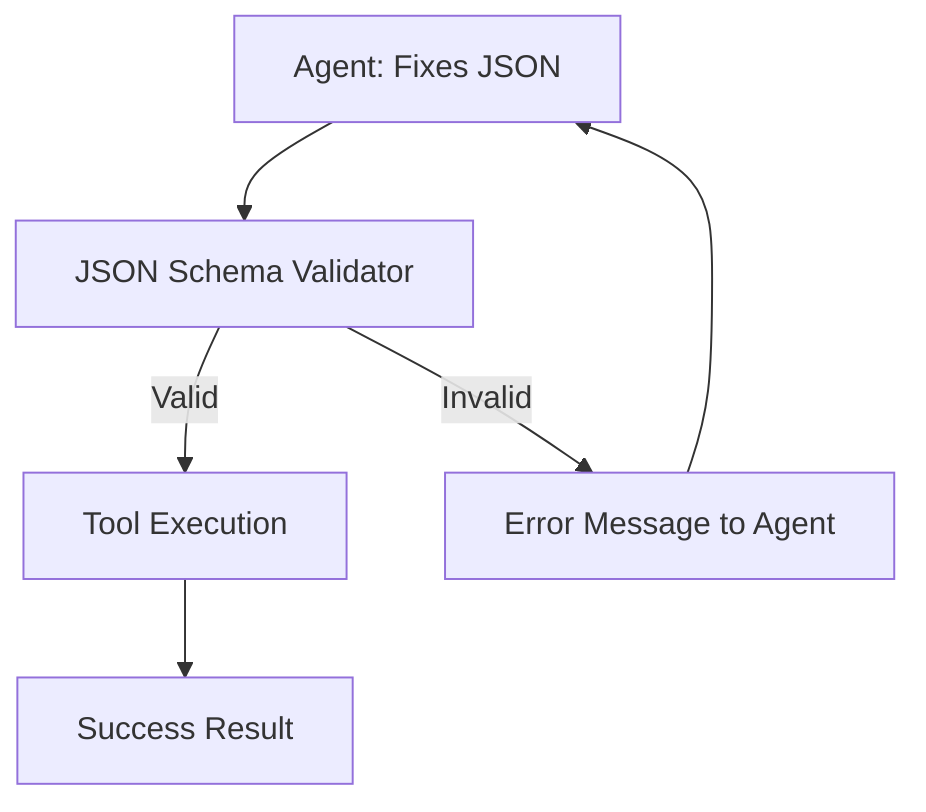

# 📜 Communication Protocols & JSON Schemas: The Rulebook
> **Level:** Advanced | **Language:** Hinglish | **Goal:** Master the rigid structures and standards that ensure AI agents and tools can understand each other without errors.

---

## 🧭 1. Beginner-Friendly Hinglish Explanation
Protocols aur Schemas ka matlab hai **"Baat karne ka dhang"**.

- **The Problem:** Agar aap ek agent ko bolo "Email bhejo" aur dusre ko bolo "Bhejo email," toh computer confuse ho jayega.
- **The Solution:** Humein ek **"Format"** fix karna padta hai.
  - Sabse popular format hai **JSON**.
  - **Schema** wo rulebook hai jo batati hai ki:
    - Email address "string" hona chahiye.
    - Message "string" hona chahiye.
    - Attachments "list" honi chahiye.

Ye bilkul ek "Bank Form" bharne jaisa hai—agar aap naam ki jagah mobile number likhoge, toh form reject ho jayega. **Schemas** yahi "Rejection" ya "Acceptance" control karte hain.

---

## 🧠 2. Deep Technical Explanation
JSON Schema is the backbone of **Inter-operability** in AI Agent systems.

### 1. Why JSON?
- **Machine Readable:** Easy for Python/Node.js to parse.
- **Human Readable:** Easy for us to debug.
- **Structured:** Supports nesting (objects within objects).

### 2. The Components of a Schema:
- **`type`**: `string`, `number`, `boolean`, `array`, `object`.
- **`required`**: List of keys that MUST be present.
- **`description`**: The most important part for LLMs! This is how the model knows what each field means.
- **`enum`**: A list of allowed values (e.g., `["USD", "INR", "EUR"]`).

### 3. Protocols (The 'How'):
- **JSON-RPC:** A remote procedure call protocol using JSON.
- **SSE (Server-Sent Events):** For streaming agent responses.
- **Webhooks:** For agents to "Listen" for external events.

---

## 🏗️ 3. Architecture Diagrams (The Validation Gate)


---

## 💻 4. Production-Ready Code Example (Pydantic to JSON Schema)
```python
# 2026 Standard: Using Pydantic for deterministic schemas

from pydantic import BaseModel, Field
from typing import List

class SearchToolSchema(BaseModel):
    query: str = Field(description="The search term to look for on Google")
    num_results: int = Field(default=3, description="Number of links to return")
    search_type: str = Field(description="Format: 'news', 'image', or 'web'", pattern="^(news|image|web)$")

# Convert to JSON Schema for the LLM
print(SearchToolSchema.schema_json(indent=2))

# Mastery Insight: Use 'pattern' (Regex) to force the LLM to follow specific formats.
```

---

## 🌍 5. Real-World Use Cases
- **Payment Gateways:** Ensuring an agent sends exactly `amount`, `currency`, and `recipient_id`.
- **Data Entry:** Ensuring an agent extracts data from a PDF into a strictly formatted Excel-ready JSON.
- **Flight Booking:** Mandatory fields like `origin`, `destination`, and `date`.

---

## ❌ 6. Failure Cases
- **Schema Drift:** You update the tool code but forget to update the JSON schema given to the agent.
- **Loose Schemas:** Not using `required` fields, so the agent "Forgets" to send the most important info.
- **Recursive Bloat:** Making a schema so complex (deeply nested) that the LLM gets confused.

---

## 🛠️ 7. Debugging Guide
| Symptom | Cause | Fix |
| :--- | :--- | :--- |
| **JSONDecodeError** | Model sent markdown instead of raw JSON | Use **'JSON Mode'** or a prompt that says "Return ONLY the JSON object, no preamble." |
| **Field Mismatch** | Agent used an old field name | Clear the **Episodic Memory** or provide a "Deprecated" warning in the tool description. |

---

## ⚖️ 8. Tradeoffs
- **Strict vs Flexible:** Strict (Schema) is safer; Flexible (Free text) is more creative but buggy.
- **JSON vs XML:** JSON is standard; XML is better for some older enterprise systems.

---

## 🛡️ 9. Security Concerns
- **Schema Poisoning:** An attacker modifies the schema to include a "Hidden field" that the agent fills with sensitive data.
- **Type Injection:** Sending a very large integer to cause a buffer overflow in the tool execution.

---

## 📈 10. Scaling Challenges
- **Dynamic Schemas:** When an agent has access to 1000 tools, sending all schemas in the prompt is impossible. **Solution: RAG for Tools (Retrieving the right schema only when needed).**

---

## 💸 11. Cost Considerations
- **Schema Tokens:** Large schemas consume input tokens. **Best Practice: Use 'Short field names' and 'Concise descriptions'.**

---

## 📝 12. Interview Questions
1. Why do we use JSON Schema for function calling?
2. How does a "Validator" help in an agentic loop?
3. What is Pydantic and how is it related to AI Agents?

---

## ⚠️ 13. Common Mistakes
- **No Examples:** Not providing a `sample_json` in the tool description.
- **Vague Types:** Using `type: "any"` instead of `type: "string"`.

---

## ✅ 14. Best Practices
- **Auto-generate Schemas:** Never write JSON schemas by hand; use a library like Pydantic.
- **Provide Feedback:** If the JSON is invalid, send the *exact* validation error back to the LLM.
- **Use Enums:** Whenever possible, give the LLM a fixed list of choices.

---

## 🚀 15. Latest 2026 Industry Patterns
- **Protocol Buffers (Protobuf) for Agents:** Using binary formats for ultra-fast, low-token inter-agent communication.
- **Self-Healing Schemas:** If an agent consistently fails to fill a field, the system "Suggests" a better schema design to the developer.
- **Dynamic Schema Negotiation:** Two agents "Deciding" on a format to use before they start exchanging data.
