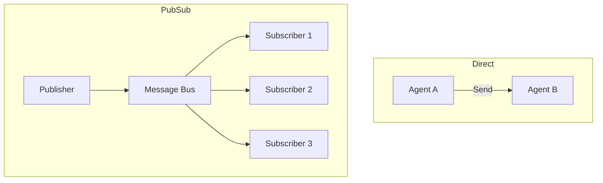

# ✉️ Message Passing Between Agents: The Neural Bus
> **Level:** Advanced | **Language:** Hinglish | **Goal:** Master the architectural patterns for passing data, state, and control between autonomous agents.

---

## 🧭 1. Beginner-friendly Hinglish Explanation
Message Passing ka matlab hai "Gyan ka lena-dena". Sochiye ek line mein 4 log khade hain. Pehla dusre ko bolta hai, dusra teesre ko. Ye "Relay Race" ki tarah hai. AI Agents mein Message Passing se hum batate hain ki "Mera kaam khatam, ab tum apna kaam shuru karo". Ye synchronous (Ruk kar wait karna) bhi ho sakta hai aur asynchronous (Message chhod kar aage badhna) bhi. Isse poora Multi-agent system ek team ki tarah behave karta hai.

---

## 🧠 2. Deep Technical Explanation
Message passing is the mechanism of inter-process communication (IPC) tailored for agents:
1. **Pub/Sub (Publisher-Subscriber):** Agent A publishes a message to a "Topic" (e.g., `news_update`), and all agents interested in that topic receive it automatically.
2. **Direct Messaging (P2P):** Agent A sends a message directly to Agent B's ID.
3. **Blackboard Pattern:** Agents write their findings to a shared memory space (Blackboard), and other agents read from it.
4. **State Transfer:** Passing the entire "Graph State" so the next agent has full context of what happened before.

---

## 🏗️ 3. Real-world Analogies
Message Passing ek **Office Slack** ki tarah hai.
- **Direct Message:** @agent_b check this.
- **Channel (Pub/Sub):** #all-agents updates for everyone.
- **Thread:** Dedicated conversation about one specific task.

---

## 📊 4. Architecture Diagrams (Pub/Sub vs Direct)


---

## 💻 5. Production-ready Examples (The Message Bus)
```python
# 2026 Standard: Using a Simple Message Queue
class MessageBus:
    def __init__(self):
        self.subscribers = {}

    def subscribe(self, topic, agent):
        if topic not in self.subscribers: self.subscribers[topic] = []
        self.subscribers[topic].append(agent)

    def publish(self, topic, data):
        for agent in self.subscribers.get(topic, []):
            agent.receive(data)

# Usage
bus = MessageBus()
bus.subscribe("stock_alert", trader_agent)
bus.publish("stock_alert", {"ticker": "AAPL", "price": 180})
```

---

## ❌ 6. Failure Cases
- **Message Deadlock:** Agent A waits for B, B waits for A. System hangs.
- **Backpressure Failure:** Messages itni fast aa rahi hain ki receiving agent unhe process nahi kar paa raha.

---

## 🛠️ 7. Debugging Section
- **Symptom:** Message sent but not received.
- **Check:** Queue depth aur TTL. Check if the subscriber is still "Alive". Use **Tracing IDs** to follow a message across multiple agents.

---

## ⚖️ 8. Tradeoffs
- **Direct Messaging:** Precise par system "Coupled" ho jata hai (hard to scale).
- **Pub/Sub:** Decoupled aur scalable par message tracking mushkil hai.

---

## 🛡️ 9. Security Concerns
- **Eavesdropping:** Malicious agent important topics ko "Subscribe" karke data chura sakta hai. Use **Access Control Lists (ACLs)**.

---

## 📈 10. Scaling Challenges
- High-frequency messaging requires low-latency queues like **Redis Streams** or **Apache Kafka**.

---

## 💸 11. Cost Considerations
- Internal messaging is "Cheap" (Compute only), par agar message context window mein jati hai, toh tokens mehenge padte hain.

---

## ⚠️ 12. Common Mistakes
- **Message Bloat:** Poora context message mein bhejna. (Sirf Delta/Changes bhejien).
- Missing Correlation IDs.

---

## 📝 13. Interview Questions
1. How do you implement 'At-least-once' delivery in agent communication?
2. What is the 'Blackboard' architecture and when should you use it?

---

## ✅ 14. Best Practices
- Every message should have a **Unique ID** and a **Timestamp**.
- Use **Idempotency** (Processing the same message twice shouldn't cause errors).

---

## 🚀 15. Latest 2026 Industry Patterns
- **Content-based Routing:** Messaging system jo message ka "Content" dekhkar use sahi agent ke paas bhejta hai (AI-driven routing).
- **Zero-Copy Messaging:** Passing data pointers instead of raw data between local agents for extreme speed.
