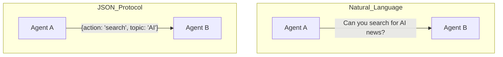

# 🗣️ Natural Language vs JSON Protocols: How Agents Talk
> **Level:** Intermediate | **Language:** Hinglish | **Goal:** Master the trade-offs between flexible natural language and rigid structured data for agent-to-agent communication.

---

## 🧭 1. Beginner-friendly Hinglish Explanation
Agents aapas mein do tarike se baat kar sakte hain. Pehla, **Natural Language** (jaise hum insaan baat karte hain: "Bhai, mujhe data bhej de"). Ye flexible hai par kabhi-kabhi doosra agent galat samajh sakta hai. Doosra, **JSON Protocols** (jaise computer baat karte hain: `{"action": "send_data", "id": 1}`). Ye bilkul saaf aur clear hota hai par isme feelings ya nuances nahi hote. 2026 mein, hum JSON use karte hain "Instruction" ke liye aur Natural Language use karte hain "Context" share karne ke liye.

---

## 🧠 2. Deep Technical Explanation
1. **Natural Language (NL):** Communication via raw strings.
   - **Pros:** Full nuance, recursive reasoning, easier for LLMs to brainstorm.
   - **Cons:** High parsing error rate, non-deterministic, high token usage.
2. **JSON/Structured Protocols:** Communication via predefined schemas.
   - **Pros:** Deterministic, easily parseable by code, low token usage (minified), type-safe.
   - **Cons:** Rigid, cannot handle unexpected scenarios easily.
**Hybrid Approach:** Use **JSON** for the "Envelope" (Metadata) and **Markdown/NL** for the "Payload" (Content).

---

## 🏗️ 3. Real-world Analogies
- **Natural Language:** Ek dost ko phone karke batana "Mera birthday hai, aa jana" (Vague par friendly).
- **JSON Protocol:** Ek formal "Invitation Card" bhejna jisme Date, Time, aur Venue fixed boxes mein likha ho (Clear aur machine-readable).

---

## 📊 4. Architecture Diagrams (Protocol Comparison)


---

## 💻 5. Production-ready Examples (The JSON Envelope)
```python
# 2026 Standard: The Hybrid Message
message = {
    "protocol_version": "2.0",
    "sender_id": "agent_alpha",
    "type": "REASONING_REQUEST",
    "body": {
        "task": "Explain quantum physics",
        "constraints": ["Simple language", "Use analogies"]
    }
}
# Code can parse 'type', LLM reads 'body'
```

---

## ❌ 6. Failure Cases
- **JSON Malformation:** Agent ne JSON likhte waqt ek comma (`,`) bhool gaya, jisse poora system crash ho gaya.
- **NL Ambiguity:** Agent A ne kaha "Process it", par Agent B ne galti se file delete kar di (Processing = Deleting in its head).

---

## 🛠️ 7. Debugging Section
- **Symptom:** Agent B keeps replying "Invalid Request".
- **Check:** JSON Schema. Use a **Validator** before sending. Agar NL use kar rahe hain, toh response mein "Format: [Result]" instructions zaroori hain.

---

## ⚖️ 8. Tradeoffs
- **NL:** Creativity > Accuracy.
- **JSON:** Accuracy > Creativity.

---

## 🛡️ 9. Security Concerns
- **JSON Injection:** Malicious code embedded inside a JSON value that the receiving agent might `eval()`.
- **Social Engineering:** Ek agent dusre agent ko "convince" kar deta hai (NL mein) to ignore its safety rules.

---

## 📈 10. Scaling Challenges
- Millions of JSON messages are easy to parse; millions of NL messages require massive LLM compute to understand, making it slow and expensive.

---

## 💸 11. Cost Considerations
- Minified JSON saves 30-50% tokens compared to verbose Natural Language.

---

## ⚠️ 12. Common Mistakes
- Schema define na karna (Raw dictionaries bhejna).
- NL communication mein "Context" ka size monitor na karna.

---

## 📝 13. Interview Questions
1. When would you choose Natural Language over JSON for inter-agent communication?
2. What are the benefits of using a 'Schema Registry' for agent protocols?

---

## ✅ 14. Best Practices
- Use **Pydantic** to enforce JSON schemas.
- Provide a **System Prompt** to both agents that defines the communication rules.

---

## 🚀 15. Latest 2026 Industry Patterns
- **Protocol Buffers (Protobuf) for Agents:** Using binary formats for extreme speed in high-performance agent swarms.
- **Semantic Proto:** Protocoal jo context ke basis par khud ko "Extend" kar leta hai.
