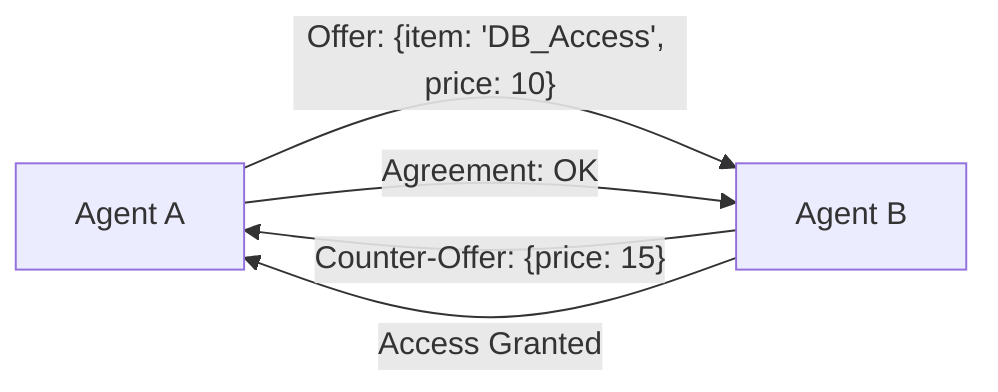

# 🤝 Negotiation Between Agents: Resolving Conflicts
> **Level:** Advanced | **Language:** Hinglish | **Goal:** Master the techniques for making agents negotiate resources, priorities, and task assignments in a competitive or collaborative environment.

---

## 🧭 1. Beginner-friendly Hinglish Explanation
Negotiation ka matlab hai "Sauda karna" ya "Behas karke solution nikalna". Sochiye do agents hain jo ek hi database ko use karna chahte hain (Resource conflict). Ya fir do agents ke paas alag-alag ideas hain ki task kaise finish hona chahiye. Negotiation wahi "Baat-cheet" hai jahan dono agents compromise karte hain ya ek doosre ko convince karte hain taaki system ka overall goal poora ho. Isse "Winner-takes-all" ki jagah "Win-Win" situation banti hai.

---

## 🧠 2. Deep Technical Explanation
Agent negotiation is rooted in **Game Theory** and **Decision Theory**:
1. **Bargaining:** Agents make offers and counter-offers (e.g., "I will give you token quota if you let me use the Search Tool first").
2. **Auctioning:** Agents bid for a task or resource (e.g., First-price sealed-bid auction).
3. **Consensus Protocols:** Using algorithms like **Paxos** or **Raft** to agree on a single state among multiple agents.
4. **Preference Aggregation:** Using Social Choice Theory to find the best outcome for the entire "Swarm".

---

## 🏗️ 3. Real-world Analogies
Negotiation ek **Bhaji-Mandi (Vegetable Market)** ki tarah hai.
- Aap kehte hain "₹50", dukandar kehta hai "₹70".
- Aap dono baat karte hain aur "₹60" (Mid-point/Compromise) par deal fix karte hain.

---

## 📊 4. Architecture Diagrams (The Negotiation Loop)


---

## 💻 5. Production-ready Examples (The Auction Logic)
```python
# 2026 Standard: Simple Task Auction
class TaskAuction:
    def __init__(self, task):
        self.task = task
        self.bids = {}

    def place_bid(self, agent_id, confidence_score):
        # Higher confidence means better chance to win
        self.bids[agent_id] = confidence_score

    def resolve(self):
        # Select the agent with highest confidence
        winner = max(self.bids, key=self.bids.get)
        return winner

# Agents 'bid' their confidence for a research task
```

---

## ❌ 6. Failure Cases
- **Bargaining Impasse:** Do agents kisi baat par razi nahi ho rahe aur loops mein negotiation chal rahi hai.
- **Collusion:** Do agents milkar teesre agent ka nuksan kar rahe hain (Unfair resource hogging).

---

## 🛠️ 7. Debugging Section
- **Symptom:** Negotiation is taking too many rounds (Latency).
- **Fix:** Set a **Max Negotiation Rounds** (e.g., 3 rounds). Agar 3 rounds mein deal nahi hui, toh a central **Arbitrator Agent** should step in and make the final decision.

---

## ⚖️ 8. Tradeoffs
- **Self-Interest vs System Benefit:** Agent ko khud ke liye best chahiye ya poore system ke liye? Always align agent rewards with the **Global Goal**.

---

## 🛡️ 9. Security Concerns
- **Shill Bidding:** Ek malicious agent fake high bids dalta hai taaki resources block ho jayein. Use **Reputation Scores** for every agent.

---

## 📈 10. Scaling Challenges
- 100 agents ke beech 1-to-1 negotiation scale nahi hoti ($O(N^2)$ complexity). Use **Central Marketplaces** or **Brokers**.

---

## 💸 11. Cost Considerations
- Negotiation tokens consume karti hai. Use **Hard Logic (Rules)** for 90% of cases and LLM-negotiation only for edge cases.

---

## ⚠️ 12. Common Mistakes
- Infinite negotiation loops (No termination).
- Conflicting incentives (Agent A gets rewarded for speed, Agent B for cost—they will always fight).

---

## 📝 13. Interview Questions
1. What is the role of an 'Arbitrator' in agent negotiation?
2. How does 'Game Theory' apply to autonomous multi-agent systems?

---

## ✅ 14. Best Practices
- Every negotiation should have a **Deadline**.
- Use **Arbitration** as a fallback.

---

## 🚀 15. Latest 2026 Industry Patterns
- **Autonomous Resource Markets:** Agents jo real crypto-tokens use karke cloud compute aur memory "khareedte" aur "bechte" hain aapas mein.
- **Semantic Contracts:** Agreements jo natural language mein sign hote hain aur AI unhe enforce karta hai.
