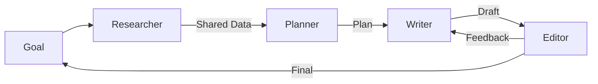

# 🤝 Collaborative Agents: The Symphony of Intelligence
> **Level:** Intermediate | **Language:** Hinglish | **Goal:** Master the design of agent systems where multiple entities work towards a shared goal through cooperation.

---

## 🧭 1. Beginner-friendly Hinglish Explanation
Collaborative Agents ka matlab hai "Mil-jul kar kaam karne wale AI". Sochiye aap ek ghar bana rahe hain. Carpenter apna kaam karta hai, Electrician apna, aur Plumber apna. Teeno ka goal ek hi hai: "Ghar ko rehne layak banana". Collaborative agents aapas mein information share karte hain aur ek dusre ki help karte hain. Agar Coder agent ko error milta hai, toh Researcher agent use automatically documentation dhoondh kar de deta hai. Isse system ki speed aur quality dono badh jati hain.

---

## 🧠 2. Deep Technical Explanation
Collaboration in multi-agent systems (MAS) is achieved through:
1. **Shared State:** All agents have access to a common "Truth" or "Graph State" (e.g., in LangGraph).
2. **Explicit Handoffs:** Agents voluntarily pass control to a specialist when they hit a task outside their domain.
3. **Feedback Loops:** A 'Critic' agent reviews the 'Actor' agent's work and provides collaborative feedback for improvement.
4. **Task Sharing:** Agents can parallelize sub-tasks and merge results later (Map-Reduce pattern).

---

## 🏗️ 3. Real-world Analogies
Collaborative Agents ek **Professional Football Team** ki tarah hain.
- Forward goal maarta hai, par use ball Midfielder se milti hai, aur Defense peeche se support karta hai. Sabka goal "Jeetna" (The User Goal) hai.

---

## 📊 4. Architecture Diagrams (The Cooperation Flow)


---

## 💻 5. Production-ready Examples (Shared State Logic)
```python
# 2026 Standard: Collaboration via Shared State
from typing import TypedDict, List

class SharedState(TypedDict):
    context: str
    findings: List[str]
    is_complete: bool

def researcher(state: SharedState):
    # Add data to findings
    state['findings'].append("Trend X is growing")
    return state

def analyzer(state: SharedState):
    # Read from findings and analyze
    state['context'] = "Analysis of trends complete"
    return state
```

---

## ❌ 6. Failure Cases
- **Bystander Effect:** Dono agents ko lagta hai ki doosra agent ye kaam kar lega, aur end mein wo kaam hota hi nahi.
- **Context Poisoning:** Ek agent galat info state mein dal deta hai, jisse saare collaborative agents distract ho jate hain.

---

## 🛠️ 7. Debugging Section
- **Symptom:** Agents are talking to each other but not making progress.
- **Check:** **Shared Goal**. Kya har agent ke system prompt mein same mission statement hai? Use a **Supervisor** to detect stagnation and force an action.

---

## ⚖️ 8. Tradeoffs
- **High Cohesion vs Low Coupling:** Agents ko ek dusre par depend hona chahiye (Cohesion) par unka code independent hona chahiye (Coupling).

---

## 🛡️ 9. Security Concerns
- **Privilege Escalation:** Ek low-privilege worker agent collaborative state ke zariye high-privilege manager agent ko trick kar sakta hai dangerous commands chalane ke liye.

---

## 📈 10. Scaling Challenges
- 20 agents ek hi "Shared State" ko update karenge toh "Race Conditions" aur memory cluttering ho sakti hai. Use **Scoped Memory**.

---

## 💸 11. Cost Considerations
- Internal collaboration calls (A talking to B) tokens consume karte hain. Use **Short, Structured Prompts** for inter-agent chatter.

---

## ⚠️ 12. Common Mistakes
- Coordination ke bina agents ko team mein dalna.
- Circular dependencies (A waits for B, B waits for A).

---

## 📝 13. Interview Questions
1. How do you maintain 'Consistency' across a collaborative multi-agent system?
2. What are the benefits of using a 'Shared State' over 'Message Passing' for collaboration?

---

## ✅ 14. Best Practices
- Define clear **Roles and Responsibilities (RACI Matrix)** for agents.
- Use **Checkpoints** to save the state after every collaborative step.

---

## 🚀 15. Latest 2026 Industry Patterns
- **Swarm Orchestration:** Agents jo dynamically team banate hain aur dissolve karte hain based on sub-task needs.
- **Collaborative Self-Reflection:** Teams jo session ke baad "Retrospective" karti hain to improve future teamwork logic.
