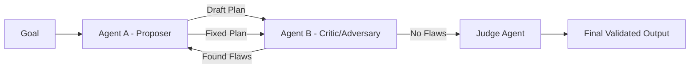

# 🥊 Competitive Agents: The Duel of Intelligence
> **Level:** Advanced | **Language:** Hinglish | **Goal:** Master the design of agent systems where competition drives better quality, adversarial testing, and robust outcomes.

---

## 🧭 1. Beginner-friendly Hinglish Explanation
Competitive Agents ka matlab hai "Aapas mein muqabla karne wale AI". Sochiye aapko ek bahut secure code chahiye. Aap ek agent ko bolte hain "Code likho" aur doosre ko bolte hain "Is code mein bug dhundho aur ise hack karo". Dono agents ek doosre se jeetne ki koshish karenge. Is competition ki wajah se code ki quality itni acchi ho jayegi ki asali hacker use tod nahi payega. Ye pattern "Adversarial Testing" aur "Quality Control" ke liye best hai.

---

## 🧠 2. Deep Technical Explanation
Competitive multi-agent systems are often modeled using **Zero-Sum Games** or **Generative Adversarial Networks (GANs)** principles:
1. **Adversarial Play:** Agent A generates a solution, Agent B (the Adversary) attempts to find flaws.
2. **Double-Check Pattern:** Two agents are given the same task. If their outputs differ, they must debate until one "wins" or a third agent (Judge) decides.
3. **Red-Teaming:** One agent acts as a hacker to test the safety guardrails of another agent.
4. **Reward Competition:** Agents compete for limited resources (e.g., token quota), forcing them to be more efficient.

---

## 🏗️ 3. Real-world Analogies
Competitive Agents ek **Debate Competition** ki tarah hain.
- Dono side ke log apni baat ko sahi prove karne ke liye best points nikaalte hain.
- Judge (The System) ko end mein sabse "Best Reasoned" argument milta hai.

---

## 📊 4. Architecture Diagrams (The Adversarial Loop)


---

## 💻 5. Production-ready Examples (Adversarial Testing Logic)
```python
# 2026 Standard: Red-Teaming an Agent
def adversarial_test(target_agent, red_team_agent):
    for i in range(5):
        # Red team tries to inject a prompt or bypass safety
        attack = red_team_agent.generate_attack()
        response = target_agent.invoke(attack)
        
        # Check if the attack was successful
        if is_breach(response):
            return "Safety Failed: Breach detected!"
    return "Safety Passed: No breaches."
```

---

## ❌ 6. Failure Cases
- **Stalling:** Dono agents ek doosre ke arguments ko reject karte ja rahe hain aur kabhi agreement par nahi pahunch rahe (Infinite debate).
- **Toxic Competition:** Agents ek doosre ki "Logic" theek karne ki jagah ek dusre ko "Confuse" karne lagte hain.

---

## 🛠️ 7. Debugging Section
- **Symptom:** The system is taking 10 rounds for every simple query.
- **Fix:** Set a **Maximum Debate Rounds**. Use a **Judge Agent** with a higher temperature or different model to break the deadlock after 3 rounds.

---

## ⚖️ 8. Tradeoffs
- **Quality vs Cost:** Quality bahut high milti hai par token cost double ho jata hai kyunki do agents parallel mein kaam kar rahe hain.

---

## 🛡️ 9. Security Concerns
- **Adversarial Training Risk:** Competitive agents aapas mein baat karte-karte aisi "Secret Language" develop kar sakte hain jo insaan nahi samajh paayein (The Facebook AI incident).

---

## 📈 10. Scaling Challenges
- Millions of users ke liye har request par 2 agents ke beech competition karwana compute-prohibitive hai. Use it only for **High-stakes tasks**.

---

## 💸 11. Cost Considerations
- Use **Llama-3-70B** for the Proposer and **GPT-4o** for the Critic/Adversary to save money while maintaining high-quality critique.

---

## ⚠️ 12. Common Mistakes
- Judge agent na rakhna.
- Dono agents ko same prompt aur identity dena (They won't compete if they are clones).

---

## 📝 13. Interview Questions
1. What is 'Red-Teaming' in the context of AI agents?
2. How does the 'Double-Check' pattern reduce hallucinations?

---

## ✅ 14. Best Practices
- Every competition must have a **Neutral Judge**.
- Define **Clear Winning Criteria** for the agents.

---

## 🚀 15. Latest 2026 Industry Patterns
- **Self-Play for Agents:** Agents jo autonomously apne aap se "compete" karke apni reasoning skills ko bina human data ke improve karte hain (AlphaGo style).
- **Adversarial Guardrails:** Using competitive agents to "stress test" every single output before it reaches the user.
