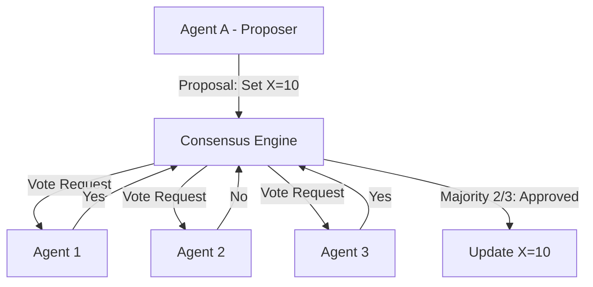

# ⚖️ Consensus and Conflict Resolution: Agreement in Autonomy
> **Level:** Advanced | **Language:** Hinglish | **Goal:** Master the algorithms and protocols that allow multiple agents to agree on a single truth and resolve disagreements.

---

## 🧭 1. Beginner-friendly Hinglish Explanation
Consensus ka matlab hai "Sabka razi hona". Sochiye 5 agents ek hi calendar manage kar rahe hain. Do agents ne ek hi time par meeting book kar di (Conflict). Ab kiska appointment rahega? Resolution ka matlab hai is jhagde ko khatam karna. Agents aapas mein "Voting" kar sakte hain ya fir ek "Judge" agent decide kar sakta hai. Consensus zaroori hai taaki poora system ek hi direction mein chale aur koi confusion na ho.

---

## 🧠 2. Deep Technical Explanation
Consensus protocols are essential for maintaining a unified state in decentralized systems:
1. **Majority Voting:** Agents vote on a proposal. If >50% agree, it becomes the truth.
2. **Consensus Algorithms (Paxos/Raft):** Ensuring a single leader agent exists and all followers replicate its state.
3. **Byzantine Fault Tolerance (BFT):** Reaching agreement even if some agents are "Lying" or "Malicious".
4. **Resolution Logic:** Using priority (e.g., higher-ranked agent wins) or timestamps (e.g., first-come-first-served) to break ties.

---

## 🏗️ 3. Real-world Analogies
Consensus ek **Panchayat** ki tarah hai.
- Gaon ke 5 buzurg (Agents) ek masle par baat karte hain.
- Jab tak Majority razi nahi hoti, faisla (State change) nahi hota.

---

## 📊 4. Architecture Diagrams (The Voting Loop)


---

## 💻 5. Production-ready Examples (Simple Majority Vote)
```python
# 2026 Standard: Simple Vote Logic
def resolve_conflict(votes):
    # votes = {"agent_1": "OPTION_A", "agent_2": "OPTION_B", "agent_3": "OPTION_A"}
    from collections import Counter
    counts = Counter(votes.values())
    
    # Get the most common option
    winner, count = counts.most_common(1)[0]
    
    if count > len(votes) / 2:
        return winner # Consensus reached
    return None # No consensus, trigger fallback
```

---

## ❌ 6. Failure Cases
- **Hung Parliament:** 50-50 split ho gaya aur koi decision nahi ho paa raha (Deadlock).
- **Sybil Attack:** Ek agent ne 100 fake identities banali aur voting ko dominate kar liya.

---

## 🛠️ 7. Debugging Section
- **Symptom:** System is "Stuck" and not making any updates.
- **Check:** **Quorum Status**. Kya enough agents online hain voting ke liye? Agar 5 mein se sirf 2 online hain, toh majority (3) kabhi nahi hogi.

---

## ⚖️ 8. Tradeoffs
- **Speed vs Accuracy:** Voting time leti hai par results accurate hote hain. Centralized decision fast hai par unreliable.

---

## 🛡️ 9. Security Concerns
- **Byzantine Failures:** Malicious agents intentionally misleading the consensus to cause system collapse. Use **Cryptographic Signatures** for every vote.

---

## 📈 10. Scaling Challenges
- 10,000 agents ke beech voting karaana network ko crash kar sakta hai. Use **Representative Voting** (Delegates).

---

## 💸 11. Cost Considerations
- Consensus is expensive in terms of network calls. Use it only for **State-changing actions** (e.g., writing to DB), not for simple internal reasoning.

---

## ⚠️ 12. Common Mistakes
- Network latency ko ignore karna (Votes late aa sakte hain).
- Clear tie-breaking rules na rakhna.

---

## 📝 13. Interview Questions
1. What is the difference between 'Paxos' and 'Raft' consensus algorithms?
2. How do you handle 'Byzantine' agents in a peer-to-peer agent network?

---

## ✅ 14. Best Practices
- Every proposal should have a **Timeout**.
- Use **Weighted Voting** if some agents are more "Expert" than others.

---

## 🚀 15. Latest 2026 Industry Patterns
- **Proof-of-Stake for Agents:** Agents ko resources "Stake" karne padte hain vote dene ke liye, ensuring skin in the game.
- **Semantic Consensus:** Agents jo natural language mein "Argument" karte hain aur ek LLM-Judge decide karta hai ki kiska point sabse valid hai.
