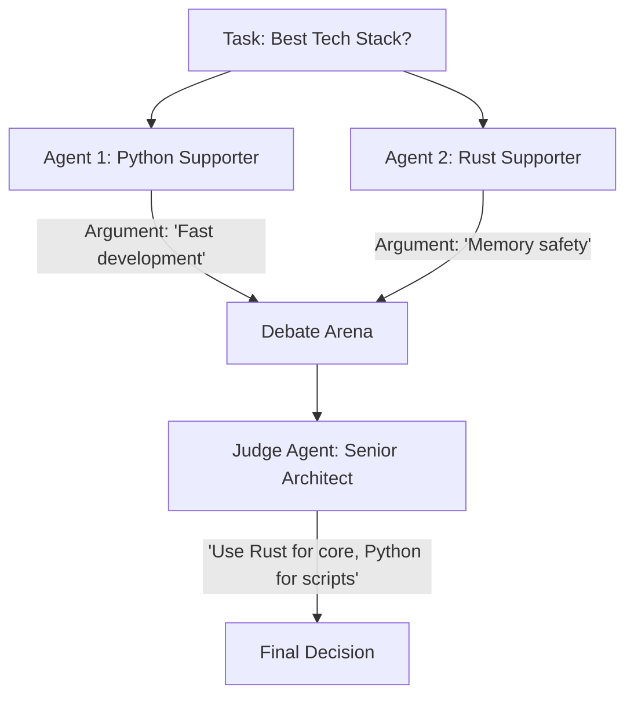

# ⚖️ Cooperation & Conflict Resolution: The Diplomatic Agent
> **Level:** Extreme Advanced | **Language:** Hinglish | **Goal:** Master how agents negotiate, agree, and resolve disagreements when working in a multi-agent team.

---

## 🧭 1. Beginner-Friendly Hinglish Explanation
Conflict Resolution ka matlab hai **"Jhagda suljhana"**.

- **The Problem:** Jab aapke paas 2 specialized agents hain, toh wo aapas mein disagree kar sakte hain.
  - Researcher: "Ye data sahi hai."
  - Analyst: "Nahi, ye purana hai."
- **The Solution:** Humein agents ko "Negotiate" karna sikhana padta hai.
  - "Dono apne points rakho."
  - "Evidence dikhao."
  - "Final decision ke liye 'Judge' agent ke paas jao."

Multi-agent system mein "Harmony" tabhi aati hai jab conflict resolution ke rules clear honge.

---

## 🧠 2. Deep Technical Explanation
Conflict resolution in MAS is modeled as a **Negotiation Protocol** or a **Consensus Game**.

### 1. Types of Conflicts:
- **Resource Conflict:** Two agents want to use the same tool/API at once.
- **Truth Conflict:** Agents have contradictory information from different sources.
- **Goal Conflict:** Agent A's sub-goal interferes with Agent B's sub-goal (e.g., A wants to save money, B wants to use the best model).

### 2. Resolution Strategies:
- **The Judge Pattern:** A third, highly-capable model (like GPT-4o) reviews both arguments and makes a binding decision.
- **Debate (Self-Correction):** Agents exchange messages (Turn 1: Argue, Turn 2: Counter-argue, Turn 3: Concede) until they reach a common ground.
- **Voting / Consensus:** All agents vote on the outcome.

### 3. Game Theory in Resolution:
Using concepts like **Nash Equilibrium** where no agent can benefit by changing its decision alone.

---

## 🏗️ 3. Architecture Diagrams (The Debate Loop)


---

## 💻 4. Production-Ready Code Example (Implementing a Judge Node)
```python
# 2026 Standard: Resolving conflicts using a Judge agent

def resolve_conflict(agent_a_output, agent_b_output, context):
    prompt = f"""
    Context: {context}
    Agent A says: {agent_a_output}
    Agent B says: {agent_b_output}
    
    There is a conflict. Analyze both perspectives.
    Identify the factually correct one or provide a compromise.
    """
    
    decision = judge_llm.generate(prompt)
    return decision

# Insight: Judges should be 'Hidden' from workers until a conflict occurs 
# to save token costs.
```

---

## 🌍 5. Real-World Use Cases
- **Autonomous Legal Research:** Two agents (Prosecutor/Defense) finding contradictory precedents; a third agent acts as "Judge".
- **Medical Consultation:** Multiple expert agents disagreeing on a diagnosis; a senior specialist agent resolves.
- **System Migration:** Different agents proposing different paths for cloud migration; the CTO agent decides based on budget and safety.

---

## ❌ 6. Failure Cases
- **Endless Debate:** Agents keep arguing back and forth without reaching a decision. **Fix: Set a hard 'Max 3 turns' limit for debates.**
- **Groupthink:** All agents agree immediately on a wrong answer because they want to "Cooperate" too much.
- **Judge Bias:** The Judge agent has its own bias (e.g., favoring one model's style over another).

---

## 🛠️ 7. Debugging Guide
| Symptom | Cause | Fix |
| :--- | :--- | :--- |
| **System is stuck in debate** | No 'Decision Maker' | Add a **Tie-breaker** rule: "If no consensus in 3 turns, Agent A wins." |
| **Agents are being too polite** | Weak 'Critic' persona | Tell the agents: "Your goal is to find errors in your teammate's work. Be honest and blunt." |

---

## ⚖️ 8. Tradeoffs
- **Consensus vs. Speed:** Total agreement is accurate but very slow; "Boss decides" is fast but might miss nuances.
- **Competitive vs. Cooperative:** Competition (Debate) reduces hallucinations but increases token costs significantly.

---

## 🛡️ 9. Security Concerns
- **Collusion Attack:** Two worker agents "Team up" to lie to the manager agent so they can finish early and save compute.
- **Veto Exploitation:** An agent given "Veto" power using it to block all progress until a specific (malicious) condition is met.

---

## 📈 10. Scaling Challenges
- **Multiparty Negotiation:** When 10 agents disagree at once, the "Debate Arena" becomes chaotic. **Solution: Hierarchical Voting.**

---

## 💸 11. Cost Considerations
- **Debate is expensive:** 3 turns of debate between 2 agents + 1 Judge call = $7$ LLM calls. Use only for **Critical Decisions**.

---

## 📝 12. Interview Questions
1. How do you implement "Self-Correction" in a multi-agent team?
2. What is the "Judge Pattern" in agentic systems?
3. How can game theory be applied to agent cooperation?

---

## ⚠️ 13. Common Mistakes
- **Assuming the LLM is always right:** Even the Judge can make a mistake. For high-stakes decisions, use **Human-in-the-loop**.
- **No Evidence Requirement:** Letting agents argue without showing their sources. **Fix: Force agents to cite their 'Tools' or 'Docs'.**

---

## ✅ 14. Best Practices
- **Define a 'Tie-breaker':** Always know who wins if the debate is a draw.
- **Evidence-based Debate:** Agents must provide "Logs" or "Docs" to support their claims.
- **Summarize the disagreement:** Instead of reading the whole debate, the Judge should get a summary of the "Core Disagreement".

---

## 🚀 15. Latest 2026 Industry Patterns
- **Multi-Model Consensus:** Using models from different families (OpenAI, Anthropic, Google) to ensure "Diversity of Thought" in the debate.
- **RL-based Negotiation:** Agents that are trained specifically to "Win" fair negotiations through reinforcement learning.
- **Automated Mediation:** A background process that monitors agent chat and intervenes only when it detects a "Circular Argument".
